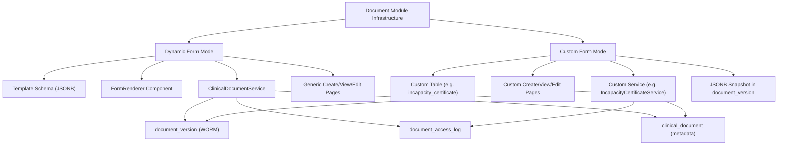

# Document Module: Dual-Mode Architecture (Dynamic + Custom Forms)

## Problem

The TVL (incapacity certificate) is currently created via the **generic** `CreateDocumentPage` -> `ClinicalDocumentService.create()` flow. This path tries to bridge into the `incapacity_certificate` table via `createIncapacityCertificateFromContent()`, but:

1. The content structure from `FormRenderer` (`{basic: {tvl_type, ...}, diagnosis: {...}}`) is fragile - any mismatch silently fails (caught exception at line 200 of `ClinicalDocumentService`)
2. Even when it works, the `incapacity_certificate` row may not populate correctly
3. TVL was using custom statuses (`draft`, `open`, `confirmed`, `cancelled`) instead of Document Module statuses -- custom forms should use the same status lifecycle
4. Result: `/api/incapacity-certificates/patient/{id}` returns `[]`

The real issue is architectural: TVL should use its **own dedicated flow** (`IncapacityCertificateService.createDraft()`) which already correctly creates `clinical_document` + `incapacity_certificate` + `document_version` with a proper JSONB snapshot.

## Proposed Architecture: Two Document Modes

### Mode 1: Dynamic Form (existing, unchanged)

- **Use when:** Simple documents with no custom business logic (GP Visit Note, Referral Letter, Discharge Summary)
- **Source of truth:** `document_version.content` (JSONB)
- **UI:** `FormRenderer` renders form from template schema
- **Status lifecycle:** `preliminary` -> `final` -> `amended` / `entered_in_error`
- **Pages:** Generic `CreateDocumentPage`, `DocumentViewPage`, `EditDocumentPage`
- **API:** `ClinicalDocumentController` / `ClinicalDocumentService`

### Mode 2: Custom Form (new pattern, TVL is the first user)

- **Use when:** Documents with custom business logic, external registry integration, or queryable relational columns
- **Source of truth:** Custom table (e.g. `incapacity_certificate`) -- relational columns for queryability
- **JSONB copy:** Every mutation creates a `document_version` with a JSONB snapshot of the custom table (via `buildContentSnapshot()`)
- **Status lifecycle:** Uses **Document Module statuses** (`preliminary` -> `final` -> `amended` / `entered_in_error`) as the primary status on `clinical_document`. If a custom document needs additional statuses beyond these, they form a superset that must be mapped to Document Module statuses (mapping specified during planning). The Document Module status drives versioning behaviour.
- **Pages:** Dedicated create/view/edit pages with custom UI
- **API:** Dedicated controller/service (e.g. `IncapacityCertificateController` / `IncapacityCertificateService`)
- **Shared infrastructure:** `clinical_document` (metadata + status), `document_version` (WORM versioning), `document_access_log` (audit), SHA-256 hashing, document numbering

## Changes Required

### 1. Update feature documentation

**[plans/feature-clinical-document-repository.md](plans/feature-clinical-document-repository.md):**

- Add "Document Modes" section describing Dynamic Form vs Custom Form architecture
- Add planning guidance: "When planning a new document type, determine whether it's a Dynamic Form or Custom Form"
- List criteria for choosing each mode

**[plans/feature-incapacity-certificate.md](plans/feature-incapacity-certificate.md):**

- Mark TVL as "Custom Form" mode document
- Update architecture description to reflect dedicated flow as the primary/only path
- Remove references to using generic `CreateDocumentPage` / `EditDocumentPage` for TVL

### 2. Backend: Remove bridge code from ClinicalDocumentService

**[ClinicalDocumentService.java](api/src/main/java/com/company/project/service/document/ClinicalDocumentService.java):**

- Remove `createIncapacityCertificateFromContent()` method (lines 162-204)
- Remove `updateIncapacityCertificateFromContent()` method (lines 274-309)
- Remove the calls to these methods in `create()` (lines 151-154) and `saveNewVersion()` (lines 265-266)
- Remove `IncapacityCertificateRepository` dependency
- Remove helper methods (`getStringValue`, `getLocalDateValue`, `getBooleanValue`) if no longer needed elsewhere

The generic `ClinicalDocumentService` should have no knowledge of specific document types. Custom form documents manage their own custom table through their own service.

### 3. Frontend: TVL uses dedicated API

**[IncapacityCertificateListPage.tsx](web/src/pages/documents/IncapacityCertificateListPage.tsx):**

- Change "New certificate" button to navigate to a dedicated TVL creation page (e.g. `/patients/:patientId/incapacity-certificates/new`) instead of the generic `/patients/:patientId/documents/new?template=INCAPACITY_CERTIFICATE`

**New/Updated Pages (Custom TVL form):**

- Create `IncapacityCertificateCreatePage.tsx` - Custom create page using `incapacityCertificateService.create()` API, with TVL-specific form fields (not FormRenderer)
- Create `IncapacityCertificateViewPage.tsx` - Custom view page with TVL-specific actions (Register, Close, Cancel, Sync)
- Create `IncapacityCertificateEditPage.tsx` - Custom edit page using `incapacityCertificateService.update()` API

**[App.tsx](web/src/App.tsx):**

- Add routes for dedicated TVL pages

### 4. Align IncapacityCertificateService with Document Module statuses

**[IncapacityCertificateService.java](api/src/main/java/com/company/project/service/document/IncapacityCertificateService.java):**

TVL uses Document Module statuses directly -- no custom status superset needed.

**Status mapping (old -> new):**

| Operation                | Current `clinical_document.status` | New `clinical_document.status`    | Notes                                                                                         |
| ------------------------ | ---------------------------------- | --------------------------------- | --------------------------------------------------------------------------------------------- |
| `createDraft()`          | `"draft"`                          | `"preliminary"`                   | Editable, not yet signed                                                                      |
| `registerWithRegistry()` | `"open"`                           | no change (stays `"preliminary"`) | Registry is orthogonal; tracked via `incapacity_certificate.registry_status`                  |
| `modify()`               | no change                          | no change (stays `"preliminary"`) | Still editable, new version created                                                           |
| Confirm (new operation)  | n/a                                | `"final"`                         | Immutable, can only amend                                                                     |
| Amend (new operation)    | n/a                                | `"amended"`                       | Re-opens for editing                                                                          |
| `close()`                | `"confirmed"`                      | no change to document status      | Registry closing tracked via `registry_status`; document status managed separately            |
| `cancel()`               | `"cancelled"`                      | no change to document status      | Registry cancellation tracked via `registry_status`; use void for document-level cancellation |
| Void                     | n/a                                | `"entered_in_error"`              | Document voided                                                                               |

**Key changes in `IncapacityCertificateService`:**

- `createDraft()`: Change `document.setStatus("draft")` to `document.setStatus("preliminary")`
- `registerWithRegistry()`: Remove `document.setStatus("open")` -- registry status is tracked on `incapacity_certificate.registry_status`, not on `clinical_document.status`
- `modify()`: Status check changes from `!"open".equals(...)` to `!"preliminary".equals(...) && !"amended".equals(...)` (same as generic documents)
- `close()`: Remove `document.setStatus("confirmed")` -- registry closing updates `registry_status` only
- `cancel()`: Remove `document.setStatus("cancelled")` -- registry cancellation updates `registry_status` only; document voiding uses the void operation with `entered_in_error`

**Registry lifecycle (separate, on `incapacity_certificate` table):**

The `registry_status` field on `incapacity_certificate` tracks the external registry state independently: `null` -> `registered` -> `closed`/`cancelled`. This is an external system concern, not a document lifecycle concern.

## Planning Questions for Future Document Types

When planning any new document type, ask these questions:

> **1. Is this a Dynamic Form or Custom Form document?**
>
> - **Dynamic Form:** No custom business logic, simple data capture, no external integrations. Uses template schema + FormRenderer. Example: GP Visit Note, Referral Letter.
> - **Custom Form:** Has custom business logic, external registry integration, or needs queryable relational columns. Gets its own table, service, controller, and UI pages. Example: TVL (Incapacity Certificate), future: e-Prescription, Referral to Hospital.

> **2. (Custom Form only) Does this document type need additional statuses beyond the Document Module statuses?**
>
> - Document Module statuses (`preliminary`, `final`, `amended`, `entered_in_error`) are always the **primary** status on `clinical_document` and drive versioning.
> - If additional statuses are needed, they form a **superset** and must be mapped to Document Module statuses. Specify the mapping during planning.
> - Example (TVL): No additional statuses needed -- uses Document Module statuses directly. Registry lifecycle is tracked separately via `registry_status` on the custom table.

> **3. Should this document type have its own number sequence and pattern?**
>
> - Document Module provides automatic numbering via `DocumentNumberService` with format: `{ACRONYM}{YEAR}{SEQUENCE}`
>   - Acronym: First character of each word in template code (e.g. `INCAPACITY_CERTIFICATE` → `IC`)
>   - Year: Last 2 digits (e.g. `2026` → `26`)
>   - Sequence: 5-digit zero-padded, per tenant + template (e.g. `00001`, `00042`)
> - Examples: `IC26-00001`, `GVN26-00042`, `RL26-00123`
> - If a different pattern is needed (e.g. external registry requires specific format), specify during planning and implement custom numbering logic in the custom service.
> - Example (TVL): Uses Document Module numbering with `IC` acronym. External registry may assign its own `registry_id` separately (stored on `incapacity_certificate` table).

