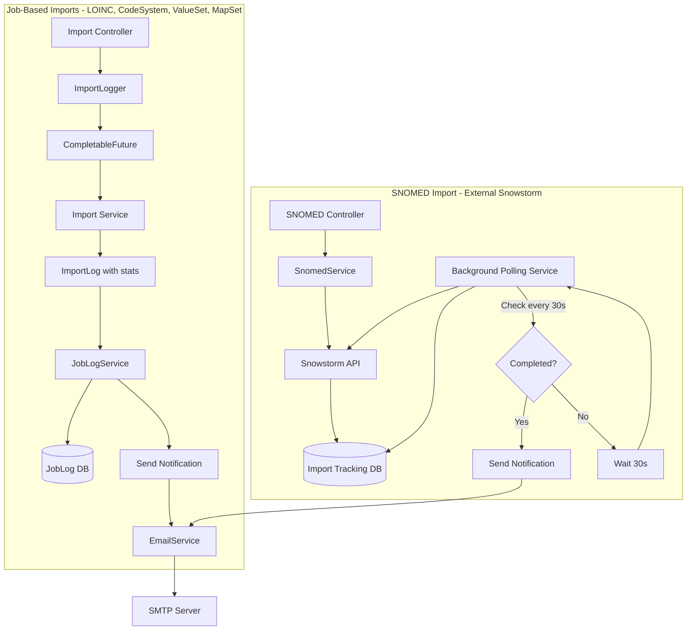
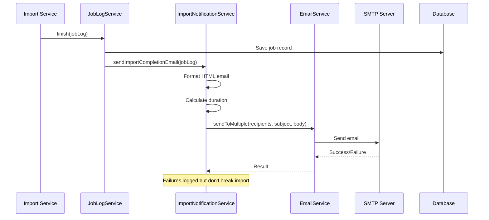

# Email Import Notifications

## Description

Automatic email notifications are sent when terminology imports complete. This feature helps administrators and data managers stay informed about import operations without manually checking the UI or logs.

**Key capabilities:**

- Email notifications for all import types (LOINC, SNOMED, CodeSystem, ValueSet, MapSet, Wiki)
- Notifications for all completion statuses (COMPLETED, FAILED, WARNINGS)
- Multi-recipient support for team distribution lists
- Rich HTML emails with import statistics and color-coded status badges
- Automatic polling for SNOMED imports (delegates to external Snowstorm server)
- Graceful handling when SMTP is not configured

**Supported import types:**

- LOINC imports
- SNOMED RF2 imports (via Snowstorm)
- CodeSystem file imports
- ValueSet imports
- MapSet imports
- Association imports
- Wiki space imports

## Configuration

### Properties

| Property | Env variable | Default | Description |
|----------|--------------|---------|-------------|
| `micronaut.email.enabled` | `SMTP_ENABLED` | `false` | Enables email sending (required) |
| `micronaut.email.import.recipients` | `SMTP_TO_IMPORT` | (empty) | Comma-separated list of recipients for import notifications |

**Prerequisites:**

SMTP must be configured and enabled. See [SMTP Email Support](smtp-email-support.md) for SMTP configuration.

### Configuring import notification recipients

**Option A** - Via environment variable:

```bash
export SMTP_ENABLED=true
export SMTP_TO_IMPORT=admin@company.org,data-team@company.org,imports@company.org

./gradlew :termx-app:run
```

**Option B** - Via Docker environment file:

Edit `deployment/docker-compose/server.env`:

```bash
# SMTP Configuration (required)
SMTP_ENABLED=true
SMTP_HOST=smtp.gmail.com
# ... other SMTP settings ...

# Import notification recipients
SMTP_TO_IMPORT=admin@company.org,data-team@company.org
```

**Option C** - Via application.yml:

```yaml
micronaut:
  email:
    enabled: true
    import:
      recipients: admin@company.org,data-team@company.org
```

### Behavior when not configured

- If `SMTP_TO_IMPORT` is not set, no import notifications are sent
- If SMTP is not configured, notifications are silently skipped
- Import processing continues normally regardless of email status

## Use-Cases

### Scenario 1: LOINC Import Completion Notification

**Context:** Data team imports large LOINC dataset overnight and wants automatic notification when complete.

**Steps:**
1. Configure `SMTP_TO_IMPORT=data-team@company.org,admin@company.org`
2. Trigger LOINC import via UI or API: upload LOINC 2.76 file
3. Import runs in background (takes 15 minutes)
4. Import completes with 50,000 concepts imported
5. Email automatically sent to all recipients

**Outcome:** Team receives email with "Import Completed: LOINC 2.76" containing duration (15 min), success count (50,000), and zero errors.

### Scenario 2: Failed Import Alert

**Context:** Administrator needs immediate notification when CodeSystem import fails.

**Steps:**
1. Configure import notification recipients
2. Trigger CodeSystem import with malformed CSV file
3. Import fails during processing with validation errors
4. Email automatically sent with FAILED status badge (red)
5. Admin reviews error details in email and fixes data

**Outcome:** Team immediately aware of import failure. Email contains specific error messages for quick troubleshooting.

### Scenario 3: SNOMED Import with Automatic Polling

**Context:** Organization imports large SNOMED RF2 file that takes hours to process on Snowstorm server.

**Steps:**
1. Upload SNOMED RF2 file via TermX UI
2. TermX delegates import to Snowstorm and receives job ID
3. TermX creates tracking record and starts background polling
4. Polling service checks Snowstorm status every 30 seconds
5. After 2 hours, Snowstorm reports completion
6. Email automatically sent with import statistics

**Outcome:** No manual monitoring required. Team receives notification when SNOMED import completes, even for multi-hour imports.

### Scenario 4: Multi-Team Distribution

**Context:** Different teams need import notifications (data team, QA team, management).

**Steps:**
1. Configure multiple recipients: `SMTP_TO_IMPORT=data@co.org,qa@co.org,mgmt@co.org`
2. Any import completes
3. All three teams receive the same notification email
4. Each team can track imports relevant to their responsibilities

**Outcome:** Improved visibility across organization. All stakeholders informed of import operations.

### Scenario 5: Import with Warnings

**Context:** ValueSet import completes but with validation warnings that should be reviewed.

**Steps:**
1. Import ValueSet from Excel file
2. Import completes with 1,000 concepts imported, 50 warnings (duplicate codes)
3. Email sent with WARNINGS status badge (yellow)
4. Data team reviews warnings section in email
5. Team decides if corrections needed

**Outcome:** Team aware of partial success. Warnings documented in email for follow-up action.

## API

Import notifications are sent automatically by the system. No API endpoints are provided for triggering notifications manually.

### Integration Points

**Job-based imports:**

Notifications are sent automatically when `JobLogService.finish()` completes. No code changes required in import services.

**SNOMED imports:**

Background polling service checks Snowstorm import status every 30 seconds and sends notifications when imports complete.

### Email Content

Each notification email includes:

- Import type (LOINC, SNOMED, CodeSystem, etc.)
- Status badge (green for COMPLETED, yellow for WARNINGS, red for FAILED)
- Duration (calculated from start/finish timestamps)
- Statistics (success count, warning count, error count)
- Source resource information (CodeSystem ID, file name, etc.)
- Collapsible sections with detailed success/warning/error messages

## Testing

### Configure test recipients

```bash
export SMTP_ENABLED=true
export SMTP_HOST=smtp.gmail.com
export SMTP_USERNAME=your-email@gmail.com
export SMTP_PASSWORD=your-app-password
export SMTP_TO_IMPORT=test@example.com

./gradlew :termx-app:run
```

### Test with LOINC import

```bash
# 1. Upload LOINC file via UI or API
curl -X POST -H "Content-Type: multipart/form-data" \
     -F "file=@loinc.csv" \
     http://localhost:8200/api/ts/code-systems/loinc/versions/2.76/import

# 2. Wait for import to complete (check UI or poll job status)

# 3. Check email inbox
# Expected: Email with subject "Import Completed: LOINC 2.76"
```

### Test with CodeSystem import

```bash
# 1. Import CodeSystem via file upload
curl -X POST http://localhost:8200/api/ts/code-systems/my-cs/versions/1.0/import \
     -F "file=@concepts.csv"

# 2. Wait for completion
# Expected: Email notification with import statistics
```

### Test SNOMED import polling

```bash
# 1. Trigger SNOMED import (delegates to Snowstorm)
curl -X POST http://localhost:8200/api/snomed/import/rf2 \
     -F "file=@snomed_rf2.zip"

# 2. Background polling service checks Snowstorm status every 30s

# 3. When Snowstorm reports completion, email is sent
# Expected: Email with SNOMED import statistics
```

### Verify email sending

Check application logs for email confirmation:

```bash
tail -f termx-app.log | grep "ImportNotification"
# Expected: "Sent import notification email to [recipients]"
```

## Data Model

### JobLog

Import job record used for notifications.

| Field | Type | Description |
|-------|------|-------------|
| id | Long | Job ID |
| type | String | Job type (e.g., "loinc-import", "CS-FILE-IMPORT") |
| status | String | `COMPLETED`, `FAILED`, `WARNINGS` |
| started | Instant | Job start timestamp |
| finished | Instant | Job completion timestamp |
| source | String | Source identifier (e.g., CodeSystem ID) |
| successes | List<String> | Success messages |
| warnings | List<String> | Warning messages |
| errors | List<String> | Error messages |

**Example:**

```json
{
  "id": 12345,
  "type": "loinc-import",
  "status": "COMPLETED",
  "started": "2026-03-09T10:00:00Z",
  "finished": "2026-03-09T10:15:23Z",
  "source": "loinc-2.76",
  "successes": ["Imported 50,000 concepts"],
  "warnings": [],
  "errors": []
}
```

### SnomedImportTracking

Tracking record for SNOMED imports that delegate to Snowstorm.

| Field | Type | Description |
|-------|------|-------------|
| id | Long | Tracking ID |
| snowstormJobId | String | Snowstorm job ID |
| status | String | `RUNNING`, `COMPLETED`, `FAILED` |
| started | Instant | Import start timestamp |
| finished | Instant | Import completion timestamp (null while running) |
| notified | Boolean | Whether notification email was sent |

**Lifecycle:**

1. Created when SNOMED import starts with `status=RUNNING`
2. Polling service updates status when Snowstorm reports completion
3. Email sent and `notified=true` set
4. Record remains for audit trail

### Email Notification Content

Each notification email includes:

| Content Element | Source | Description |
|----------------|--------|-------------|
| Import Type | `jobLog.type` | Human-readable type (LOINC, CodeSystem, etc.) |
| Status Badge | `jobLog.status` | Color-coded: green (COMPLETED), yellow (WARNINGS), red (FAILED) |
| Duration | `finished - started` | Formatted as "15 min 23 sec" |
| Success Count | `successes.size()` | Number of successful operations |
| Warning Count | `warnings.size()` | Number of warnings |
| Error Count | `errors.size()` | Number of errors |
| Resource | `jobLog.source` | CodeSystem ID, file name, etc. |
| Details | `successes/warnings/errors` | Collapsible sections with messages |

## Architecture

### Two Import Patterns



**Job-based import flow:**

1. Controller receives import request
2. `ImportLogger.runJob()` starts async processing
3. Import service processes data and returns `ImportLog` with statistics
4. `JobLogService.finish()` saves job to database
5. `ImportNotificationService` is called automatically
6. Email sent to all configured recipients

**SNOMED import flow:**

1. Controller delegates to Snowstorm server and receives job ID
2. Tracking record created in local database
3. Background `SnomedImportPollingService` runs every 30 seconds
4. Polls Snowstorm API for job status
5. When status changes to COMPLETED/FAILED, sends email notification
6. Marks tracking record as processed

### Email Notification Flow



## Technical Implementation

### Source Files

| File | Description |
|------|-------------|
| `termx-core/src/main/java/com/kodality/termx/core/sys/email/EmailService.java` | SMTP service with multi-recipient support |
| `termx-core/src/main/java/com/kodality/termx/core/sys/job/logger/ImportNotificationService.java` | Formats and sends import completion emails |
| `termx-core/src/main/java/com/kodality/termx/core/sys/job/JobLogService.java` | Hooks email notifications into finish() method |
| `snomed/src/main/java/com/kodality/termx/snomed/snomed/SnomedImportPollingService.java` | Background polling for SNOMED imports |
| `snomed/src/main/java/com/kodality/termx/snomed/snomed/SnomedImportTracking.java` | Tracks SNOMED import jobs |
| `snomed/src/main/java/com/kodality/termx/snomed/snomed/SnomedService.java` | Creates tracking record on import start |

### ImportNotificationService

**Responsibilities:**

- Extract import statistics from `JobLog`
- Format professional HTML email with styled status badges
- Calculate duration from start/finish timestamps
- Send to all configured recipients
- Handle email failures gracefully

**Email template features:**

- Color-coded status badges (green/yellow/red)
- Summary table with job metadata
- Success/warning/error counts
- Duration in human-readable format
- Collapsible sections for detailed messages
- Professional styling with TermX branding

### JobLogService Integration

Hook point in `JobLogService.finish()`:

```java
public void finish(Long jobId, Status status, ImportLog importLog) {
  // ... save to database ...
  
  try {
    if (isImportJob(jobLog.getType())) {
      importNotificationService.sendImportCompletionEmail(jobLog);
    }
  } catch (Exception e) {
    log.error("Failed to send import notification email", e);
    // Don't throw - email failure should not break import tracking
  }
}
```

### SNOMED Import Polling

**SnomedImportPollingService:**

```java
@Singleton
public class SnomedImportPollingService {
  @Scheduled(fixedDelay = "30s")
  public void pollPendingImports() {
    List<SnomedImportTracking> pending = repository.findPending();
    
    for (SnomedImportTracking tracking : pending) {
      SnomedImportJob job = snowstormClient.loadImportJob(tracking.getSnowstormJobId());
      
      if (job.getStatus().equals("COMPLETED") || job.getStatus().equals("FAILED")) {
        tracking.setFinished(Instant.now());
        tracking.setStatus(job.getStatus());
        repository.save(tracking);
        
        // Send email notification
        importNotificationService.sendSnomedImportNotification(tracking, job);
      }
    }
  }
}
```

**Tracking table:**

```sql
CREATE TABLE snomed.import_tracking (
  id                    bigint PRIMARY KEY,
  snowstorm_job_id      text NOT NULL,
  status                text NOT NULL,
  started               timestamptz NOT NULL,
  finished              timestamptz,
  notified              boolean DEFAULT false
);
```

### Error Handling

**Email failures do not affect imports:**

- All email sending is wrapped in try-catch blocks
- Failures are logged but not propagated
- Import tracking continues normally
- Application stability is prioritized over notification delivery

**Graceful degradation:**

- If SMTP not configured: notifications silently skipped
- If recipients not configured: no emails sent
- If Snowstorm unavailable: polling continues with exponential backoff
