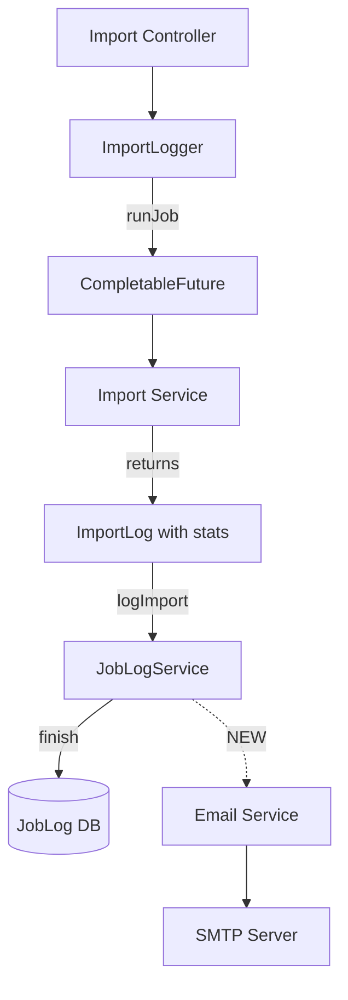

# Email Notifications for Terminology Imports

## Architecture Overview

The system uses two different import patterns:

1. **Job-based imports** (LOINC, CodeSystem, ValueSet, MapSet): Use `[ImportLogger](termx-core/src/main/java/com/kodality/termx/core/sys/job/logger/ImportLogger.java)` which tracks jobs in the database via `[JobLogService](termx-core/src/main/java/com/kodality/termx/core/sys/job/JobLogService.java)`
2. **SNOMED import**: Delegates to external Snowstorm server, different flow




## Implementation Strategy

### 1. Add Multi-Recipient Configuration

Add `SMTP_TO_IMPORT` property in `[application.yml](termx-app/src/main/resources/application.yml)`:

```yaml
micronaut:
  email:
    enabled: ${SMTP_ENABLED:false}
    from:
      email: ${SMTP_FROM:noreply@termx.org}
    import:
      recipients: ${SMTP_TO_IMPORT:} # comma-separated list
```

Update `[deployment/docker-compose/server.env](deployment/docker-compose/server.env)` with new parameter:

```bash
#SMTP_TO_IMPORT=admin@company.org,imports@company.org
```

### 2. Enhance EmailService for Multi-Recipient Support

Modify `[EmailService](termx-core/src/main/java/com/kodality/termx/core/sys/email/EmailService.java)`:

- Add new property `@Property(name = "micronaut.email.import.recipients")`
- Add method `sendToMultiple(List<String> recipients, String subject, String body, boolean html)`
- Parse comma-separated recipients from configuration

### 3. Create Import Notification Service

Create new class `ImportNotificationService` in `termx-core/src/main/java/com/kodality/termx/core/sys/job/logger/`:

- Inject `EmailService` and configuration for import recipients
- Method `sendImportCompletionEmail(JobLog jobLog)` that:
  - Calculates duration from `started` and `finished` timestamps
  - Formats **HTML email** with job type, status, duration, success/warning/error counts
  - Sends to **all configured recipients** for **all statuses** (COMPLETED, FAILED, WARNINGS)
  - Only sends if recipients are configured
  - Gracefully handles email failures without breaking import tracking

HTML email template with styled formatting:

- Status badge (green for COMPLETED, yellow for WARNINGS, red for FAILED)
- Summary table with job metadata
- Collapsible sections for detailed success/warning/error messages
- Professional styling with termx branding

### 4. Integrate Email Notifications into Job Completion

Modify `[JobLogService.finish()](termx-core/src/main/java/com/kodality/termx/core/sys/job/JobLogService.java)` method (lines 39-50):

- Inject `ImportNotificationService`
- After database update, call `importNotificationService.sendImportCompletionEmail(jobLog)` 
- Wrap in try-catch to prevent email failures from breaking import tracking
- Filter to only send for import job types (check if job type contains "import")

### 5. Handle SNOMED Import (Automatic Background Polling)

SNOMED import delegates to external Snowstorm server and requires special handling:

**Implementation approach:**

1. **Track SNOMED jobs in database**:
  - When SNOMED import starts, create a tracking record (reuse `JobLog` or create `SnomedImportTracking` table)
  - Store: `jobId`, `snowstormJobId`, `status=RUNNING`, `started`, etc.
2. **Background polling service** (`SnomedImportPollingService`):
  - Scheduled task runs every 30 seconds (`@Scheduled(fixedDelay = "30s")`)
  - Query all RUNNING SNOMED jobs from tracking table
  - For each job, call `snowstormClient.loadImportJob(snowstormJobId)`
  - If status changed to "COMPLETED" or "FAILED":
    - Update tracking record with `finished` timestamp and final status
    - Send email notification via `ImportNotificationService`
    - Mark as processed to prevent re-notification
3. **Statistics from Snowstorm**:
  - `[SnomedImportJob](termx-api/src/main/java/com/kodality/termx/snomed/rf2/SnomedImportJob.java)` provides: status, errorMessage, branchPath, moduleIds, type
  - Duration calculated from our tracking timestamps
  - Module count from `moduleIds.size()`
4. **Integration point**:
  - Modify `[SnomedService.importRF2File()](snomed/src/main/java/com/kodality/termx/snomed/snomed/SnomedService.java)` to create tracking record after receiving `jobId` from Snowstorm

## Files to Modify

1. `[termx-app/src/main/resources/application.yml](termx-app/src/main/resources/application.yml)` - Add import recipients config
2. `[deployment/docker-compose/server.env](deployment/docker-compose/server.env)` - Add SMTP_TO_IMPORT parameter
3. `[termx-core/src/main/java/com/kodality/termx/core/sys/email/EmailService.java](termx-core/src/main/java/com/kodality/termx/core/sys/email/EmailService.java)` - Multi-recipient support
4. `termx-core/src/main/java/com/kodality/termx/core/sys/job/logger/ImportNotificationService.java` (NEW) - HTML email formatting and sending
5. `[termx-core/src/main/java/com/kodality/termx/core/sys/job/JobLogService.java](termx-core/src/main/java/com/kodality/termx/core/sys/job/JobLogService.java)` - Hook email sending into finish()
6. `termx-api/src/main/java/com/kodality/termx/sys/job/JobLog.java` (NEW field) - Add `notified` field to prevent duplicate emails
7. `snomed/src/main/java/com/kodality/termx/snomed/snomed/SnomedImportTracking.java` (NEW) - Track SNOMED import jobs
8. `snomed/src/main/java/com/kodality/termx/snomed/snomed/SnomedImportTrackingRepository.java` (NEW) - Repository for tracking
9. `snomed/src/main/java/com/kodality/termx/snomed/snomed/SnomedImportPollingService.java` (NEW) - Background polling service
10. `[snomed/src/main/java/com/kodality/termx/snomed/snomed/SnomedService.java](snomed/src/main/java/com/kodality/termx/snomed/snomed/SnomedService.java)` - Create tracking record on import start
11. SQL migration - Add tracking table for SNOMED imports

## Key Design Decisions

### Statistics Available

From `[JobLog](termx-api/src/main/java/com/kodality/termx/sys/job/JobLog.java)`:

- Job type (e.g., "loinc-import", "CS-FILE-IMPORT")
- Status (COMPLETED, FAILED, WARNINGS)
- Started/Finished timestamps → Duration calculation
- Counts: successes.size(), warnings.size(), errors.size()
- Source (e.g., CodeSystem ID)

### Error Handling

- Email failures should NOT break import tracking
- Log email failures but continue normal operation
- If SMTP not configured, skip silently (no spam in logs)

## Implementation Details

### Email Scope

- **All import types**: LOINC, CodeSystem, ValueSet, MapSet, Association, Space, SNOMED
- **All statuses**: COMPLETED, FAILED, WARNINGS
- **Format**: HTML with professional styling and color-coded status badges

### SNOMED Polling Strategy

- Poll every 30 seconds for active imports
- Track jobs in separate table to avoid conflicts with standard JobLog
- Automatically clean up completed jobs after notification sent
- Use exponential backoff if Snowstorm API fails (circuit breaker pattern)

