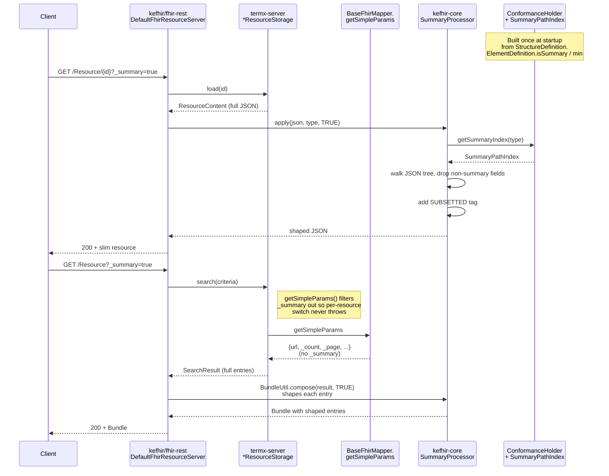

# FHIR `_summary` Parameter Support

**Feature:** Full FHIR R5 `_summary` parameter handling (`true`, `text`, `data`, `false`, `count`) on `read`, `vread`, and `search`
**Spans:** [`com.kodality.kefhir`](https://github.com/termx-health/kefhir) (framework) + termx-server (search-mapper unblock fix)
**Introduced:** [kefhir#3](https://github.com/termx-health/kefhir/pull/3) + [kefhir#5](https://github.com/termx-health/kefhir/pull/5) + [termx-server#94](https://github.com/termx-health/termx-server/pull/94) + [termx-server#95](https://github.com/termx-health/termx-server/pull/95) — landed 2026-04-30

---

## 1. Description

The FHIR `_summary` parameter lets a client ask the server for a **slimmed-down representation** of a resource, dropping the parts they don't need on a given screen. Clients use it to:

- Render lists fast without paying for `concept` arrays of millions of codes.
- Show terminology metadata (publisher, version, status) before deciding to fetch the full body.
- Pull human-readable narrative without the structured payload (`?_summary=text`).

Before this feature, TermX only handled `?_summary=count` (a count-only Bundle returned by the kefhir framework). Any other `_summary` value triggered a `500 OperationOutcome "Search by '_summary' not supported"` from the per-resource search mappers, and `read` calls silently returned the full body. After this feature:

- All five FHIR R5 modes are honoured (`true`, `text`, `data`, `false`, `count`).
- Behaviour is uniform across `read`, `vread`, `search`, `searchCompartment`.
- Response shaping is driven by the bundled `StructureDefinition`s — every resource type whose SD is loaded into `ConformanceHolder` gets the feature for free, no per-resource code.
- The `Meta.tag` `SUBSETTED` security tag is added automatically for `true` and `text`, per spec.

The accompanying termx-server fix also stops mappers throwing `Search by '<key>' not supported` on any FHIR-standard result modifier (`_summary`, `_elements`, `_sort`, `_include`, `_revinclude`, `_contained`, `_containedType`, `_pretty`, `_format`), which previously blocked tx-router-style upstream-discovery probes.

## 2. Configuration

No configuration — the feature is always on. The summary path index is built once at startup from `ConformanceHolder.getDefinitions()` (the bundled FHIR R5 `StructureDefinition` snapshots under `*/src/main/resources/conformance/StructureDefinition-*.json`).

To remove a resource type from `_summary` semantics, drop or replace its `StructureDefinition-*.json` (the processor falls back to "return unchanged" when no index entry exists for the requested resource type).

## 3. Use-Cases

### Scenario 1 — UI list of CodeSystems

A web UI renders 50 CodeSystems per page with publisher / status / counts. Without `_summary` it pays for the full `concept` array of every CodeSystem. With `?_summary=true` it gets:

- Metadata only: `url`, `name`, `title`, `status`, `publisher`, `count`, `content`, `caseSensitive`, `date`, `version`, `identifier`, `contact`, `useContext`, `jurisdiction`.
- `concept`, `filter`, `property`, `text` are **stripped**.
- `meta.tag` carries `SUBSETTED`.

A second request without `_summary` (or with `?_summary=false`) gets the full body when the user opens an item.

### Scenario 2 — Terminology router upstream discovery

`tx-router` (terminology-explorer) calls `GET /ValueSet?url=…&_count=1&_summary=false` against each candidate upstream to find which one owns a canonical URL. The `_summary=false` is intentional: it forces upstreams that strip `compose` from search bundles by default (e.g., tehik) to return the full body, so the orchestrator's downstream "is compose empty?" check is accurate. Before this feature the whole probe 500'd on TermX. After the fix, the probe succeeds and the router proceeds to expand.

### Scenario 3 — Narrative-only render

`?_summary=text` returns `id`, `meta`, `text`, plus mandatory elements (`status`, `content` for CodeSystem). Useful when the consumer already has the data and only wants the human-readable narrative. SUBSETTED tag is added.

### Scenario 4 — Drop narrative, keep data (`?_summary=data`)

A consumer has a renderer that builds its own narrative; sending `?_summary=data` skips the server's `text` element while preserving everything structural. No SUBSETTED tag (per spec — the resource is still semantically complete).

### Scenario 5 — Count-only search (`?_summary=count`)

Unchanged from prior behaviour. Returns a `Bundle` with `total` set and `entry` empty. Handled at the kefhir framework level before the storage is touched.

## 4. API

`_summary` is a query-string parameter on `read`, `vread`, `search`, and `searchCompartment` operations:

| Method | Path | Behaviour with `_summary` |
|--------|------|---------------------------|
| GET | `/api/fhir/<Resource>/<id>` | Single-resource shape transformation. |
| GET | `/api/fhir/<Resource>/<id>/_history/<vid>` | Same shape transformation as read. |
| GET | `/api/fhir/<Resource>?...` | Each entry's resource is shaped before bundle composition. |
| GET | `/api/fhir/<Compartment>/<id>/<Resource>?...` | Compartment search; same as search. |

`_summary` is **not** applied to FHIR operations (e.g. `$expand`, `$lookup`, `$validate-code`) — operations specify their own response shape per the FHIR spec.

### Mode semantics

| Value      | Effect                                                                                                                  | `SUBSETTED` tag |
|------------|-------------------------------------------------------------------------------------------------------------------------|-----------------|
| `true`     | Keep elements with `isSummary=true` plus mandatory ones. Heavy collections (`CodeSystem.concept`, `ValueSet.compose` / `expansion`, `ConceptMap.group.element`) are dropped. | yes |
| `text`     | Keep `id`, `meta`, `text`, plus mandatory elements only.                                                                | yes |
| `data`     | Drop only the root narrative (`<ResourceType>.text`). All structural data preserved.                                    | no  |
| `false`    | Pass through unchanged (default if `_summary` absent).                                                                  | no  |
| `count`    | Bundle with `total` set, `entry` empty. Handled by kefhir before the storage runs.                                      | n/a |

Always-kept fields regardless of mode: `id`, `meta`, `extension`, `modifierExtension`, `resourceType`. The walker never tests these against the keep set.

The accompanying mapper fix means search no longer rejects standard FHIR result modifiers, so e.g. `?_sort=name`, `?_elements=name,status`, `?_include=ValueSet:reference` are all accepted on search (their semantic application is a separate matter — `_sort` and `_elements` are framework-level concerns this PR doesn't yet implement).

## 5. Testing

### Quick smoke checks against `dev.termx.org`

```bash
# _summary=true on CodeSystem — concept/text/description gone, SUBSETTED present
curl -s 'https://dev.termx.org/api/fhir/CodeSystem/administrative-gender--6.0.0?_summary=true' \
  | jq 'has("concept"), has("text"), has("description"), .meta.tag'
# expect: false / false / false / [{system: ".../v3-ObservationValue", code: "SUBSETTED"}]

# _summary=text on CodeSystem — narrative + mandatory only
curl -s 'https://dev.termx.org/api/fhir/CodeSystem/administrative-gender--6.0.0?_summary=text' \
  | jq 'has("concept"), has("text"), .meta.tag'
# expect: false / true / SUBSETTED present

# _summary=true on ValueSet — compose, expansion, text gone
curl -s 'https://dev.termx.org/api/fhir/ValueSet/administrative-gender--6.0.0?_summary=true' \
  | jq 'has("compose"), has("expansion"), has("text"), .meta.tag'
# expect: false / false / false / SUBSETTED present

# _summary=data — text gone, structure preserved
curl -s 'https://dev.termx.org/api/fhir/ValueSet/administrative-gender--6.0.0?_summary=data' \
  | jq 'has("text"), has("compose")'
# expect: false / true

# _summary=false — full body
curl -s 'https://dev.termx.org/api/fhir/ValueSet/administrative-gender--6.0.0?_summary=false' \
  | jq 'has("compose"), has("text")'
# expect: true / true

# _summary=count — count-only Bundle (kefhir framework, unchanged)
curl -s 'https://dev.termx.org/api/fhir/ValueSet?_summary=count' \
  | jq '.total, (.entry // [])'
# expect: integer / empty array

# Mapper unblock probe (was 500 before)
curl -is 'https://dev.termx.org/api/fhir/ValueSet?url=https://termx.org/fhir/ValueSet/publisher&_count=1&_summary=false' \
  | head -1
# expect: HTTP/1.1 200 OK
```

### Unit tests

| Test | Module | Covers |
|------|--------|--------|
| `SummaryProcessorTest` | `kefhir-core` | All four modes, `SUBSETTED` tag, choice-type (`value[x]`) path matching, missing-index fallback, idempotent SUBSETTED. |
| `BaseFhirMapperSpec` | `termx-core` | `getSimpleParams` filters `_summary` / `_elements` / `_sort` / `_include` / `_revinclude` / `_contained` / `_containedType` / `_pretty` / `_format`; preserves `_count`, `_page`, and arbitrary search params. |

## 6. Architecture



### Module dependencies

- **`kefhir-core`** owns `SummaryPathIndex`, `SummaryProcessor`, and the `ConformanceHolder` extension. Depends only on the HAPI R5 model (already loaded for conformance).
- **`fhir-rest`** wires `SummaryProcessor` into `DefaultFhirResourceServer.read` / `vread` / `search` / `searchCompartment` and adds a `BundleUtil.compose(SearchResult, Mode)` overload.
- **`termx-server/termx-core`** owns the unblock fix in `BaseFhirMapper.getSimpleParams` — independent of the kefhir change but required because the storage mappers run on every search.
- **Consumers** (`terminology`, `modeler`, etc.) inherit both fixes for free; no resource-storage code changed.

## 7. Technical Implementation

### Source files

| File | Module | Description |
|------|--------|-------------|
| [`SummaryPathIndex.java`](https://github.com/termx-health/kefhir/blob/master/kefhir-core/src/main/java/com/kodality/kefhir/core/service/conformance/SummaryPathIndex.java) | kefhir-core | Per-resource sets of element paths classified as summary / mandatory / text. Built from `ElementDefinition.isSummary` and `min`. **No ancestor closure** — see "Subtleties" below. |
| [`ConformanceHolder.java`](https://github.com/termx-health/kefhir/blob/master/kefhir-core/src/main/java/com/kodality/kefhir/core/service/conformance/ConformanceHolder.java) | kefhir-core | Builds and caches `SummaryPathIndex` per resource type inside `setStructureDefinitions`. Exposes `getSummaryIndex(resourceType)`. |
| [`SummaryProcessor.java`](https://github.com/termx-health/kefhir/blob/master/kefhir-core/src/main/java/com/kodality/kefhir/core/util/SummaryProcessor.java) | kefhir-core | The JSON-tree walker. Public API: `apply(json, type, mode)` and a test-friendly overload accepting an explicit index. |
| [`DefaultFhirResourceServer.java`](https://github.com/termx-health/kefhir/blob/master/fhir-rest/src/main/java/com/kodality/kefhir/rest/DefaultFhirResourceServer.java) | fhir-rest | Reads `_summary` from the request and applies the processor on `read`, `vread`, `search`, `searchCompartment`. |
| [`BundleUtil.java`](https://github.com/termx-health/kefhir/blob/master/fhir-rest/src/main/java/com/kodality/kefhir/rest/util/BundleUtil.java) | fhir-rest | New `compose(SearchResult, SummaryProcessor.Mode)` overload that processes each entry's JSON before parsing into the model. |
| [`BaseFhirMapper.java`](https://github.com/termx-health/termx-server/blob/main/termx-core/src/main/java/org/termx/core/fhir/BaseFhirMapper.java) | termx-server/termx-core | `getSimpleParams` filters `NON_FILTER_PARAM_KEYS` (the FHIR result modifiers + ignore params) before the per-resource switches see them. |

### Key components

- **`SummaryPathIndex.from(StructureDefinition)`** walks `snapshot.element` once, collecting:
  - `summaryPaths`: element paths with `isSummary=true`. Literal paths only — no ancestor closure.
  - `mandatoryPaths`: element paths with `min > 0`.
  - `textPaths`: `<ResourceType>.id`, `.meta`, `.text`, plus all mandatory paths.
- **`SummaryProcessor.apply`** walks the resource as a Jackson `JsonNode` tree, computing a canonical FHIR path per visited node (`<ResourceType>.<a>.<b>...`, ignoring array indices). For each field:
  - If the field name is in `ALWAYS_KEEP_FIELDS` (`id`, `meta`, `extension`, `modifierExtension`, `resourceType`), keep regardless of mode.
  - Otherwise, decide via `shouldKeep(path, choicePath, index, mode)` against the index; drop the field if not kept.
  - For choice-type fields (e.g. `valueString`), check both the literal path and the `<prefix>[x]` form.
- **`addSubsettedTag`** appends `{system: ".../v3-ObservationValue", code: "SUBSETTED"}` to `meta.tag` for `TRUE` and `TEXT` modes, idempotently.

### Subtleties

- **No ancestor closure on the keep set.** The first cut closed the summary set under ancestry (if `A.b.c` is summary, also keep `A.b` and `A`). FHIR R5 marks `modifierExtension` as `isSummary=true` on **every** element by spec — so closure dragged every parent (`CodeSystem.concept`, `ValueSet.compose`, etc.) into the summary set via their `modifierExtension` descendants, defeating the entire purpose of `_summary=true`. The fix in [kefhir#5](https://github.com/termx-health/kefhir/pull/5) is to keep elements iff their **own** path matches; the walker still descends naturally into kept parents.
- **Operation responses are exempt.** `$expand`, `$lookup`, `$validate-code`, etc. specify their own response shape and are not subject to `_summary` (kefhir doesn't apply the processor in `instanceOperation` / `typeOperation`).
- **Robustness over correctness.** `SummaryProcessor.apply` returns the input unchanged on parse failure or missing index — better an oversized response than a 500. Logged at `WARN`.
- **Performance.** One additional Jackson parse + serialize per entry for non-`FALSE` modes. Acceptable since `_summary` is an explicit client opt-in.

### Pull requests (chronological)

| PR | Repo | Description |
|----|------|-------------|
| [kefhir#3](https://github.com/termx-health/kefhir/pull/3) | kefhir | Add `_summary=true|text|data` framework support. |
| [kefhir#4](https://github.com/termx-health/kefhir/pull/4) | kefhir | Bump version to `R5.5.2` so CI can publish (R5.5.1 immutable on GitHub Packages). |
| [termx-server#94](https://github.com/termx-health/termx-server/pull/94) | termx-server | Stop rejecting standard FHIR result params in search mappers; bump `kefhirVersion=R5.5.2`. |
| [kefhir#5](https://github.com/termx-health/kefhir/pull/5) | kefhir | Drop ancestor closure in `SummaryPathIndex` (the `modifierExtension` bug); bump to `R5.6`. |
| [termx-server#95](https://github.com/termx-health/termx-server/pull/95) | termx-server | Bump `kefhirVersion=R5.6` to consume the closure fix. |
