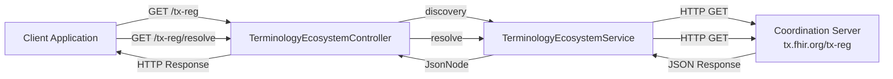
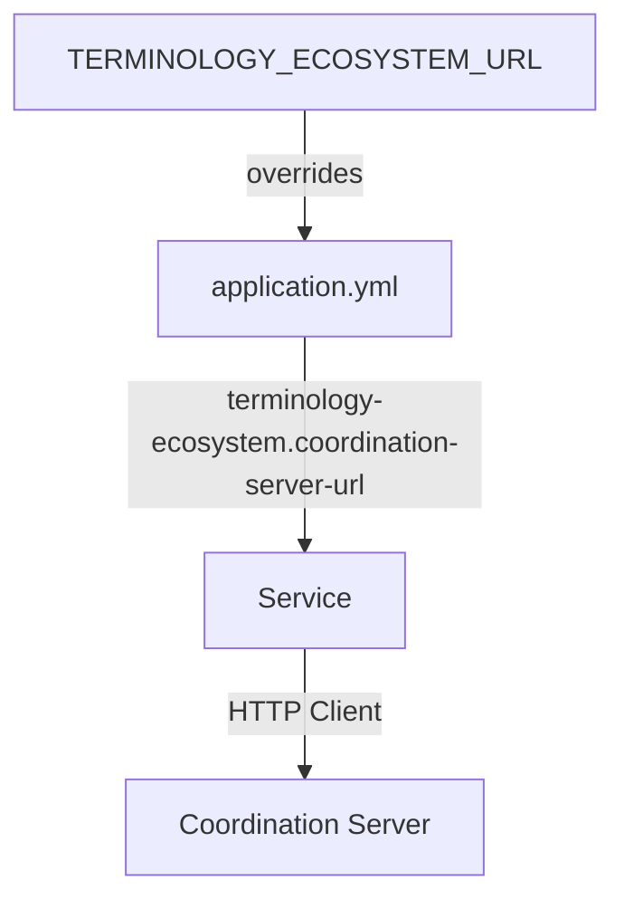
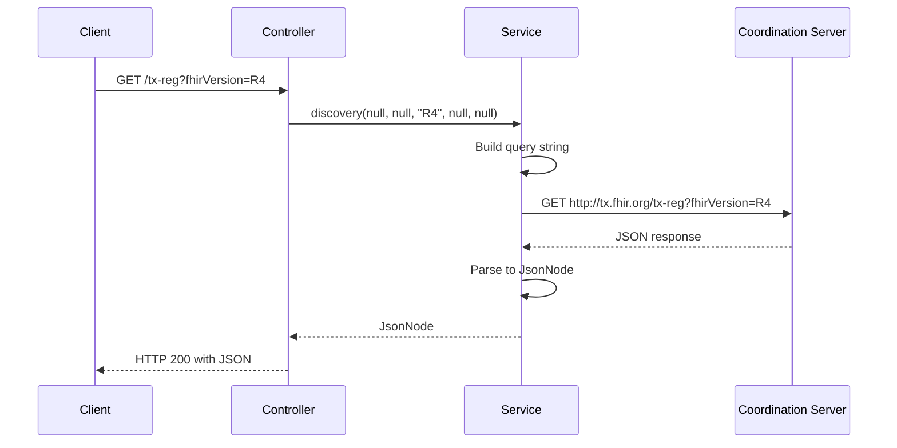
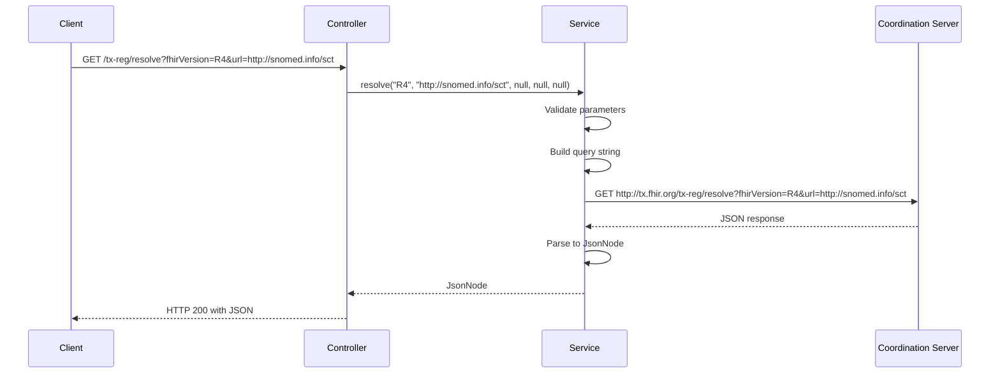
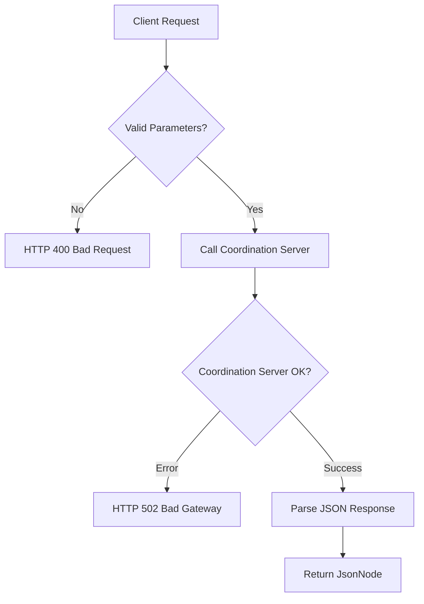

# FHIR Terminology Ecosystem API

## Description

The FHIR Terminology Ecosystem API enables TermX to integrate with the [FHIR Terminology Ecosystem](https://build.fhir.org/ig/HL7/fhir-tx-ecosystem-ig/ecosystem.html) specification defined by HL7. This feature allows clients to discover available terminology servers and resolve which server should be used for specific CodeSystems or ValueSets.

**Key capabilities:**

- **Discovery**: Query and list all registered terminology servers in the ecosystem with filtering capabilities
- **Resolution**: Find the appropriate authoritative server for a given CodeSystem or ValueSet
- **File Download**: Export server registry information as JSON files for offline use or integration
- **Standards Compliance**: Fully compliant with the HL7 FHIR Terminology Ecosystem IG specification
- **Public Access**: Endpoints are publicly accessible without authentication, mirroring the behavior of tx.fhir.org

**What problem does it solve?**

In distributed terminology ecosystems, multiple servers host different code systems (e.g., SNOMED CT, LOINC, ICD-10). Clients need a standardized way to:

1. Discover which servers are available and what they host
2. Determine which server is authoritative for a specific terminology
3. Route terminology operations (validation, expansion, translation) to the correct server

This feature provides a coordination API that acts as a proxy to the HL7 ecosystem coordination server (tx.fhir.org/tx-reg), allowing TermX instances to participate in or provide their own terminology ecosystem.

**Who uses this feature?**

- IG (Implementation Guide) publishers needing to validate against multiple terminology servers
- Terminology management tools requiring discovery of available servers
- Clinical systems integrating with distributed terminology infrastructure
- DevOps teams managing terminology server deployments and configurations

## Configuration

### Properties

| Property | Env variable | Default | Description |
|----------|-------------|---------|-------------|
| `terminology-ecosystem.coordination-server-url` | `TERMINOLOGY_ECOSYSTEM_URL` | `http://tx.fhir.org/tx-reg` | Base URL of the FHIR Terminology Ecosystem coordination server |

### Enabling the Feature

The feature is enabled by default and requires no additional configuration. The API endpoints are automatically registered at application startup.

**Default configuration (application.yml):**

```yaml
terminology-ecosystem:
  coordination-server-url: ${TERMINOLOGY_ECOSYSTEM_URL:http://tx.fhir.org/tx-reg}

auth:
  public:
    endpoints:
      - '/tx-reg'  # Public access (no authentication required)
```

**Using a custom coordination server:**

Set the environment variable to point to your own coordination server:

```bash
export TERMINOLOGY_ECOSYSTEM_URL=https://custom.coordination.server/tx-reg
./gradlew :termx-app:run
```

Or override in `application.yml`:

```yaml
terminology-ecosystem:
  coordination-server-url: https://custom.coordination.server/tx-reg
```

## Use-Cases

### Scenario 1: Discover All Available Terminology Servers

**Context:** A developer wants to see what terminology servers are registered in the ecosystem and what code systems they support.

**Steps:**

1. Client makes a GET request to the discovery endpoint
2. TermX proxies the request to the coordination server
3. Client receives a JSON response with the list of servers, their capabilities, and authoritative code systems

**Example:**

```bash
curl https://dev.termx.org/tx-reg | jq
```

**Response (simplified):**

```json
{
  "last-update": "2026-03-10T12:00:00Z",
  "master-url": "https://fhir.github.io/ig-registry/tx-servers.json",
  "results": [
    {
      "server-name": "HL7 Terminology Server",
      "server-code": "tx.fhir.org",
      "url": "http://tx.fhir.org/r4",
      "fhirVersion": "4.0.1",
      "systems": 150,
      "authoritative": [
        "http://terminology.hl7.org/CodeSystem/*",
        "http://hl7.org/fhir/*"
      ],
      "open": true
    },
    {
      "server-name": "SNOMED International",
      "server-code": "snowstorm.snomed.org",
      "url": "https://snowstorm.snomed.org/fhir",
      "fhirVersion": "4.0.1",
      "authoritative": [
        "http://snomed.info/sct|http://snomed.info/sct/900000000000207008"
      ],
      "open": true
    }
  ]
}
```

**Outcome:** Developer can identify available servers, their endpoints, and what terminologies they host.

### Scenario 2: Find the Authoritative Server for a CodeSystem

**Context:** An IG publisher needs to validate codes from SNOMED CT and wants to route requests to the authoritative SNOMED server.

**Steps:**

1. Client queries the resolve endpoint with the SNOMED CT CodeSystem URL
2. TermX queries the coordination server for authoritative servers
3. Client receives server recommendations with authoritative and candidate servers

**Example:**

```bash
curl "https://dev.termx.org/tx-reg/resolve?fhirVersion=R4&url=http://snomed.info/sct" | jq
```

**Response (simplified):**

```json
{
  "formatVersion": "1",
  "registry-url": "https://fhir.github.io/ig-registry/tx-servers.json",
  "authoritative": [
    {
      "server-name": "SNOMED International",
      "url": "https://snowstorm.snomed.org/fhir",
      "fhirVersion": "4.0.1",
      "open": true
    }
  ],
  "candidate": []
}
```

**Outcome:** IG publisher routes all SNOMED CT validation requests to `snowstorm.snomed.org`.

### Scenario 3: Filter Servers by FHIR Version

**Context:** A FHIR R5 application needs to find terminology servers that support R5.

**Steps:**

1. Client queries discovery with `fhirVersion=R5` filter
2. Only servers supporting FHIR R5 are returned

**Example:**

```bash
curl "https://dev.termx.org/tx-reg?fhirVersion=R5" | jq
```

**Outcome:** Application receives only R5-compatible servers, avoiding version incompatibility issues.

### Scenario 4: Download Server Registry for Offline Use

**Context:** A DevOps team wants to document all available terminology servers for their architecture documentation.

**Steps:**

1. Client requests the discovery endpoint with `download=true`
2. Browser downloads a `tx-servers.json` file
3. Team includes the file in their documentation

**Example:**

```bash
# Download via browser
https://dev.termx.org/tx-reg?download=true

# Or via curl
curl "https://dev.termx.org/tx-reg?download=true" -o tx-servers.json
```

**Outcome:** Team has a snapshot of the ecosystem configuration for documentation and reference.

### Scenario 5: Find Servers Hosting a Specific ValueSet

**Context:** A clinical application needs to expand a ValueSet and wants to find which server hosts it.

**Steps:**

1. Client queries resolve with `valueSet` parameter
2. Coordination server identifies authoritative servers
3. Client receives server recommendations

**Example:**

```bash
curl "https://dev.termx.org/tx-reg/resolve?fhirVersion=R4&valueSet=http://hl7.org/fhir/ValueSet/administrative-gender" | jq
```

**Outcome:** Application routes ValueSet expansion requests to the recommended server.

## API

All endpoints are publicly accessible (no authentication required) and are based at `/tx-reg`.

### Discovery Endpoint

Lists all registered terminology servers in the ecosystem with optional filtering.

| Method | Path | Auth | Description |
|--------|------|------|-------------|
| GET | `/tx-reg` | Public | Query terminology servers with optional filters |

**Query Parameters:**

| Parameter | Type | Required | Description |
|-----------|------|----------|-------------|
| `registry` | String | No | Filter by registry code |
| `server` | String | No | Filter by server code |
| `fhirVersion` | String | No | Filter by FHIR version (R3, R4, R4B, R5, R6) |
| `url` | String | No | Filter servers that support a specific CodeSystem URL |
| `authoritativeOnly` | Boolean | No | Return only authoritative servers (default: false) |
| `download` | Boolean | No | Return as downloadable file (default: false) |

**Example Requests:**

```bash
# List all servers
curl https://dev.termx.org/tx-reg

# List only R4 servers
curl https://dev.termx.org/tx-reg?fhirVersion=R4

# Find servers hosting SNOMED CT
curl "https://dev.termx.org/tx-reg?url=http://snomed.info/sct"

# Find authoritative servers for LOINC
curl "https://dev.termx.org/tx-reg?url=http://loinc.org&authoritativeOnly=true"

# Download server list
curl "https://dev.termx.org/tx-reg?download=true" -o servers.json
```

**Response Format:**

```json
{
  "last-update": "2026-03-10T12:00:00Z",
  "master-url": "https://fhir.github.io/ig-registry/tx-servers.json",
  "results": [
    {
      "server-name": "Human readable name",
      "server-code": "unique-code",
      "registry-name": "Registry Name",
      "registry-code": "registry-code",
      "url": "http://server/endpoint",
      "fhirVersion": "4.0.1",
      "error": null,
      "last-success": 123456,
      "systems": 150,
      "authoritative": [
        "http://example.org/CodeSystem/*"
      ],
      "authoritative-valuesets": [
        "http://example.org/ValueSet/*"
      ],
      "candidate": [],
      "open": true,
      "password": true
    }
  ]
}
```

### Resolution Endpoint

Recommends which server to use for a specific CodeSystem or ValueSet.

| Method | Path | Auth | Description |
|--------|------|------|-------------|
| GET | `/tx-reg/resolve` | Public | Resolve authoritative server for CodeSystem or ValueSet |

**Query Parameters:**

| Parameter | Type | Required | Description |
|-----------|------|----------|-------------|
| `fhirVersion` | String | **Yes** | FHIR version (R3, R4, R4B, R5, R6) |
| `url` | String | One required | CodeSystem canonical URL (url or url\|version) |
| `valueSet` | String | One required | ValueSet canonical URL (url or url\|version) |
| `authoritativeOnly` | Boolean | No | Return only authoritative servers (default: false) |
| `usage` | String | No | Usage token (publication, validation, code-generation) |
| `download` | Boolean | No | Return as downloadable file (default: false) |

**Example Requests:**

```bash
# Find server for SNOMED CT
curl "https://dev.termx.org/tx-reg/resolve?fhirVersion=R4&url=http://snomed.info/sct"

# Find server for specific SNOMED version
curl "https://dev.termx.org/tx-reg/resolve?fhirVersion=R4&url=http://snomed.info/sct|http://snomed.info/sct/900000000000207008/version/20230901"

# Find server for ValueSet
curl "https://dev.termx.org/tx-reg/resolve?fhirVersion=R4&valueSet=http://hl7.org/fhir/ValueSet/administrative-gender"

# Find authoritative server only
curl "https://dev.termx.org/tx-reg/resolve?fhirVersion=R4&url=http://loinc.org&authoritativeOnly=true"

# Download resolution result
curl "https://dev.termx.org/tx-reg/resolve?fhirVersion=R4&url=http://snomed.info/sct&download=true" -o resolution.json
```

**Response Format:**

```json
{
  "formatVersion": "1",
  "registry-url": "https://fhir.github.io/ig-registry/tx-servers.json",
  "authoritative": [
    {
      "server-name": "SNOMED International",
      "url": "https://snowstorm.snomed.org/fhir",
      "fhirVersion": "4.0.1",
      "open": true,
      "access_info": "Publicly accessible"
    }
  ],
  "candidate": [
    {
      "server-name": "HL7 Terminology Server",
      "url": "http://tx.fhir.org/r4",
      "fhirVersion": "4.0.1",
      "open": true,
      "content": "complete"
    }
  ]
}
```

## Web UI

A web-based user interface is available for exploring the FHIR Terminology Ecosystem API.

### Accessing the UI

Navigate to:
```
https://dev.termx.org/tx-ecosystem/
```

Or locally:
```
http://localhost:8200/tx-ecosystem/
```

### Features

**Discovery Tab:**
- Filter servers by FHIR version, registry, server code, or CodeSystem URL
- Toggle to show only authoritative servers
- View comprehensive server information in a table
- Download results as JSON file

**Resolution Tab:**
- Find authoritative servers for specific CodeSystems or ValueSets
- Select FHIR version and usage type (publication, validation, code-generation)
- See both authoritative and candidate servers
- Download resolution results as JSON file

**UI Components:**
- 🔍 **Smart Filtering**: Real-time server discovery with multiple filter options
- 📊 **Data Tables**: Clean presentation of server information
- ⬇️ **Download**: Export results for offline use or integration
- 🎨 **Modern Design**: Responsive, gradient UI that works on all devices
- ✅ **Validation**: Client-side validation for required fields

### Screenshots

**Discovery View:**
- Lists all terminology servers in the ecosystem
- Shows server name, code, URL, FHIR version, number of systems
- Displays access methods (Open, OAuth, Token, etc.)
- Lists authoritative CodeSystems for each server

**Resolution View:**
- Recommends authoritative servers for specific terminologies
- Separates authoritative and candidate servers
- Shows content level for candidate servers (complete, fragment, etc.)
- Direct links to server endpoints

### Configuration

The UI is served as a static resource and requires no additional configuration.

**Static Resource Mapping** (in `application.yml`):
```yaml
micronaut:
  router:
    static-resources:
      tx-ecosystem:
        paths: classpath:static/tx-ecosystem
        mapping: /tx-ecosystem/**

auth:
  public:
    endpoints:
      - '/tx-ecosystem'  # Public access
```

### Technical Details

- **Framework**: Pure HTML/CSS/JavaScript (no dependencies)
- **API Calls**: Fetch API with async/await
- **Styling**: Modern CSS with gradients and responsive design
- **Accessibility**: Semantic HTML, keyboard navigation support
- **Browser Support**: All modern browsers (Chrome, Firefox, Safari, Edge)

## Testing

### Automated Tests

Integration tests are available in `termx-integtest/src/test/groovy/org/termx/core/TerminologyEcosystemTest.groovy`.

**Run all ecosystem tests:**

```bash
./gradlew :termx-integtest:test --tests "TerminologyEcosystemTest"
```

**Note:** Integration tests require Docker (Testcontainers) to run the embedded PostgreSQL database.

**Test coverage includes:**

- ✅ Discovery endpoint accessibility and response format
- ✅ All query parameter filters (fhirVersion, server, registry, url, authoritativeOnly)
- ✅ Resolution endpoint with validation
- ✅ Required parameter validation (400 errors)
- ✅ File download functionality (Content-Disposition headers)
- ✅ Content-Type headers (application/json)
- ✅ Public access (no authentication required)
- ✅ Error handling (502 when coordination server unavailable)
- ✅ URL encoding in parameters
- ✅ All FHIR versions (R3, R4, R4B, R5, R6)
- ✅ Usage tokens (publication, validation, code-generation)
- ✅ Response structure validation

### Quick Start

Test the discovery endpoint:

```bash
# Basic discovery
curl https://dev.termx.org/tx-reg | jq

# Check response structure
curl https://dev.termx.org/tx-reg | jq '.results[0] | keys'

# Verify server list is not empty
curl https://dev.termx.org/tx-reg | jq '.results | length'
```

Test the resolution endpoint:

```bash
# Resolve SNOMED CT
curl "https://dev.termx.org/tx-reg/resolve?fhirVersion=R4&url=http://snomed.info/sct" | jq

# Verify authoritative server is returned
curl "https://dev.termx.org/tx-reg/resolve?fhirVersion=R4&url=http://snomed.info/sct" | jq '.authoritative | length'

# Test error handling (missing required parameter)
curl "https://dev.termx.org/tx-reg/resolve?url=http://snomed.info/sct"
# Expected: HTTP 400 with error about missing fhirVersion
```

### Test Filtering

Test various filter combinations:

```bash
# Filter by FHIR version
curl "https://dev.termx.org/tx-reg?fhirVersion=R4" | jq '.results[].fhirVersion' | sort -u

# Filter by CodeSystem URL
curl "https://dev.termx.org/tx-reg?url=http://snomed.info/sct" | jq '.results[].authoritative[]' | grep snomed

# Filter for authoritative only
curl "https://dev.termx.org/tx-reg?url=http://loinc.org&authoritativeOnly=true" | jq '.results | length'
```

### Test Download Functionality

Verify file download headers:

```bash
# Check Content-Disposition header
curl -I "https://dev.termx.org/tx-reg?download=true" | grep -i content-disposition
# Expected: Content-Disposition: attachment; filename="tx-servers.json"

# Download and verify JSON is valid
curl "https://dev.termx.org/tx-reg?download=true" -o test-download.json
jq empty test-download.json && echo "Valid JSON"

# Test resolution download
curl "https://dev.termx.org/tx-reg/resolve?fhirVersion=R4&url=http://snomed.info/sct&download=true" -o test-resolve.json
jq empty test-resolve.json && echo "Valid JSON"
```

### Test Error Handling

Verify error responses:

```bash
# Missing required parameter (fhirVersion)
curl -w "\nHTTP Status: %{http_code}\n" "https://dev.termx.org/tx-reg/resolve?url=http://snomed.info/sct"
# Expected: HTTP 400

# Missing both url and valueSet
curl -w "\nHTTP Status: %{http_code}\n" "https://dev.termx.org/tx-reg/resolve?fhirVersion=R4"
# Expected: HTTP 400

# Invalid coordination server (test with misconfigured server)
# Expected: HTTP 502 Bad Gateway
```

### Integration Testing

Test integration with actual FHIR operations:

```bash
# 1. Discover servers
SERVERS=$(curl -s "https://dev.termx.org/tx-reg?url=http://snomed.info/sct")
echo $SERVERS | jq

# 2. Resolve authoritative server
RESOLVE=$(curl -s "https://dev.termx.org/tx-reg/resolve?fhirVersion=R4&url=http://snomed.info/sct")
SERVER_URL=$(echo $RESOLVE | jq -r '.authoritative[0].url')
echo "Authoritative server: $SERVER_URL"

# 3. Use the server for actual terminology operation
curl "$SERVER_URL/CodeSystem/\$lookup?system=http://snomed.info/sct&code=38341003"
```

## Data Model

### Discovery Response

The discovery response is returned directly from the coordination server without transformation.

**Root Object:**

| Field | Type | Description |
|-------|------|-------------|
| `last-update` | String (ISO 8601) | Last time registries were scanned |
| `master-url` | String (URL) | Master registry URL |
| `results` | Array of Server | List of discovered servers |

**Server Object:**

| Field | Type | Description |
|-------|------|-------------|
| `server-name` | String | Human readable server name |
| `server-code` | String | Unique persistent server identifier |
| `registry-name` | String | Name of the registry this server belongs to |
| `registry-code` | String | Persistent registry identifier |
| `registry-url` | String (URL) | Registry definition URL |
| `url` | String (URL) | FHIR endpoint URL |
| `fhirVersion` | String | FHIR version (semver, e.g., "4.0.1") |
| `error` | String or null | Error from last scan, null if successful |
| `last-success` | Integer | Milliseconds since last successful scan |
| `systems` | Integer | Number of CodeSystems on the server |
| `authoritative` | Array of String | Canonical URLs of authoritative CodeSystems |
| `authoritative-valuesets` | Array of String | Canonical URLs of authoritative ValueSets |
| `candidate` | Array of String | Canonical URLs of candidate CodeSystems |
| `candidate-valuesets` | Array of String | Canonical URLs of candidate ValueSets |
| `open` | Boolean | True if server supports unauthenticated access |
| `password`, `token`, `oauth`, `smart`, `cert` | Boolean | Supported authentication methods |

### Resolution Response

The resolution response recommends servers for a specific CodeSystem or ValueSet.

**Root Object:**

| Field | Type | Description |
|-------|------|-------------|
| `formatVersion` | String | Response format version (currently "1") |
| `registry-url` | String (URL) | Master registry URL |
| `authoritative` | Array of ResolvedServer | Authoritative servers |
| `candidate` | Array of ResolvedServer | Candidate servers |

**ResolvedServer Object:**

| Field | Type | Description |
|-------|------|-------------|
| `server-name` | String | Human readable server name |
| `url` | String (URL) | FHIR endpoint URL |
| `fhirVersion` | String | FHIR version (semver) |
| `open`, `password`, `token`, `oauth`, `smart`, `cert` | Boolean | Supported authentication methods |
| `access_info` | String | Description of how to access (if not open) |
| `content` | String | Content level for candidates (not-present, example, fragment, complete, supplement) |

### Example Payloads

**Discovery Request:**

```http
GET /tx-reg?fhirVersion=R4&url=http://snomed.info/sct HTTP/1.1
Host: dev.termx.org
Accept: application/json
```

**Discovery Response:**

```json
{
  "last-update": "2026-03-10T12:00:00Z",
  "master-url": "https://fhir.github.io/ig-registry/tx-servers.json",
  "results": [
    {
      "server-name": "SNOMED International",
      "server-code": "snowstorm.snomed.org",
      "registry-name": "HL7 FHIR Terminology Registry",
      "registry-code": "hl7-main",
      "registry-url": "https://fhir.github.io/ig-registry/tx-servers.json",
      "url": "https://snowstorm.snomed.org/fhir",
      "fhirVersion": "4.0.1",
      "error": null,
      "last-success": 15000,
      "systems": 1,
      "authoritative": [
        "http://snomed.info/sct|http://snomed.info/sct/900000000000207008"
      ],
      "authoritative-valuesets": [],
      "candidate": [],
      "candidate-valuesets": [],
      "open": true
    }
  ]
}
```

**Resolution Request:**

```http
GET /tx-reg/resolve?fhirVersion=R4&url=http://snomed.info/sct HTTP/1.1
Host: dev.termx.org
Accept: application/json
```

**Resolution Response:**

```json
{
  "formatVersion": "1",
  "registry-url": "https://fhir.github.io/ig-registry/tx-servers.json",
  "authoritative": [
    {
      "server-name": "SNOMED International",
      "url": "https://snowstorm.snomed.org/fhir",
      "fhirVersion": "4.0.1",
      "open": true
    }
  ],
  "candidate": []
}
```

## Architecture

The FHIR Terminology Ecosystem API acts as a transparent proxy to the HL7 coordination server.



### Component Responsibilities

**TerminologyEcosystemController:**
- Exposes public REST endpoints at `/tx-reg`
- Handles query parameter binding and validation
- Adds `Content-Disposition` header when `download=true`
- Returns JSON responses directly from the service

**TerminologyEcosystemService:**
- Manages HTTP client connection to coordination server
- Builds query strings from request parameters
- Executes HTTP GET requests to coordination server
- Handles connection errors and maps to HTTP 502
- Returns response as JsonNode (no transformation)

**HttpClient:**
- Reuses `com.kodality.commons.client.HttpClient`
- Executes HTTP requests with standard Java 11+ HTTP client
- No authentication required for coordination server

### Configuration Flow



### Request Flow

**Discovery Request:**



**Resolution Request:**



### Error Handling



## Technical Implementation

### Source Files

| File | Description |
|------|-------------|
| `termx-core/src/main/java/org/termx/core/sys/server/TerminologyEcosystemService.java` | Service layer: HTTP client for coordination server |
| `termx-core/src/main/java/org/termx/core/sys/server/TerminologyEcosystemController.java` | REST controller: `/tx-reg` endpoints |
| `termx-app/src/main/resources/application.yml` | Configuration: coordination server URL and public endpoints |

### Key Components

**TerminologyEcosystemService:**

```java
@Slf4j
@Singleton
public class TerminologyEcosystemService {
  private final HttpClient httpClient;
  private final String coordinationServerUrl;

  // Inject coordination server URL from configuration
  public TerminologyEcosystemService(
      @Value("${terminology-ecosystem.coordination-server-url:http://tx.fhir.org/tx-reg}") 
      String coordinationServerUrl) {
    this.coordinationServerUrl = coordinationServerUrl;
    this.httpClient = new HttpClient();
  }

  // Discovery: list servers with optional filters
  public JsonNode discovery(String registry, String server, String fhirVersion, 
                           String url, Boolean authoritativeOnly) {
    // Build query string and call coordination server
    // Return response as JsonNode (no transformation)
  }

  // Resolution: find authoritative server for CodeSystem/ValueSet
  public JsonNode resolve(String fhirVersion, String url, String valueSet, 
                         Boolean authoritativeOnly, String usage) {
    // Validate required parameters
    // Build query string and call coordination server
    // Return response as JsonNode (no transformation)
  }
}
```

**TerminologyEcosystemController:**

```java
@Controller("/tx-reg")
@RequiredArgsConstructor
public class TerminologyEcosystemController {
  private final TerminologyEcosystemService ecosystemService;

  // Discovery endpoint
  @Get(produces = MediaType.APPLICATION_JSON)
  public HttpResponse<JsonNode> discovery(
      @QueryValue Optional<String> registry,
      @QueryValue Optional<String> server,
      @QueryValue Optional<String> fhirVersion,
      @QueryValue Optional<String> url,
      @QueryValue Optional<Boolean> authoritativeOnly,
      @QueryValue Optional<Boolean> download) {
    
    JsonNode result = ecosystemService.discovery(...);
    MutableHttpResponse<JsonNode> response = HttpResponse.ok(result);
    
    // Add download headers if requested
    if (download.orElse(false)) {
      response.header(HttpHeaders.CONTENT_DISPOSITION, 
                     "attachment; filename=\"tx-servers.json\"");
    }
    
    return response;
  }

  // Resolution endpoint
  @Get(uri = "/resolve", produces = MediaType.APPLICATION_JSON)
  public HttpResponse<JsonNode> resolve(...) {
    // Similar structure with validation and download support
  }
}
```

### Authentication

The `/tx-reg` path is registered as a public endpoint in `application.yml`:

```yaml
auth:
  public:
    endpoints:
      - '/tx-reg'
```

This configuration is read by `AuthorizationFilter` which allows unauthenticated access to all `/tx-reg/*` paths.

### HTTP Client Usage

The service uses `com.kodality.commons.client.HttpClient` which wraps Java 11+ HTTP client:

```java
HttpRequest request = httpClient.builder(requestUrl).GET().build();
String response = httpClient.execute(request, BodyHandlers.ofString()).body();
return JsonUtil.fromJson(response, JsonNode.class);
```

### Error Handling

**Parameter Validation:**

- `fhirVersion` is required for resolve endpoint (HTTP 400 if missing)
- Either `url` or `valueSet` is required for resolve (HTTP 400 if both missing)

**Connection Errors:**

- If coordination server is unreachable, throw `HttpStatusException` with HTTP 502
- Log error with full details for troubleshooting

**Response Processing:**

- Response is returned as-is (JsonNode) without transformation
- Ensures full compliance with IG specification
- Avoids drift if coordination server API evolves

### Dependencies

No new dependencies are required. The feature uses existing libraries:

- `com.kodality.commons:commons-http-client` - HTTP client
- `com.kodality.commons:commons-util` - JSON utilities
- `io.micronaut:micronaut-http-server` - REST controller
- `com.fasterxml.jackson:jackson-databind` - JsonNode

### Integration Points

**AuthorizationFilter:**

The filter checks if the request path matches any public endpoint prefix. The `/tx-reg` prefix is configured as public, allowing unauthenticated access.

**OpenAPI Documentation:**

Micronaut OpenAPI automatically generates API documentation for the controller endpoints. The endpoints appear in the Swagger UI at `/swagger`.

### Configuration Priority

Configuration values are resolved in this order:

1. Environment variable `TERMINOLOGY_ECOSYSTEM_URL`
2. Configuration property `terminology-ecosystem.coordination-server-url`
3. Default value `http://tx.fhir.org/tx-reg`

This allows flexible deployment configuration without code changes.
