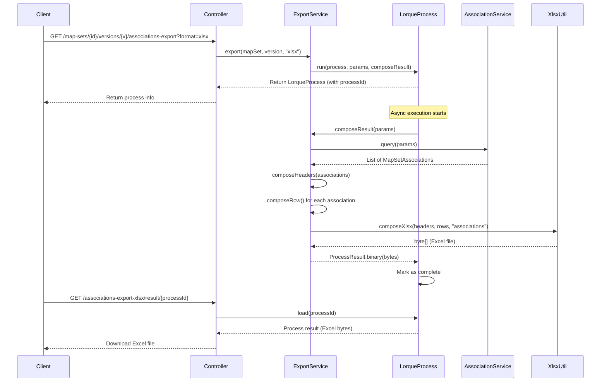

# Add MapSet Excel Export Functionality

## Overview

Implement Excel (XLSX) and CSV export for MapSet associations, following the established pattern used in ValueSetExportService and ConceptExportService. MapSets represent concept mappings between code systems, and the export will include source concepts, target concepts, relationships, and custom property values.

## Current Implementation Pattern

Both ValueSet and CodeSystem use the same export architecture:

1. **Export Service** - Contains business logic for composing headers and rows
2. **Async Processing** - Uses `LorqueProcessService` for background processing
3. **Controller Endpoints** - Three endpoints:
  - Initiate export: `/{resource}/versions/{version}/export{?params*}`
  - Download CSV: `/export-csv/result/{lorqueProcessId}`
  - Download XLSX: `/export-xlsx/result/{lorqueProcessId}`
4. **Performance Optimizations** - Streaming Excel generation, batch loading, single-pass header composition

## MapSet Data Structure

A MapSet association contains:

- **Source**: code, codeSystem, display
- **Target**: code, codeSystem, display (nullable for noMap)
- **Relationship**: equivalence type (equivalent, broader, narrower, etc.)
- **Verified**: boolean flag
- **NoMap**: boolean flag (indicates unmappable concept)
- **Property Values**: custom properties specific to the MapSet

## Implementation Plan

### 1. Create MapSetExportService

**File:** `[terminology/src/main/java/com/kodality/termx/terminology/terminology/mapset/association/MapSetExportService.java](terminology/src/main/java/com/kodality/termx/terminology/terminology/mapset/association/MapSetExportService.java)`

**Structure:**

```java
@Singleton
@RequiredArgsConstructor
public class MapSetExportService {
  private final LorqueProcessService lorqueProcessService;
  private final MapSetAssociationService mapSetAssociationService;
  private final MapSetVersionService mapSetVersionService;
  
  private static final String process = "ms-association-export";
  
  public LorqueProcess export(String mapSet, String version, String format);
  private ProcessResult composeResult(Map<String, String> params);
  private List<String> composeHeaders(List<MapSetAssociation> associations, MapSet mapSet);
  private Object[] composeRow(MapSetAssociation association, List<String> headers);
}
```

**Header Composition Logic:**

Standard columns (always included):

1. `sourceCode` - Source concept code
2. `sourceCodeSystem` - Source code system
3. `sourceDisplay` - Source concept display name
4. `targetCode` - Target concept code (empty if noMap)
5. `targetCodeSystem` - Target code system (empty if noMap)
6. `targetDisplay` - Target concept display name (empty if noMap)
7. `relationship` - Relationship type
8. `verified` - Verification status (true/false)
9. `noMap` - No mapping flag (true/false)

Dynamic columns (based on MapSet properties):

- One column per custom property defined in the MapSet
- Property names extracted from first 1000 associations for efficiency

**Row Composition Logic:**

For each association:

- Map source entity fields
- Map target entity fields (handle noMap case)
- Include relationship and flags
- Extract property values by matching property names to headers
- Handle missing values with empty strings

**Optimizations Applied:**

- Single-pass header composition (scan first 1000 associations)
- Streaming Excel generation with SXSSFWorkbook
- No N+1 queries needed (associations already contain all data)

### 2. Add Controller Endpoints

**File:** `[terminology/src/main/java/com/kodality/termx/terminology/terminology/mapset/MapSetController.java](terminology/src/main/java/com/kodality/termx/terminology/terminology/mapset/MapSetController.java)`

**Location:** After associations section (around line 270), before provenances section

**Add three endpoints:**

```java
// Inject service
private final MapSetExportService mapSetExportService;

// Initiate export
@Authorized(Privilege.MS_VIEW)
@Get(uri = "/{mapSet}/versions/{version}/associations-export{?params*}")
public LorqueProcess exportAssociations(
    @PathVariable String mapSet, 
    @PathVariable String version, 
    Map<String, String> params
) {
    return mapSetExportService.export(mapSet, version, params.getOrDefault("format", "csv"));
}

// Download CSV result
@Authorized(Privilege.MS_VIEW)
@Get(value = "/associations-export-csv/result/{lorqueProcessId}", produces = "application/csv")
public HttpResponse<?> getAssociationExportCSV(Long lorqueProcessId) {
    MutableHttpResponse<byte[]> response = HttpResponse.ok(lorqueProcessService.load(lorqueProcessId).getResult());
    return response
        .header(HttpHeaders.CONTENT_DISPOSITION, "attachment; filename=associations.csv")
        .contentType(MediaType.of("application/csv"));
}

// Download XLSX result
@Authorized(Privilege.MS_VIEW)
@Get(value = "/associations-export-xlsx/result/{lorqueProcessId}", produces = "application/vnd.ms-excel")
public HttpResponse<?> getAssociationExportXLSX(Long lorqueProcessId) {
    MutableHttpResponse<byte[]> response = HttpResponse.ok(lorqueProcessService.load(lorqueProcessId).getResult());
    return response
        .header(HttpHeaders.CONTENT_DISPOSITION, "attachment; filename=associations.xlsx")
        .contentType(MediaType.of("application/vnd.ms-excel"));
}
```

**Required imports:**

- `com.kodality.termx.core.sys.lorque.LorqueProcessService`
- `io.micronaut.http.HttpHeaders`
- `io.micronaut.http.MediaType`
- `io.micronaut.http.MutableHttpResponse`

### 3. Query Associations for Export

Use existing `MapSetAssociationService.query()` method with appropriate parameters:

```java
MapSetAssociationQueryParams params = new MapSetAssociationQueryParams()
    .setMapSet(mapSet)
    .setMapSetVersionId(mapSetVersionId)
    .all();
QueryResult<MapSetAssociation> result = mapSetAssociationService.query(params);
List<MapSetAssociation> associations = result.getData();
```

### 4. Handle Property Values

MapSet property values are custom properties attached to associations. Each property has:

- `mapSetPropertyName` - The property identifier
- `value` - The actual value (can be any type)
- `mapSetPropertyType` - The data type

**Processing logic:**

1. Collect all unique property names from associations
2. Create one column per property in the headers
3. For each row, extract property values and match to column headers
4. Convert values to strings for Excel output

## Data Flow Diagram




## Example Export Output

**Headers:**

```
sourceCode | sourceCodeSystem | sourceDisplay | targetCode | targetCodeSystem | targetDisplay | relationship | verified | noMap | customProp1 | customProp2
```

**Sample Row:**

```
250.1 | ICD10 | Diabetes Type 1 | E10 | ICD11 | Type 1 diabetes mellitus | equivalent | true | false | high-confidence | auto-mapped
```

**Sample Row (noMap):**

```
999.9 | ICD10 | Obsolete code | | | | | false | true | | 
```

## Testing Recommendations

1. **Small MapSet** (10 associations) - Verify correctness, all columns present
2. **Medium MapSet** (1000 associations) - Verify performance, check memory usage
3. **Large MapSet** (10000+ associations) - Stress test, ensure streaming works
4. **Custom Properties** - Test with various property types (string, number, date)
5. **NoMap Cases** - Verify empty target fields handled correctly
6. **Both Formats** - Test CSV and XLSX separately

## Files to Create

1. **MapSetExportService.java** - New service implementing export logic
  - Location: `terminology/src/main/java/com/kodality/termx/terminology/terminology/mapset/association/`

## Files to Modify

1. **MapSetController.java** - Add export endpoints
  - Add `MapSetExportService` dependency
  - Add 3 new GET endpoints (export initiation, CSV download, XLSX download)
  - Add required imports

## Dependencies

All required dependencies are already available:

- ✅ `LorqueProcessService` - For async processing
- ✅ `MapSetAssociationService` - For querying associations
- ✅ `XlsxUtil` - For Excel generation (with streaming support)
- ✅ `CsvUtil` - For CSV generation
- ✅ `MapSetVersionService` - For loading MapSet version details

## Performance Considerations

**Already Optimized:**

- ✅ Streaming Excel generation (from recent optimization work)
- ✅ Async processing prevents blocking
- ✅ Single-pass header composition

**No Additional Optimization Needed:**

- MapSet associations are already fully loaded with all data
- No N+1 query problem (unlike ValueSet export which loads concept displays)
- Property values are part of the association object

**Expected Performance:**

- 10k associations: ~5-10 seconds export time
- Memory: Constant O(1) due to streaming Excel generation
- No database query overhead during export (only initial load)

## Privileges

Use existing MapSet privilege: `Privilege.MS_VIEW` for all export endpoints.