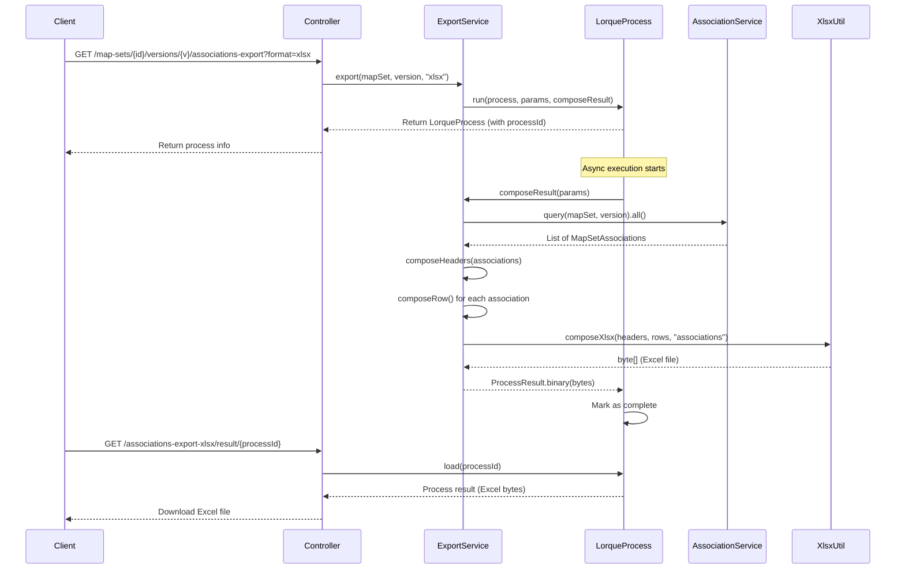

# MapSet Excel Export

## Description

MapSet Excel export allows users to download MapSet associations (concept mappings) in Excel (XLSX) or CSV format. This feature is essential for sharing mapping data with external systems, offline review, and data analysis.

**Key capabilities:**

- Export all associations from a MapSet version
- Support for both Excel (XLSX) and CSV formats
- Includes source concepts, target concepts, relationships, and custom properties
- Handles noMap cases (unmappable concepts)
- Async processing for large datasets
- Optimized performance with streaming Excel generation

**Use cases:**

- Data interchange with external terminology systems
- Offline mapping review and validation
- Bulk data analysis in spreadsheet applications
- Backup and archival of mapping data
- Sharing mappings with collaborators

## Configuration

No configuration is required. MapSet export is automatically available for all MapSet resources.

### Performance Settings

Export uses the Lorque async processing system with default settings:

- **Async processing**: Prevents blocking for large exports
- **Streaming mode**: Constant memory usage regardless of MapSet size
- **Single-pass processing**: Headers collected from first 1000 associations

## Use-Cases

### Scenario 1: Export ICD-10 to ICD-11 Mapping

**Context:** Organization needs to share ICD-10 to ICD-11 mapping with external partner.

**Steps:**
1. Navigate to ICD-SNOMED MapSet version page
2. Click "Export to Excel" button
3. Select format: XLSX
4. Wait for async processing to complete (5-10 seconds for 10k mappings)
5. Download Excel file
6. Send file to partner via email

**Outcome:** Partner receives complete mapping data in Excel format with all relationships and custom properties.

### Scenario 2: Offline Mapping Review

**Context:** Subject matter expert needs to review mappings offline without TermX access.

**Steps:**
1. Export MapSet to Excel
2. Open in Microsoft Excel or Google Sheets
3. Filter and sort by relationship type, verification status
4. Add comments in spreadsheet for corrections
5. Send annotated file back to terminology team
6. Team imports corrections into TermX

**Outcome:** Expert can review hundreds of mappings efficiently using familiar spreadsheet tools.

### Scenario 3: Bulk Data Analysis

**Context:** Data analyst needs to calculate statistics on mapping quality across multiple MapSets.

**Steps:**
1. Export 3 different MapSets to CSV format
2. Import all CSVs into analysis tool (R, Python, Excel)
3. Aggregate data: count by relationship type, verification rate, noMap percentage
4. Generate charts and reports
5. Present findings to terminology governance committee

**Outcome:** Data-driven insights into mapping coverage and quality across the terminology system.

### Scenario 4: Backup Before Major Changes

**Context:** Team planning to update MapSet associations needs backup of current state.

**Steps:**
1. Export current MapSet version to Excel before making changes
2. Save file with timestamp in backup folder
3. Make extensive updates to MapSet
4. If issues found, reference backup to restore or compare
5. Keep backup for audit trail

**Outcome:** Safe fallback available if changes need to be reverted. Historical snapshot preserved.

### Scenario 5: Custom Property Export

**Context:** MapSet has custom properties (confidence scores, mapping methods) that need to be shared.

**Steps:**
1. MapSet contains associations with custom properties: confidence, methodology, reviewer
2. Export to Excel - custom properties automatically included as columns
3. Recipient can see and filter by confidence scores
4. High-confidence mappings identified for automated use

**Outcome:** Rich metadata preserved in export. Custom properties available for downstream processing.

## API

All endpoints are under `/api/ts/map-sets`.

| Method | Path | Privilege | Description |
|--------|------|-----------|-------------|
| GET | `/{mapSet}/versions/{version}/associations-export{?params*}` | `MapSet.view` | Initiate async export, returns process ID |
| GET | `/associations-export-csv/result/{lorqueProcessId}` | `MapSet.view` | Download CSV result |
| GET | `/associations-export-xlsx/result/{lorqueProcessId}` | `MapSet.view` | Download Excel result |

### Initiate Export

**Request:**

```bash
GET /api/ts/map-sets/icd-snomed/versions/1.0/associations-export?format=xlsx
```

**Query parameters:**

- `format`: `csv` or `xlsx` (default: `csv`)

**Response:**

```json
{
  "id": 12345,
  "process": "ms-association-export",
  "status": "running",
  "started": "2026-03-09T10:30:00Z"
}
```

### Download Export Result

**CSV download:**

```bash
GET /api/ts/map-sets/associations-export-csv/result/12345
```

**Excel download:**

```bash
GET /api/ts/map-sets/associations-export-xlsx/result/12345
```

**Response:**

Binary file download with appropriate headers:

- CSV: `Content-Type: application/csv`, `Content-Disposition: attachment; filename=associations.csv`
- Excel: `Content-Type: application/vnd.ms-excel`, `Content-Disposition: attachment; filename=associations.xlsx`

## Testing

### Quick start

```bash
# 1. Initiate Excel export
curl http://localhost:8200/api/ts/map-sets/icd-snomed/versions/1.0/associations-export?format=xlsx

# Response includes processId, e.g., 12345

# 2. Wait a few seconds for processing (poll status if needed)

# 3. Download Excel file
curl -o associations.xlsx \
     http://localhost:8200/api/ts/map-sets/associations-export-xlsx/result/12345
```

### Test with CSV format

```bash
# 1. Initiate CSV export
curl http://localhost:8200/api/ts/map-sets/icd-snomed/versions/1.0/associations-export?format=csv

# 2. Download CSV file
curl -o associations.csv \
     http://localhost:8200/api/ts/map-sets/associations-export-csv/result/12345
```

### Test with various MapSet sizes

**Small MapSet (10 associations):**

- Verify all columns are present
- Check custom properties are exported correctly
- Validate noMap cases show empty target fields

**Medium MapSet (1000 associations):**

- Verify performance (should complete in < 5 seconds)
- Check file opens correctly in Excel

**Large MapSet (10000+ associations):**

- Stress test memory usage
- Verify streaming works (no OutOfMemoryError)
- Confirm all data exported correctly

### Verify export content

**Expected columns:**

Standard columns (always present):
1. `sourceCode`
2. `sourceCodeSystem`
3. `sourceDisplay`
4. `targetCode`
5. `targetCodeSystem`
6. `targetDisplay`
7. `relationship`
8. `verified`
9. `noMap`

Dynamic columns (based on MapSet properties):
- One column per custom property defined in the MapSet

**Sample output:**

```csv
sourceCode,sourceCodeSystem,sourceDisplay,targetCode,targetCodeSystem,targetDisplay,relationship,verified,noMap,customProp1,customProp2
250.1,ICD10,Diabetes Type 1,E10,ICD11,Type 1 diabetes mellitus,equivalent,true,false,high-confidence,auto-mapped
999.9,ICD10,Obsolete code,,,,,,true,,
```

## Data Model

### MapSetAssociation

The primary entity exported to Excel/CSV.

| Field | Type | Description |
|-------|------|-------------|
| source | Entity | Source concept (code, codeSystem, display) |
| target | Entity | Target concept (code, codeSystem, display) - null if noMap |
| relationship | String | Equivalence type: `equivalent`, `broader`, `narrower`, `related`, `inexact` |
| verified | Boolean | Whether mapping has been verified by expert |
| noMap | Boolean | Indicates concept is unmappable (no equivalent in target) |
| propertyValues | PropertyValue[] | Custom properties specific to this MapSet |

**Entity structure:**

```json
{
  "code": "250.1",
  "codeSystem": "ICD10",
  "display": "Diabetes Type 1"
}
```

### PropertyValue

Custom property attached to a MapSet association.

| Field | Type | Description |
|-------|------|-------------|
| mapSetPropertyName | String | Property identifier (becomes column header) |
| value | Object | Property value (string, number, boolean, etc.) |
| mapSetPropertyType | String | Data type of the property |

**Example:**

```json
{
  "mapSetPropertyName": "confidence",
  "value": "high",
  "mapSetPropertyType": "string"
}
```

### Export Column Mapping

**Standard columns** (always present in order):

1. `sourceCode` ← `association.source.code`
2. `sourceCodeSystem` ← `association.source.codeSystem`
3. `sourceDisplay` ← `association.source.display`
4. `targetCode` ← `association.target.code` (empty if noMap)
5. `targetCodeSystem` ← `association.target.codeSystem` (empty if noMap)
6. `targetDisplay` ← `association.target.display` (empty if noMap)
7. `relationship` ← `association.relationship`
8. `verified` ← `association.verified` (true/false)
9. `noMap` ← `association.noMap` (true/false)

**Dynamic columns** (based on MapSet properties):

- Extracted from first 1000 associations for efficiency
- One column per unique property name
- Property values matched by name during row composition

**Example with custom properties:**

```csv
sourceCode,sourceCodeSystem,sourceDisplay,targetCode,targetCodeSystem,targetDisplay,relationship,verified,noMap,confidence,methodology,reviewer
250.1,ICD10,Diabetes Type 1,E10,ICD11,Type 1 diabetes mellitus,equivalent,true,false,high,automated,john-doe
```

## Architecture



**Processing steps:**

1. **Initiate**: Controller receives export request, starts async Lorque process
2. **Query**: Load all associations for the MapSet version
3. **Headers**: Compose headers from standard columns + custom properties (scan first 1000)
4. **Rows**: Transform each association to row array matching headers
5. **Generate**: Create Excel/CSV file using XlsxUtil/CsvUtil
6. **Store**: Save binary result in Lorque process
7. **Download**: Client retrieves file via result endpoint

### Performance Optimizations

**Streaming Excel generation:**

Uses Apache POI's `SXSSFWorkbook` to keep only a small window of rows in memory:

```java
SXSSFWorkbook workbook = new SXSSFWorkbook(100); // Keep 100 rows in memory
```

**Single-pass header composition:**

Headers are collected from the first 1000 associations to avoid scanning entire dataset:

```java
associations.stream()
  .limit(1000)
  .flatMap(a -> a.getPropertyValues().stream())
  .map(PropertyValue::getMapSetPropertyName)
  .distinct()
  .collect(Collectors.toList());
```

**No N+1 queries:**

MapSet associations already contain all required data (source, target, properties). No additional database queries are needed during export.

## Technical Implementation

### MapSetExportService

**Core methods:**

```java
@Singleton
@RequiredArgsConstructor
public class MapSetExportService {
  private final LorqueProcessService lorqueProcessService;
  private final MapSetAssociationService associationService;
  
  public LorqueProcess export(String mapSet, String version, String format) {
    // Start async process
  }
  
  private ProcessResult composeResult(Map<String, String> params) {
    // Load associations and generate file
  }
  
  private List<String> composeHeaders(List<MapSetAssociation> associations) {
    // Standard columns + dynamic properties
  }
  
  private Object[] composeRow(MapSetAssociation assoc, List<String> headers) {
    // Map association to row array
  }
}
```

**Row composition logic:**

```java
private Object[] composeRow(MapSetAssociation assoc, List<String> headers) {
  Object[] row = new Object[headers.size()];
  
  // Standard columns
  row[0] = assoc.getSource().getCode();
  row[1] = assoc.getSource().getCodeSystem();
  row[2] = assoc.getSource().getDisplay();
  
  if (assoc.isNoMap()) {
    row[3] = row[4] = row[5] = ""; // Empty target
  } else {
    row[3] = assoc.getTarget().getCode();
    row[4] = assoc.getTarget().getCodeSystem();
    row[5] = assoc.getTarget().getDisplay();
  }
  
  row[6] = assoc.getRelationship();
  row[7] = assoc.isVerified();
  row[8] = assoc.isNoMap();
  
  // Custom properties
  Map<String, Object> propMap = assoc.getPropertyValues().stream()
    .collect(Collectors.toMap(PropertyValue::getMapSetPropertyName, PropertyValue::getValue));
  
  for (int i = 9; i < headers.size(); i++) {
    row[i] = propMap.getOrDefault(headers.get(i), "");
  }
  
  return row;
}
```

### Controller Integration

**MapSetController endpoints:**

Location: After associations section (around line 270)

```java
private final MapSetExportService mapSetExportService;

@Authorized(Privilege.MS_VIEW)
@Get(uri = "/{mapSet}/versions/{version}/associations-export{?params*}")
public LorqueProcess exportAssociations(
    @PathVariable String mapSet, 
    @PathVariable String version, 
    Map<String, String> params
) {
    return mapSetExportService.export(mapSet, version, params.getOrDefault("format", "csv"));
}

@Authorized(Privilege.MS_VIEW)
@Get(value = "/associations-export-csv/result/{lorqueProcessId}", produces = "application/csv")
public HttpResponse<?> getAssociationExportCSV(Long lorqueProcessId) {
    byte[] result = lorqueProcessService.load(lorqueProcessId).getResult();
    return HttpResponse.ok(result)
        .header(HttpHeaders.CONTENT_DISPOSITION, "attachment; filename=associations.csv")
        .contentType(MediaType.of("application/csv"));
}

@Authorized(Privilege.MS_VIEW)
@Get(value = "/associations-export-xlsx/result/{lorqueProcessId}", produces = "application/vnd.ms-excel")
public HttpResponse<?> getAssociationExportXLSX(Long lorqueProcessId) {
    byte[] result = lorqueProcessService.load(lorqueProcessId).getResult();
    return HttpResponse.ok(result)
        .header(HttpHeaders.CONTENT_DISPOSITION, "attachment; filename=associations.xlsx")
        .contentType(MediaType.of("application/vnd.ms-excel"));
}
```

### Expected Performance

- **Small (10 associations)**: < 1 second
- **Medium (1000 associations)**: 2-5 seconds
- **Large (10000 associations)**: 5-10 seconds
- **Memory usage**: Constant O(1) due to streaming (100 rows in memory)
- **Database queries**: Single query to load all associations
