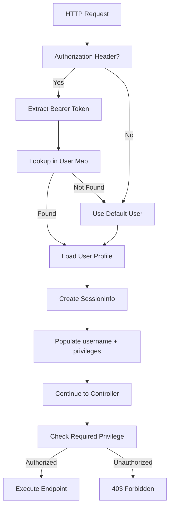

# Mock Authentication

## Description

Mock authentication allows running TermX locally without an SSO/OAuth provider (e.g., Keycloak).
Users and their privileges are defined in JSON files shipped with the application. This is
useful for local development, manual QA testing, and demo environments.

Each user profile has a key (used as a bearer token), a username, and a set of privilege
strings following the TermX convention `<resourceId>.<ResourceType>.<action>`. On each
request the provider looks up the bearer token in the loaded profiles and returns the
matching session. When no token is provided, the configured default user is used.

Two bundled user suites are included:
- `mock/users.json` -- minimal set for local development (admin, publisher, editor, viewer).
- `mock/users-demo.json` -- extended set for demo/showcase with additional roles.

Custom user files can be created and referenced via configuration.

## Configuration

### Properties

| Property                 | Env variable             | Default           | Description                                                |
|--------------------------|--------------------------|-------------------|------------------------------------------------------------|
| `auth.mock.enabled`      | `AUTH_MOCK_ENABLED`      | `false`           | Enables mock authentication                                |
| `auth.mock.default-user` | `AUTH_MOCK_DEFAULT_USER` | `admin`           | Profile key used when no `Authorization` header is present |
| `auth.mock.users-file`   | `AUTH_MOCK_USERS_FILE`   | `mock/users.json` | Classpath path to the JSON file with user definitions      |

### Enabling mock auth

**Option A** -- use the `local` Micronaut profile (already configured in `application-local.yml`):

```bash
MICRONAUT_ENVIRONMENTS=local ./gradlew :termx-app:run
```

**Option B** -- set the property directly:

```bash
AUTH_MOCK_ENABLED=true ./gradlew :termx-app:run
```

### Switching to the demo user suite

```bash
AUTH_MOCK_USERS_FILE=mock/users-demo.json ./gradlew :termx-app:run
```

Or in `application-local.yml`:

```yaml
auth:
  mock:
    enabled: true
    users-file: mock/users-demo.json
```

### Bundled user suites

#### mock/users.json (default, local development)

| Profile key | Username     | Privileges                                                                                    |
|-------------|--------------|-----------------------------------------------------------------------------------------------|
| `admin`     | `admin`      | `*.*.*` (full access)                                                                         |
| `publisher` | `publisher1` | `*.*.view`, `*.Task.publish`, `icd-10.CodeSystem.publish`, `disorders.ValueSet.publish`, `icd-snomed.MapSet.publish` |
| `editor`    | `editor1`    | `*.*.view`, `*.Task.edit`, `icd-10.CodeSystem.edit`, `disorders.ValueSet.edit`                 |
| `viewer`    | `viewer1`    | `*.*.view`                                                                                    |

#### mock/users-demo.json (demo/showcase)

| Profile key           | Username         | Role description                                      |
|-----------------------|------------------|-------------------------------------------------------|
| `admin`               | `demo-admin`     | Full access                                           |
| `terminology-manager` | `demo-tm`        | Can publish all resource types                        |
| `publisher`           | `demo-publisher` | Can publish specific resources (icd-10, icd-11, etc.) |
| `editor`              | `demo-editor`    | Can edit specific resources                           |
| `reviewer`            | `demo-reviewer`  | Can edit icd-10 only                                  |
| `viewer`              | `demo-viewer`    | View-only                                             |
| `guest`               | `guest`          | View-only                                             |

### Custom user files

Create a JSON file with the following format and point `auth.mock.users-file` to it:

```json
{
  "<profile-key>": {
    "username": "<display username>",
    "privileges": ["<privilege>", "..."]
  }
}
```

The `<profile-key>` is used in the `Authorization: Bearer <profile-key>` header.

#### Privilege format

Privileges follow the TermX convention: `<resourceId>.<ResourceType>.<action>`.

| Segment        | Description                                | Wildcard |
|----------------|--------------------------------------------|----------|
| `resourceId`   | Specific resource ID (e.g., `icd-10`)      | `*`      |
| `ResourceType` | `CodeSystem`, `ValueSet`, `MapSet`, `Task` | `*`      |
| `action`       | `view`, `edit`, `publish`                  | `*`      |

Examples:
- `*.*.*` -- full admin access
- `*.*.view` -- view all resources
- `*.Task.edit` -- edit tasks across all resources
- `icd-10.CodeSystem.publish` -- publish access to a specific code system

## Use-Cases

### Scenario 1: Local Development Without SSO

**Context:** Developer wants to work on TermX locally without setting up Keycloak or other OAuth provider.

**Steps:**
1. Enable mock authentication in `application-local.yml`
2. Start application with `MICRONAUT_ENVIRONMENTS=local`
3. Access API without any authentication header (defaults to admin user)
4. Make authenticated requests using `Authorization: Bearer <profile-key>`

**Outcome:** Developer can test all features with different privilege levels without external dependencies.

### Scenario 2: Manual QA Testing with Multiple Roles

**Context:** QA team needs to test privilege-based access control across different user roles.

**Steps:**
1. Start application with mock authentication enabled
2. Test viewer role: `curl -H "Authorization: Bearer viewer" /api/tm/tasks` → empty result
3. Test editor role: `curl -H "Authorization: Bearer editor" /api/tm/tasks` → sees own tasks
4. Test publisher role: `curl -H "Authorization: Bearer publisher" /api/tm/tasks` → sees all permitted tasks
5. Test admin role: `curl http://localhost:8200/api/tm/tasks` → sees all tasks

**Outcome:** QA verifies access control behavior matches requirements without managing real user accounts.

### Scenario 3: Demo Environment with Role-Based Users

**Context:** Sales team needs a demo environment showing TermX to prospects with different user personas.

**Steps:**
1. Configure `AUTH_MOCK_USERS_FILE=mock/users-demo.json`
2. Start demo instance
3. Switch between demo users by changing Authorization header
4. Show how each role sees different data and has different permissions

**Outcome:** Effective demonstration of role-based access control and workflow features to potential customers.

### Scenario 4: Testing Task Access Control

**Context:** Developer implementing privilege-based filtering needs to verify editor can only see their own tasks.

**Steps:**
1. Enable mock auth with default users
2. Create task as editor1: `curl -H "Authorization: Bearer editor" -X POST /api/tm/tasks -d '{...}'`
3. Query as editor1: sees the task
4. Query as viewer1: empty result
5. Query as publisher1: sees the task

**Outcome:** Verified that task access control filtering works correctly for different privilege levels.

## API

Mock authentication does not expose dedicated REST endpoints. It is implemented as a `SessionProvider` that intercepts all HTTP requests and populates the session based on the `Authorization` header.

**Header format:**

```http
Authorization: Bearer <profile-key>
```

Where `<profile-key>` matches a key in the configured users JSON file (e.g., `admin`, `editor`, `publisher`, `viewer`).

**Behavior:**

- If header is present and matches a profile key, that user's session is loaded
- If header is missing or doesn't match, the default user (configured via `auth.mock.default-user`) is used
- Session is populated with username and privileges from the matched profile

**Integration with TermX API:**

All TermX REST endpoints under `/api/` check privileges using the session populated by MockSessionProvider. No changes to endpoint code are required.

## Testing

### Quick start

```bash
# Authenticated as admin (default user)
curl http://localhost:8200/api/tm/tasks

# Authenticated as editor1
curl -H "Authorization: Bearer editor" http://localhost:8200/api/tm/tasks

# Authenticated as publisher1
curl -H "Authorization: Bearer publisher" http://localhost:8200/api/tm/tasks

# Authenticated as viewer1 (no task list access)
curl -H "Authorization: Bearer viewer" http://localhost:8200/api/tm/tasks
```

### Task access control behavior

The mock users are designed to test the TaskForge privilege-based access control.
Expected behavior when querying `GET /api/tm/tasks`:

| Role      | Header                   | Tasks visible                                                      |
|-----------|--------------------------|--------------------------------------------------------------------|
| Admin     | (none) or `Bearer admin` | All tasks                                                          |
| Publisher | `Bearer publisher`       | All tasks for resources they have publish access to                |
| Editor    | `Bearer editor`          | Only tasks they created or are assigned to, for permitted resources |
| Viewer    | `Bearer viewer`          | Empty result (no task list access)                                 |

### Test scenario: create a task as editor, view as different roles

```bash
# 1. Create a task as editor1
curl -X POST -H "Authorization: Bearer editor" \
     -H "Content-Type: application/json" \
     -d '{"title":"Review ICD-10 mapping","type":"concept-review","context":[{"type":"code-system","id":"icd-10"}]}' \
     http://localhost:8200/api/tm/tasks

# 2. Query as publisher -- should see the task (has publish access to icd-10)
curl -H "Authorization: Bearer publisher" http://localhost:8200/api/tm/tasks

# 3. Query as viewer -- should get empty result
curl -H "Authorization: Bearer viewer" http://localhost:8200/api/tm/tasks

# 4. Query as editor -- should see only own/assigned tasks
curl -H "Authorization: Bearer editor" http://localhost:8200/api/tm/tasks
```

## Data Model

### MockUser

| Field | Type | Description |
|-------|------|-------------|
| username | String | Display username (e.g., "admin", "editor1") |
| privileges | String[] | Array of privilege strings in format `<resourceId>.<ResourceType>.<action>` |

**Example (from users.json):**

```json
{
  "admin": {
    "username": "admin",
    "privileges": ["*.*.*"]
  },
  "editor": {
    "username": "editor1",
    "privileges": [
      "*.*.view",
      "*.Task.edit",
      "icd-10.CodeSystem.edit",
      "disorders.ValueSet.edit"
    ]
  }
}
```

### Privilege Format

Privileges follow the pattern: `<resourceId>.<ResourceType>.<action>`

| Segment | Description | Examples | Wildcard |
|---------|-------------|----------|----------|
| resourceId | Specific resource ID or wildcard | `icd-10`, `disorders`, `*` | `*` = all resources |
| ResourceType | Resource type class name | `CodeSystem`, `ValueSet`, `MapSet`, `Task` | `*` = all types |
| action | Operation being performed | `view`, `edit`, `publish` | `*` = all actions |

**Privilege examples:**

- `*.*.*` - Full admin access to everything
- `*.*.view` - View access to all resources and types
- `*.Task.edit` - Edit tasks across all resources
- `icd-10.CodeSystem.publish` - Publish access to specific code system
- `disorders.ValueSet.edit` - Edit access to specific value set

### SessionInfo

When a request arrives, MockSessionProvider creates a SessionInfo object that is used throughout the request:

```java
SessionInfo {
  username: "editor1",
  privileges: ["*.*.view", "*.Task.edit", "icd-10.CodeSystem.edit"],
  authenticated: true
}
```

This SessionInfo is used by `@Authorized` annotations to check access at each controller endpoint.

## Architecture



**Component flow:**

1. **Startup**: `MockSessionProvider` reads JSON file from classpath into `Map<String, MockUser>`
2. **Request**: Provider extracts bearer token from `Authorization` header
3. **Lookup**: Token is used as key to find matching user profile
4. **Session**: `SessionInfo` is created with username and privilege list
5. **Authorization**: Controllers check session privileges via `@Authorized` annotations

**Provider priority:**

MockSessionProvider has order `5`, which runs before:
- OAuth providers (order `20`)
- Guest provider (order `30`)

This ensures mock auth takes precedence in local development when enabled.

## Technical Implementation

`MockSessionProvider` extends `SessionProvider` with order `5` (runs before OAuth at `20`
and Guest at `30`). It is conditionally registered via
`@Requires(property = "auth.mock.enabled", value = "true")`, so it is never instantiated
in production.

On startup it reads the configured JSON file from the classpath into a `Map<String, MockUser>`
and logs the number of loaded users. On each request it extracts the bearer token from
the `Authorization` header, looks up the matching profile key, and returns a `SessionInfo`
populated with the profile's username and privileges. If the token does not match any key,
the default user profile is returned.

### Source files

| File                                                              | Description                    |
|-------------------------------------------------------------------|--------------------------------|
| `termx-app/src/main/java/org/termx/auth/MockSessionProvider.java`| Provider implementation        |
| `termx-app/src/main/resources/mock/users.json`                   | Default user suite (local dev) |
| `termx-app/src/main/resources/mock/users-demo.json`              | Extended user suite (demo)     |
| `termx-app/src/main/resources/application.yml`                   | Default config (disabled)      |
| `termx-app/src/main/resources/application-local.yml`             | Local override (enabled)       |
