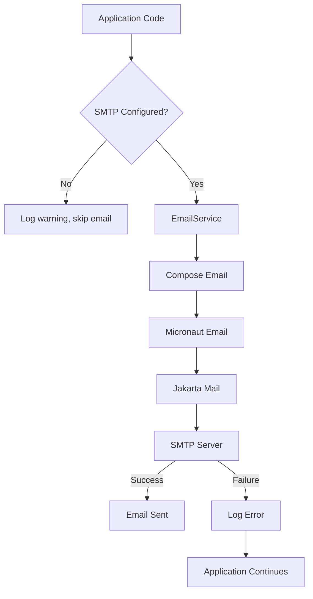
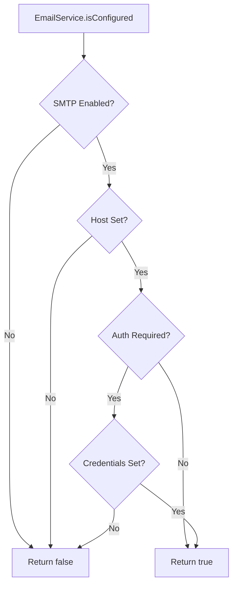

# SMTP Email Support

## Description

TermX includes SMTP email sending functionality for notifications and alerts. The system uses Micronaut Email with Jakarta Mail for industry-standard email delivery. Email support is optional and gracefully degrades when not configured - the application functions normally but email notifications are silently skipped.

**Key capabilities:**

- Send HTML and plain text emails
- Multi-recipient support
- Secure TLS/STARTTLS connections
- Configuration validation and status reporting
- Graceful fallback when SMTP is unavailable
- Test endpoint for verifying SMTP configuration (development mode only)

**Use cases:**

- Import completion notifications
- Task assignment alerts
- System notifications
- Administrative reports

## Configuration

### Properties

| Property | Env variable | Default | Description |
|----------|--------------|---------|-------------|
| `micronaut.email.enabled` | `SMTP_ENABLED` | `false` | Enables SMTP email sending |
| `micronaut.email.from.email` | `SMTP_FROM` | `noreply@termx.org` | Default sender email address |
| `micronaut.email.smtp.host` | `SMTP_HOST` | (required) | SMTP server hostname |
| `micronaut.email.smtp.port` | `SMTP_PORT` | `587` | SMTP server port |
| `micronaut.email.smtp.username` | `SMTP_USERNAME` | (required) | SMTP authentication username |
| `micronaut.email.smtp.password` | `SMTP_PASSWORD` | (required) | SMTP authentication password |
| `micronaut.email.smtp.auth` | `SMTP_AUTH` | `true` | Enable SMTP authentication |
| `micronaut.email.smtp.starttls.enable` | `SMTP_STARTTLS` | `true` | Enable STARTTLS for secure connection |

### Enabling SMTP

**Option A** - Via environment variables:

```bash
export SMTP_ENABLED=true
export SMTP_HOST=smtp.gmail.com
export SMTP_PORT=587
export SMTP_USERNAME=your-email@gmail.com
export SMTP_PASSWORD=your-app-password
export SMTP_FROM=noreply@yourdomain.org

./gradlew :termx-app:run
```

**Option B** - Via Docker environment file:

Edit `deployment/docker-compose/server.env`:

```bash
# SMTP Email Configuration
SMTP_ENABLED=true
SMTP_HOST=smtp.gmail.com
SMTP_PORT=587
SMTP_USERNAME=your-email@gmail.com
SMTP_PASSWORD=your-app-password
SMTP_FROM=noreply@termx.org
SMTP_AUTH=true
SMTP_STARTTLS=true
```

### Provider-Specific Configuration

**Gmail:**

```bash
SMTP_ENABLED=true
SMTP_HOST=smtp.gmail.com
SMTP_PORT=587
SMTP_USERNAME=your-email@gmail.com
SMTP_PASSWORD=your-app-password  # Use App Password, not account password
SMTP_FROM=your-email@gmail.com
```

**AWS SES:**

```bash
SMTP_ENABLED=true
SMTP_HOST=email-smtp.us-east-1.amazonaws.com
SMTP_PORT=587
SMTP_USERNAME=your-ses-smtp-username
SMTP_PASSWORD=your-ses-smtp-password
SMTP_FROM=verified@yourdomain.com
```

**SendGrid:**

```bash
SMTP_ENABLED=true
SMTP_HOST=smtp.sendgrid.net
SMTP_PORT=587
SMTP_USERNAME=apikey
SMTP_PASSWORD=your-sendgrid-api-key
SMTP_FROM=verified@yourdomain.com
```

**Google Workspace SMTP Relay:**

```bash
SMTP_ENABLED=true
SMTP_HOST=smtp-relay.gmail.com
SMTP_PORT=25  # or 587 for STARTTLS
SMTP_AUTH=false  # IP-based auth
SMTP_STARTTLS=false  # or true for port 587
SMTP_FROM=noreply@your-workspace-domain.com
```

Note: Google Workspace SMTP Relay requires the FROM email domain to match domains registered in your Google Workspace.

## Use-Cases

### Scenario 1: Configure SMTP for Gmail

**Context:** Administrator needs to set up email notifications using company Gmail account.

**Steps:**
1. Enable 2FA on Gmail account
2. Generate App Password in Google Account settings
3. Set environment variables with Gmail SMTP settings
4. Restart TermX application
5. Test configuration using status endpoint

**Outcome:** TermX can send emails via Gmail SMTP. Import notifications and alerts are delivered successfully.

### Scenario 2: Verify SMTP Configuration

**Context:** DevOps engineer deploying TermX to production needs to verify email is working.

**Steps:**
1. Check configuration status: `GET /management/email/status`
2. Review response for `configured: true` and correct settings
3. In development mode, send test email: `POST /management/email/test`
4. Verify test email received in inbox
5. Check application logs for successful sending

**Outcome:** Confirmed SMTP is properly configured and emails are being delivered.

### Scenario 3: Graceful Degradation Without SMTP

**Context:** Developer running TermX locally without SMTP configuration.

**Steps:**
1. Start TermX with default configuration (SMTP disabled)
2. Trigger import operation that normally sends email
3. Import completes successfully
4. Check logs - see warning "SMTP not configured, skipping email notification"
5. Application continues normal operation

**Outcome:** Application functions fully without SMTP. Email features gracefully degrade without errors.

### Scenario 4: Troubleshooting Connection Issues

**Context:** Administrator experiencing "EOF" errors when sending emails.

**Steps:**
1. Test port connectivity: `nc -zv smtp-relay.gmail.com 587`
2. Test STARTTLS: `openssl s_client -connect smtp-relay.gmail.com:587 -starttls smtp`
3. Try alternative port (25 vs 587)
4. Adjust STARTTLS setting based on port
5. Retest using status/test endpoints

**Outcome:** Identified port/STARTTLS mismatch and corrected configuration. Emails now sending successfully.

### Scenario 5: Multi-Provider Setup with SendGrid

**Context:** Organization wants to use SendGrid for reliable email delivery.

**Steps:**
1. Create SendGrid account and generate API key
2. Verify sender email domain in SendGrid
3. Configure TermX with SendGrid SMTP settings (host: smtp.sendgrid.net, username: apikey)
4. Test with sample email
5. Monitor SendGrid dashboard for delivery statistics

**Outcome:** Production-ready email delivery with SendGrid's reliability and analytics.

## API

### Management Endpoints

All endpoints are under `/management/email`. These endpoints require authentication (OAuth token) but are not part of the public API.

| Method | Path | Access | Description |
|--------|------|--------|-------------|
| GET | `/management/email/status` | Authenticated users | Check SMTP configuration status |
| POST | `/management/email/test` | Development mode only | Send test email to verify SMTP setup |

**Status endpoint response:**

```json
{
  "configured": true,
  "from": "noreply@termx.org",
  "smtpHost": "smtp.gmail.com"
}
```

When not configured:

```json
{
  "configured": false,
  "missingParameters": ["SMTP_HOST", "SMTP_USERNAME", "SMTP_PASSWORD"],
  "from": "noreply@termx.org"
}
```

**Test endpoint request:**

```json
{
  "recipient": "test@example.com",
  "subject": "TermX Test Email",
  "body": "Test email from TermX server"
}
```

**Test endpoint response:**

```json
{
  "sent": true,
  "message": "Email sent successfully to test@example.com"
}
```

On failure:

```json
{
  "sent": false,
  "error": "SMTP not configured"
}
```

### Security

- **Test endpoint** protected by `@Requires(property = "auth.dev.allowed", value = "true")` - only available in development mode
- **Status endpoint** requires valid OAuth token (same as other endpoints)
- **No public email sending API** - emails are only sent via internal service calls

## Testing

### Check SMTP configuration status

```bash
# Check status (no SMTP configured)
curl http://localhost:8200/management/email/status

# Expected: {"configured": false, "missingParameters": [...]}
```

### Configure SMTP and verify

```bash
# Set environment variables
export SMTP_ENABLED=true
export SMTP_HOST=smtp.gmail.com
export SMTP_USERNAME=your-email@gmail.com
export SMTP_PASSWORD=your-app-password

# Restart application
./gradlew :termx-app:run

# Check status (should show configured)
curl http://localhost:8200/management/email/status

# Expected: {"configured": true, "from": "noreply@termx.org", "smtpHost": "smtp.gmail.com"}
```

### Send test email (development mode)

```bash
# Enable development mode
export AUTH_DEV_ALLOWED=true

# Send test email using provided script
./termx-app/test-email.sh test@example.com

# Or manually:
curl -X POST http://localhost:8200/management/email/test \
  -H "Content-Type: application/json" \
  -d '{"recipient": "test@example.com", "subject": "Test", "body": "Test email"}'
```

### Verify SMTP connectivity (before configuration)

```bash
# Test port connectivity
nc -zv smtp.gmail.com 587

# Test STARTTLS capability
openssl s_client -connect smtp.gmail.com:587 -starttls smtp
```

### Common SMTP ports

- **Port 25**: Plain SMTP, typically for server-to-server (may be blocked by ISPs)
- **Port 587**: Submission port with STARTTLS (recommended)
- **Port 465**: SMTP over SSL/TLS (legacy)

## Data Model

### EmailConfigStatus

Response model for configuration status endpoint.

| Field | Type | Description |
|-------|------|-------------|
| configured | boolean | Whether SMTP is fully configured and ready |
| missingParameters | String[] | List of required parameters that are not set (empty if configured) |
| from | String | Configured sender email address |
| smtpHost | String | SMTP server hostname (only included if configured) |

**Example (configured):**

```json
{
  "configured": true,
  "from": "noreply@termx.org",
  "smtpHost": "smtp.gmail.com"
}
```

**Example (not configured):**

```json
{
  "configured": false,
  "missingParameters": ["SMTP_HOST", "SMTP_USERNAME", "SMTP_PASSWORD"],
  "from": "noreply@termx.org"
}
```

### EmailTestRequest

Request model for test endpoint.

| Field | Type | Description |
|-------|------|-------------|
| recipient | String | Email address to send test email to |
| subject | String | Email subject line |
| body | String | Email body (plain text or HTML) |

**Example:**

```json
{
  "recipient": "test@example.com",
  "subject": "TermX Test Email",
  "body": "Test email from TermX server"
}
```

### EmailTestResult

Response model for test endpoint.

| Field | Type | Description |
|-------|------|-------------|
| sent | boolean | Whether email was sent successfully |
| error | String | Error message if sending failed (null on success) |
| message | String | Human-readable result message |

**Example (success):**

```json
{
  "sent": true,
  "message": "Email sent successfully to test@example.com"
}
```

**Example (failure):**

```json
{
  "sent": false,
  "error": "SMTP not configured",
  "message": "Cannot send email: SMTP is not configured"
}
```

## Architecture



**Configuration validation flow:**



**Component responsibilities:**

- **EmailService**: Main service for sending emails, checks configuration, handles errors gracefully
- **EmailManagementController**: Status and test endpoints for configuration verification
- **Micronaut Email**: Framework integration with Jakarta Mail
- **Jakarta Mail**: Low-level SMTP protocol implementation

## Technical Implementation

### Source files

| File | Description |
|------|-------------|
| `termx-core/src/main/java/com/kodality/termx/core/sys/email/EmailService.java` | Main email service with send methods |
| `termx-core/src/main/java/com/kodality/termx/core/sys/email/EmailManagementController.java` | Status and test endpoints |
| `termx-core/src/main/java/com/kodality/termx/core/sys/email/EmailConfigStatus.java` | Status response DTO |
| `termx-core/src/main/java/com/kodality/termx/core/sys/email/EmailTestRequest.java` | Test request DTO |
| `termx-core/src/main/java/com/kodality/termx/core/sys/email/EmailTestResult.java` | Test result DTO |
| `termx-app/src/main/resources/application.yml` | SMTP configuration properties |
| `deployment/docker-compose/server.env` | Docker environment variables |

### EmailService implementation

**Configuration checking:**

```java
@Singleton
@RequiredArgsConstructor
public class EmailService {
  @Property(name = "micronaut.email.enabled")
  private Optional<Boolean> emailEnabled;
  
  private final Optional<EmailSender<?, ?>> emailSender;
  
  public boolean isConfigured() {
    return emailEnabled.orElse(false) 
        && emailSender.isPresent()
        && hasRequiredConfiguration();
  }
  
  private boolean hasRequiredConfiguration() {
    // Check host, username, password are set
  }
}
```

**Graceful degradation:**

When SMTP is not configured, email methods log a warning and return without throwing exceptions:

```java
public void sendEmail(String to, String subject, String body) {
  if (!isConfigured()) {
    log.warn("SMTP not configured, skipping email notification");
    return;
  }
  // Send email
}
```

**Integration points:**

Services that send emails should check configuration before attempting to send:

```java
@RequiredArgsConstructor
public class NotificationService {
  private final EmailService emailService;
  
  public void sendNotification(User user, String message) {
    if (emailService.isConfigured()) {
      emailService.sendEmail(user.getEmail(), "Notification", message);
    } else {
      log.info("Email not configured, notification not sent");
    }
  }
}
```

### Dependencies

**Gradle dependency:**

```gradle
implementation("io.micronaut.email:micronaut-email-javamail")
```

Added to `termx-app/build.gradle`.

**Runtime libraries:**

- `micronaut-email-javamail` (~500KB)
- Jakarta Mail API and SMTP transport (included)

### Troubleshooting

**Issue: `[EOF]` or Connection Timeout**

Cause: Port mismatch or STARTTLS misconfiguration

Solutions:
1. Verify port is open: `nc -zv smtp-relay.gmail.com 587`
2. Enable STARTTLS for port 587: `SMTP_STARTTLS=true`
3. Try port 25 instead: `SMTP_PORT=25` and `SMTP_STARTTLS=false`
4. Check firewall/network policies

**Issue: Authentication Failed**

Cause: Credentials required but not provided

Solutions:
1. Set `SMTP_AUTH=true`
2. Provide valid credentials: `SMTP_USERNAME` and `SMTP_PASSWORD`
3. For Gmail: Use App Passwords, not regular password

**Issue: Google Workspace "Invalid credentials for relay" (Error 550-5.7.1)**

Cause: The FROM email domain doesn't match domains registered in Google Workspace SMTP Relay

Solutions:
1. Use a registered domain: Update `SMTP_FROM` to use a domain in your Google Workspace
2. Add domain to Google Workspace: Go to Admin Console → Gmail → SMTP relay service
3. Verify both EHLO domain and FROM email domain are registered

**Issue: Timeout on Port 25**

Cause: Many ISPs block outbound port 25

Solutions:
1. Use port 587 with STARTTLS instead
2. Configure ISP/hosting provider to allow port 25
3. Use mail relay service
