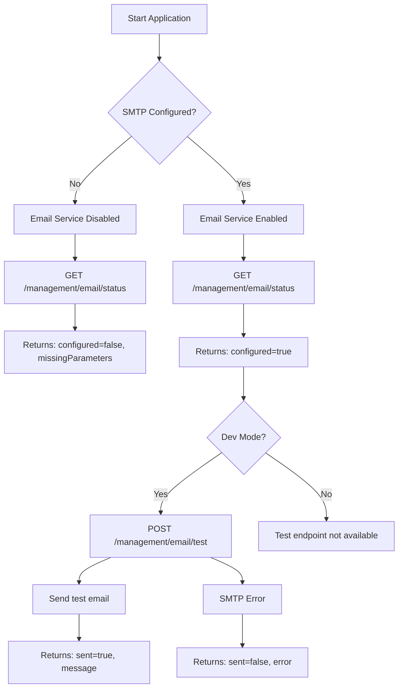

# Add SMTP Email Support to TermX

## Overview

Implement SMTP email sending functionality using Micronaut Email (native Micronaut module with Jakarta Mail). The implementation will include configuration management, graceful handling when SMTP is not configured, a test-only endpoint, and testing utilities.

## Technology Choice

**Micronaut Email** with Jakarta Mail backend

- Native Micronaut integration
- Industry-standard Jakarta Mail (JavaMail) under the hood
- Built-in templating support
- Configuration through application.yml
- Async sending support

## Implementation Components

### 1. Add Dependency

**File:** `[termx-app/build.gradle](termx-app/build.gradle)`

Add to dependencies section:

```gradle
implementation("io.micronaut.email:micronaut-email-javamail")
```

### 2. Create Email Service

**File:** `[termx-core/src/main/java/com/kodality/termx/core/sys/email/EmailService.java](termx-core/src/main/java/com/kodality/termx/core/sys/email/EmailService.java)`

**Structure:**

```java
@Singleton
@RequiredArgsConstructor
public class EmailService {
  @Property(name = "email.smtp.enabled")
  private Optional<Boolean> emailEnabled;
  
  private final Optional<EmailSenderProvider> emailSender;
  
  public void sendEmail(String to, String subject, String body);
  public boolean isConfigured();
  public List<String> getRequiredConfiguration();
}
```

**Key Features:**

- Check if SMTP is configured before sending
- Return gracefully if not configured (log warning, don't throw exception)
- Provide `isConfigured()` method to check status
- Provide `getRequiredConfiguration()` to list missing parameters
- Support both HTML and plain text emails

### 3. Configuration in application.yml

**File:** `[termx-app/src/main/resources/application.yml](termx-app/src/main/resources/application.yml)`

Add after line 79 (after termx section):

```yaml
email:
  smtp:
    enabled: ${SMTP_ENABLED:false}
    host: ${SMTP_HOST:}
    port: ${SMTP_PORT:587}
    username: ${SMTP_USERNAME:}
    password: ${SMTP_PASSWORD:}
    from: ${SMTP_FROM:noreply@termx.org}
    auth: ${SMTP_AUTH:true}
    starttls:
      enable: ${SMTP_STARTTLS:true}
```

**Rationale:**

- Default `enabled: false` - no emails sent unless explicitly configured
- Environment variable override support
- Standard SMTP settings (host, port, credentials)
- TLS/STARTTLS support for secure connections
- Configurable "from" address

### 4. Update Docker Environment Files

**File:** `[deployment/docker-compose/server.env](deployment/docker-compose/server.env)`

Add at the end (commented out):

```bash
# SMTP Email Configuration (optional)
# Uncomment and configure to enable email sending
#SMTP_ENABLED=true
#SMTP_HOST=smtp.gmail.com
#SMTP_PORT=587
#SMTP_USERNAME=your-email@gmail.com
#SMTP_PASSWORD=your-app-password
#SMTP_FROM=noreply@termx.org
#SMTP_AUTH=true
#SMTP_STARTTLS=true
```

**Documentation comment to add:**

```bash
# Email configuration is optional. When not configured, the system will
# function normally but email notifications will be silently skipped.
# To check configuration status: GET /management/email/status
```

### 5. Create Email Configuration Status Endpoint

**File:** `[termx-core/src/main/java/com/kodality/termx/core/sys/email/EmailManagementController.java](termx-core/src/main/java/com/kodality/termx/core/sys/email/EmailManagementController.java)`

**Purpose:** Internal endpoint for checking email configuration status

```java
@Controller("/management/email")
@RequiredArgsConstructor
public class EmailManagementController {
  private final EmailService emailService;
  
  @Get("/status")
  public EmailConfigStatus getStatus();
  
  @Post("/test")
  @Requires(property = "auth.dev.allowed", value = StringUtils.TRUE)
  public EmailTestResult sendTestEmail(@Body EmailTestRequest request);
}
```

**Security:**

- `/status` endpoint - No `@Authorized`, but not in public endpoints list (requires auth token)
- `/test` endpoint - Only available when `auth.dev.allowed=true` (development mode)
- NOT exposed via REST API in production (requires dev flag)

### 6. Create Test Controller for Integration Tests

**File:** `[termx-integtest/src/test/groovy/com/kodality/termx/core/EmailServiceTest.groovy](termx-integtest/src/test/groovy/com/kodality/termx/core/EmailServiceTest.groovy)`

**Purpose:** Groovy test class that can call the test endpoint

```groovy
class EmailServiceTest extends TermxIntegTest {
  def "should return configuration status"() {
    when:
    def response = client.GET("/management/email/status").join()
    
    then:
    response.statusCode() == 200
  }
  
  def "should send test email when configured"() {
    // Only runs if SMTP configured in test environment
  }
}
```

### 7. Create Shell Script for Testing

**File:** `[termx-app/test-email.sh](termx-app/test-email.sh)`

**Purpose:** Test email sending when application is running

```bash
#!/usr/bin/env bash

# Test SMTP Email Configuration for TermX Server
# Usage: ./test-email.sh [recipient-email]

TERMX_URL="${TERMX_URL:-http://localhost:8200}"
RECIPIENT="${1:-test@example.com}"

echo "Testing TermX Email Configuration..."
echo "Server: $TERMX_URL"
echo ""

# Check email configuration status
echo "1. Checking email configuration status..."
STATUS=$(curl -s -X GET "$TERMX_URL/management/email/status")
echo "Status: $STATUS"
echo ""

# Send test email (only works in dev mode)
echo "2. Sending test email to: $RECIPIENT"
RESULT=$(curl -s -X POST "$TERMX_URL/management/email/test" \
  -H "Content-Type: application/json" \
  -d "{\"recipient\": \"$RECIPIENT\", \"subject\": \"TermX Test Email\", \"body\": \"Test email from TermX server\"}")

echo "Result: $RESULT"
```

**Features:**

- Checks configuration status first
- Sends test email with customizable recipient
- Clear output and error messages
- Environment variable support for server URL

### 8. Email Service Implementation Details

**EmailConfigStatus Response:**

```json
{
  "configured": true/false,
  "missingParameters": ["SMTP_HOST", "SMTP_USERNAME", "SMTP_PASSWORD"],
  "from": "noreply@termx.org",
  "smtpHost": "smtp.gmail.com" // only if configured
}
```

**EmailTestRequest:**

```java
public class EmailTestRequest {
  private String recipient;
  private String subject;
  private String body;
}
```

**EmailTestResult:**

```json
{
  "sent": true/false,
  "error": "SMTP not configured" or null,
  "message": "Email sent successfully to test@example.com"
}
```

## Security Considerations

**1. Test Endpoint Protection:**

- Requires `@Requires(property = "auth.dev.allowed", value = StringUtils.TRUE)`
- Only available in development mode
- Never accessible in production

**2. Management Endpoint:**

- Path: `/management/email/`*
- NOT in `auth.public.endpoints` list
- Requires valid OAuth token (same as other endpoints)
- Cannot be accessed via public REST API

**3. No Direct Email API:**

- No public endpoint for sending arbitrary emails
- Test endpoint only for SMTP verification
- Actual email sending only through internal service calls

## Configuration Management

**Graceful Degradation:**

```java
if (!emailService.isConfigured()) {
  log.warn("SMTP not configured, skipping email notification");
  return;
}
```

**When SMTP Not Configured:**

- Service returns `isConfigured() = false`
- Email sending methods log warning and return gracefully
- No exceptions thrown
- Application continues normal operation

**Required Parameters:**

1. `SMTP_HOST` - SMTP server address
2. `SMTP_USERNAME` - Authentication username
3. `SMTP_PASSWORD` - Authentication password

**Optional Parameters:**

- `SMTP_PORT` (default: 587)
- `SMTP_FROM` (default: [noreply@termx.org](mailto:noreply@termx.org))
- `SMTP_AUTH` (default: true)
- `SMTP_STARTTLS` (default: true)
- `SMTP_ENABLED` (default: false)

## Example SMTP Providers Configuration

**Gmail:**

```bash
SMTP_ENABLED=true
SMTP_HOST=smtp.gmail.com
SMTP_PORT=587
SMTP_USERNAME=your-email@gmail.com
SMTP_PASSWORD=your-app-password  # Use App Password, not account password
SMTP_FROM=your-email@gmail.com
```

**AWS SES:**

```bash
SMTP_ENABLED=true
SMTP_HOST=email-smtp.us-east-1.amazonaws.com
SMTP_PORT=587
SMTP_USERNAME=your-ses-smtp-username
SMTP_PASSWORD=your-ses-smtp-password
SMTP_FROM=verified@yourdomain.com
```

**SendGrid:**

```bash
SMTP_ENABLED=true
SMTP_HOST=smtp.sendgrid.net
SMTP_PORT=587
SMTP_USERNAME=apikey
SMTP_PASSWORD=your-sendgrid-api-key
SMTP_FROM=verified@yourdomain.com
```

## Testing Flow




## Files to Create

1. **EmailService.java** - Main email service with SMTP logic
2. **EmailManagementController.java** - Status and test endpoints
3. **EmailConfigStatus.java** - Response DTO for status
4. **EmailTestRequest.java** - Request DTO for test
5. **EmailTestResult.java** - Response DTO for test result
6. **EmailServiceTest.groovy** - Integration tests
7. **test-email.sh** - Shell script for manual testing

## Files to Modify

1. **termx-app/build.gradle** - Add Micronaut Email dependency
2. **termx-app/src/main/resources/application.yml** - Add email configuration
3. **deployment/docker-compose/server.env** - Add commented SMTP variables

## Integration Points

**Future Usage Examples:**

```java
@RequiredArgsConstructor
public class SomeNotificationService {
  private final EmailService emailService;
  
  public void sendNotification(User user, String message) {
    if (emailService.isConfigured()) {
      emailService.sendEmail(user.getEmail(), "Notification", message);
    } else {
      log.info("Email not configured, notification not sent");
    }
  }
}
```

## Testing Instructions

**1. Check Status (No Config):**

```bash
curl http://localhost:8200/management/email/status
# Expected: {"configured": false, "missingParameters": ["SMTP_HOST", ...]}
```

**2. Configure SMTP (Dev Mode):**

```bash
export SMTP_ENABLED=true
export SMTP_HOST=smtp.gmail.com
export SMTP_USERNAME=your-email@gmail.com
export SMTP_PASSWORD=your-app-password
# Restart application
```

**3. Check Status (With Config):**

```bash
curl http://localhost:8200/management/email/status
# Expected: {"configured": true, "from": "noreply@termx.org", ...}
```

**4. Send Test Email (Dev Mode Only):**

```bash
./termx-app/test-email.sh test@example.com
# Or using script directly
```

**5. Try Test Endpoint in Production:**

```bash
curl -X POST http://localhost:8200/management/email/test
# Expected: 404 Not Found (endpoint not available without auth.dev.allowed=true)
```

## Dependencies Impact

**New Dependency:**

- `io.micronaut.email:micronaut-email-javamail` - ~500KB
- Includes Jakarta Mail API and SMTP transport

**Runtime Impact:**

- No impact when disabled (lazy initialization)
- Minimal memory footprint when enabled
- Async sending prevents blocking

## Configuration Validation

The service will validate:

1. Host is not empty
2. Port is valid (1-65535)
3. Username/password provided if auth enabled
4. From address is valid email format

If validation fails, service reports as "not configured" with specific missing parameters.