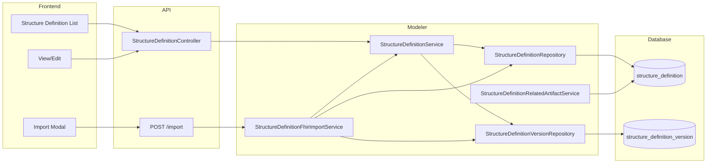

# StructureDefinition Versioning, Filters, Related Artifacts, and Import

## Description

StructureDefinition resources in TermX support **versioning**, **filtering**, **related artifacts**, and **FHIR import**. This brings StructureDefinitions in line with other versioned resources (CodeSystem, ValueSet) and enables governance, discovery, and reuse of FHIR profiles and logical models.

**Key capabilities:**

- **Versioning**: Each StructureDefinition has a header (identified by canonical URL) and one or more versions. Each version holds content (JSON/FSH), status (draft/active/retired), release date, and optional FHIR resource id.
- **List filters**: Filter StructureDefinitions by name, URL, status, publisher, and space/package in addition to the existing search and code filters.
- **Related artifacts**: StructureDefinitions can be linked to pages and spaces; the related-artifact API returns these links (same pattern as ValueSet/CodeSystem/MapSet).
- **FHIR import**: Import StructureDefinitions from a URL or from pasted/uploaded JSON. The resource URL is the unique key; the FHIR resource id is stored on the version.

**Use cases:**

- Maintain multiple versions of a profile (e.g. draft vs active) and reference a specific version from ConceptMaps or Transformations.
- Find StructureDefinitions by name, URL, status, or publisher when managing large sets of profiles.
- Link StructureDefinitions to wiki pages and spaces for documentation and discovery.
- Ingest FHIR StructureDefinitions from external registries or IG packages via URL or file.

## Configuration

No feature flags or environment variables are required. The feature is enabled when the **modeler** module is included in the application.

### Database

Liquibase changelogs in `modeler/changelog/modeler/` create and migrate:

- `modeler.structure_definition` (header: id, url, code, name, parent, publisher, sys_*). Unique on `url` where `sys_status = 'A'`.
- `modeler.structure_definition_version` (id, structure_definition_id, version, fhir_id, content, content_type, content_format, status, release_date, description, sys_*). Unique on (structure_definition_id, version).

Existing single-table data is migrated into header + one version per row; duplicate URLs are merged into a single header with multiple versions.

## Use-Cases

### Scenario 1: Import StructureDefinition from FHIR Registry

**Context:** User wants to add a FHIR profile from a public registry.

**Steps:**
1. Open StructureDefinition list in the modeler.
2. Click "Import".
3. Enter the canonical URL of the StructureDefinition (e.g. `https://hl7.org/fhir/StructureDefinition/Patient`).
4. Click Import.
5. System fetches the resource, creates or finds the header by URL, and creates/updates a version with content and FHIR id.

**Outcome:** StructureDefinition appears in the list; user can open it and see the imported version.

### Scenario 2: Filter by Name and Status

**Context:** User needs to find all active Patient profiles.

**Steps:**
1. Open StructureDefinition list.
2. Enter "Patient" in the Name filter.
3. Enter "active" in the Status filter.
4. List refreshes to show only StructureDefinitions whose name matches and whose current version has status active.

**Outcome:** Reduced list of relevant profiles for review or linking.

### Scenario 3: View Related Artifacts

**Context:** User wants to see which pages and spaces reference a StructureDefinition.

**Steps:**
1. Call the related-artifacts API with type `StructureDefinition` and id equal to the structure definition id.
2. Response includes related pages (wiki) and spaces.

**Outcome:** Frontend can display "Related artifacts" and link to those resources (when the related-artifacts UI is implemented on the StructureDefinition view).

### Scenario 4: Load a Specific Version

**Context:** Transformation or validation needs a specific version of a profile.

**Steps:**
1. Call `GET /api/structure-definitions/{id}?version=1.0.0`.
2. Or call `GET /api/structure-definitions/{id}/versions` to list versions, then `GET /api/structure-definitions/{id}/versions/1.0.0`.

**Outcome:** Backend returns the header merged with the requested version (content, status, etc.).

## API

All endpoints are under `/api` (modeler routes are mounted on the main app).

| Method | Path | Privilege | Description |
|--------|------|------------|-------------|
| GET | `/structure-definitions` | SD_VIEW | List StructureDefinitions (headers; current version status in response). Query params: ids, code, textContains, url, name, status, publisher, spaceId, packageId, packageVersionId, limit, offset. |
| GET | `/structure-definitions/{id}` | SD_VIEW | Get header + current version (merged). Optional query: `version` to get a specific version. |
| GET | `/structure-definitions/{id}/versions` | SD_VIEW | List all versions for the StructureDefinition. |
| GET | `/structure-definitions/{id}/versions/{version}` | SD_VIEW | Get header + specified version (merged). |
| POST | `/structure-definitions` | SD_EDIT | Create new header + first version. |
| PUT | `/structure-definitions/{id}` | SD_EDIT | Update header and create or update version (by version in body). |
| DELETE | `/structure-definitions/{id}` | SD_EDIT | Soft-delete header and all versions. |
| POST | `/structure-definitions/import` | SD_EDIT | Import from URL or content. Body: `{ "url": "https://..." }` or `{ "content": "<json>", "format": "json" }`. |

**Related artifacts:** Use the shared related-artifacts API with type `StructureDefinition` and id (header id) to get related pages and spaces.

## Testing

### Quick start

```bash
# List with filters
curl -s -u user:pass "http://localhost:8080/api/structure-definitions?name=Patient&status=active"

# Get by id (current version)
curl -s -u user:pass "http://localhost:8080/api/structure-definitions/1"

# Get specific version
curl -s -u user:pass "http://localhost:8080/api/structure-definitions/1?version=1.0.0"

# Import from URL
curl -s -X POST -u user:pass -H "Content-Type: application/json" \
  -d '{"url":"https://hl7.org/fhir/StructureDefinition/Patient"}' \
  "http://localhost:8080/api/structure-definitions/import"
```

### Test scenarios

1. **Import then list**: Import a StructureDefinition by URL; call list and verify it appears with correct url and name; call get by id and verify content and version.
2. **Filter by status**: Create or import versions with different statuses; filter list by status and verify only matching rows are returned.
3. **Related artifacts**: Register a page or space that references a StructureDefinition; call related-artifacts API with type StructureDefinition and that id; verify the page/space appears in the response.

## Data Model

### StructureDefinition (header)

| Field | Type | Description |
|-------|------|-------------|
| id | long | Primary key. |
| url | string | Canonical URL; unique per active row. Identifies the resource for FHIR import and linking. |
| code | string | Optional; e.g. from FHIR resource id or derived. |
| name | string | Optional; for display and filtering. |
| parent | string | Optional; base definition URL. |
| publisher | string | Optional; for filtering. |

### StructureDefinitionVersion

| Field | Type | Description |
|-------|------|-------------|
| id | long | Primary key. |
| structure_definition_id | long | FK to header. |
| version | string | Version string (e.g. "1.0.0"); can be null. |
| fhir_id | string | FHIR resource id of the imported resource. |
| content | text | Full JSON (or FSH) content. |
| content_type | string | e.g. Resource, logical. |
| content_format | string | json, fsh. |
| status | string | draft, active, retired. |
| release_date | timestamptz | Optional. |
| description | text | Optional. |

### Relationships

- One **StructureDefinition** (header) has many **StructureDefinitionVersion** rows.
- Header is identified by **url** for import and linking; **id** is used in REST and for package_version_resource.
- Related artifacts (pages, spaces) are resolved by the StructureDefinitionRelatedArtifactService using wiki and space APIs; no dedicated table for stored related-artifact links in the current implementation.

## Architecture



- **List**: Controller calls Service.query → Repository returns headers plus current version status (lateral join). Filters (name, url, status, publisher) applied in SQL.
- **Get by id**: Service loads header and current (or requested) version, merges into one DTO.
- **Import**: ImportService parses JSON, finds/creates header by URL, creates or updates version; returns merged resource.
- **Related artifacts**: Shared related-artifact API delegates to StructureDefinitionRelatedArtifactService (pages + spaces).

## Technical Implementation

### Source files (backend)

| File | Description |
|------|-------------|
| `modeler/.../changelog/modeler/11-structure_definition_versioning.sql` | Liquibase: version table, migration, url unique. |
| `termx-api/.../StructureDefinition.java` | Header + version-merged DTO (name, publisher, status, releaseDate, fhirId, content, version, etc.). |
| `termx-api/.../StructureDefinitionVersion.java` | Version entity. |
| `termx-api/.../StructureDefinitionQueryParams.java` | Query params including name, url, status, publisher. |
| `termx-api/.../StructureDefinitionImportRequest.java` | Import request body (url, content, format). |
| `modeler/.../StructureDefinitionRepository.java` | Header CRUD, loadByUrl, query with filters and lateral join for status. |
| `modeler/.../StructureDefinitionVersionRepository.java` | Version CRUD, load by id or (sdId, version), loadCurrent, listByStructureDefinition. |
| `modeler/.../StructureDefinitionService.java` | Load (merged), save (header + version), listVersions, cancel. |
| `modeler/.../StructureDefinitionController.java` | REST + GET /{id}/versions, GET /{id}/versions/{version}, POST /import. |
| `modeler/.../StructureDefinitionFhirImportService.java` | importFromUrl, importFromJson. |
| `modeler/.../StructureDefinitionUtils.java` | createStructureDefinitionFromJson (url, name, parent, version, status). |
| `modeler/.../relatedartifacts/StructureDefinitionRelatedArtifactService.java` | findRelatedArtifacts (pages, spaces) for resource type StructureDefinition. |

### Frontend

| File | Description |
|------|-------------|
| `termx-web/.../structure-definition-search-params.ts` | Search params: url, name, status, publisher. |
| `termx-web/.../structure-definition.ts` | Model: name, publisher, status, releaseDate, fhirId. |
| `termx-web/.../structure-definition-lib.service.ts` | load(id, version?), import(request). |
| `termx-web/.../structure-definition-list.component.*` | Filter inputs, Import button and modal, table columns (name, status). |

### Database schema

- **modeler.structure_definition**: id (PK), url (unique where sys_status='A'), code, name, parent, publisher, sys_*.
- **modeler.structure_definition_version**: id (PK), structure_definition_id (FK), version, fhir_id, content, content_type, content_format, status, release_date, description, sys_*. Unique (structure_definition_id, version) where sys_status='A'.

## Notes

- **ConceptMap / Transformations**: The plan includes using StructureDefinitionVersion (instead of StructureDefinition) in ConceptMaps and Transformations; that change is not yet implemented.
- **Activation gate**: The plan describes blocking activation of a version until terminology and sub-StructureDefinition dependencies are resolved; dependency extraction and activation validation are not yet implemented.
- **FSH import**: Import from FSH content (format `fsh`) is not implemented; backend returns UnsupportedOperationException.
- **Related artifacts**: Currently derived from pages and spaces only; no stored dependency list for activation checks.
