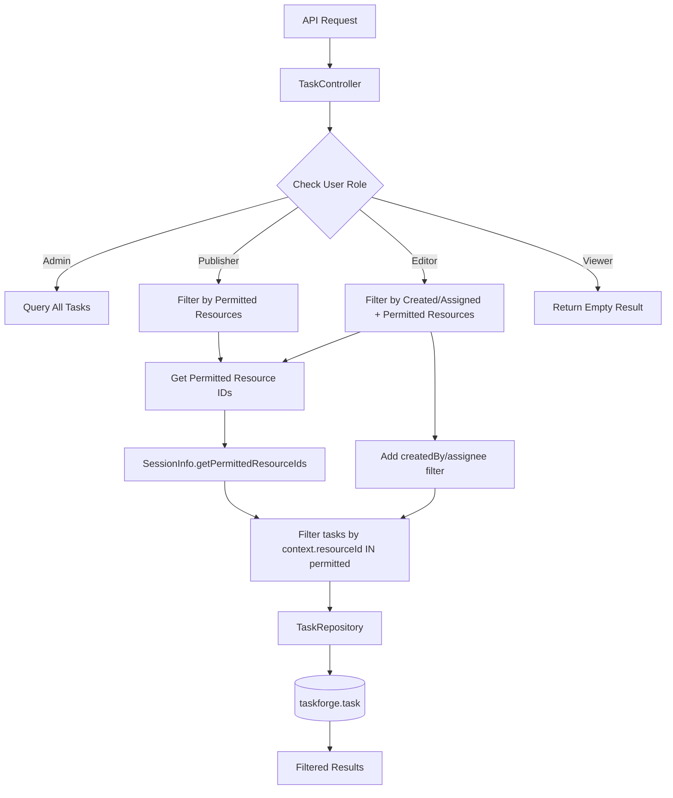

# Task Access Control

## Description

Task access control provides privilege-based visibility and filtering of tasks in TermX. Different user roles see different subsets of tasks based on their privileges and resource access levels. This ensures users only see tasks relevant to their responsibilities.

**Role-based visibility:**

- **Admin** - Sees all tasks across all resources
- **Publisher** - Sees all tasks for resources they have publish access to
- **Editor** - Sees only tasks they created or are assigned to, for resources they have edit access to
- **Viewer** - Cannot see tasks in the task list (no task access)

**Key capabilities:**

- Privilege-based task filtering at the database level
- Resource-level access control using context items
- Unseen changes tracking per user
- Automatic filtering in all API endpoints (query, load, widget)
- Support for complex privilege patterns (wildcards, resource-specific)

## Configuration

Task access control is automatically enabled and requires no configuration. It is built into the TaskForge module and uses the TermX privilege system.

### Privilege System

Task access is controlled by three privilege levels:

| Privilege | Scope | Task Visibility |
|-----------|-------|-----------------|
| `*.*.publish` or `*.*.*` | Global admin/publisher | All tasks |
| `*.Task.publish` | Task publisher | All tasks for accessible resources |
| `*.ResourceType.publish` | Resource publisher | All tasks for that resource type |
| `*.Task.edit` or `*.ResourceType.edit` | Editor | Only own/assigned tasks for accessible resources |
| `*.Task.view` or `*.ResourceType.view` | Viewer | No task list access (empty results) |

### Default Role Configuration

Default roles in TermX:

- **admin**: `*.*.*` (all privileges)
- **publisher**: `*.*.publish` (publish on all resources)
- **editor**: `*.*.edit` (edit on all resources)
- **viewer**: `*.*.view` (view-only on all resources)

See [Mock Authentication](mock-auth.md) for testing with mock user profiles.

### Resource-Level Access

Tasks are linked to resources via context items (e.g., CodeSystem, ValueSet, MapSet). Access control considers:

1. **User's privileges** on the resource type
2. **Specific resource ID** from task context
3. **Task ownership** (created by or assigned to user)

Example: A user with privilege `icd-10.CodeSystem.edit` can see tasks with context `{type: "code-system", id: "icd-10"}` that they created or are assigned to.

## Use-Cases

### Scenario 1: Editor Creating and Viewing Own Task

**Context:** Junior editor needs to create a review task for ICD-10 concepts they're working on.

**Steps:**
1. Editor logs in with `icd-10.CodeSystem.edit` privilege
2. Creates task: "Review new diabetes concepts" with context `{type: "code-system", id: "icd-10"}`
3. Task is assigned to themselves
4. Query task list - sees the newly created task
5. Another editor queries task list - does NOT see this task (not their task)

**Outcome:** Editor can manage their own tasks without seeing unrelated tasks from other editors.

### Scenario 2: Publisher Monitoring All Resource Tasks

**Context:** Senior publisher needs to see all review tasks for ICD-10 and ICD-11 code systems.

**Steps:**
1. Publisher logs in with `icd-10.CodeSystem.publish` and `icd-11.CodeSystem.publish` privileges
2. Query task list - sees ALL tasks (from all users) for ICD-10 and ICD-11
3. Can view task details even if created by other users
4. Can reassign tasks and monitor progress

**Outcome:** Publisher has oversight of all tasks for resources they manage, enabling effective coordination.

### Scenario 3: Admin Full Visibility

**Context:** System administrator needs to troubleshoot task-related issues and view all tasks.

**Steps:**
1. Admin logs in with `*.*.*` privilege
2. Query task list - sees ALL tasks across all resources
3. Can view and edit any task regardless of assignee or creator
4. Can diagnose issues and reassign stuck tasks

**Outcome:** Admin has complete system visibility for support and troubleshooting.

### Scenario 4: Viewer Restricted Access

**Context:** Read-only user (reports/auditing role) should not see task management interface.

**Steps:**
1. Viewer logs in with only `*.*.view` privileges (no Task.edit or Task.publish)
2. Query task list - receives empty result
3. Attempts to load specific task - receives 403 Forbidden
4. Task menu items hidden in UI

**Outcome:** Viewer cannot access task system, maintaining separation of concerns.

### Scenario 5: Resource-Specific Task Filtering

**Context:** Editor has edit access to multiple code systems but should only see tasks for those specific resources.

**Steps:**
1. Editor has privileges: `icd-10.CodeSystem.edit`, `disorders.ValueSet.edit`
2. Query task list - sees only tasks where:
   - Context references ICD-10 or disorders
   - AND (created by editor OR assigned to editor)
3. Tasks for other resources (e.g., SNOMED) are not visible
4. Tasks for ICD-10 created by others and not assigned to this editor are not visible

**Outcome:** Fine-grained access control based on both resource access and task ownership.

## API

Task access control is transparent - all task endpoints automatically apply privilege-based filtering.

### Filtered Endpoints

All endpoints under `/api/tm` apply access control:

| Method | Path | Filtering Behavior |
|--------|------|-------------------|
| GET | `/tasks{?params*}` | Returns only tasks user can access based on privileges |
| GET | `/tasks/{number}` | Returns 403 if user cannot access the task |
| POST | `/tasks` | Validates user has edit access to resources in task context |
| PUT/PATCH | `/tasks/{number}` | Validates user can edit the task |

### Query Parameters

The `createdByOrAssignee` filter is automatically applied for editors - it cannot be overridden via query parameters.

### Response Behavior

- **Admin/Publisher**: Full task list for accessible resources
- **Editor**: Only tasks where `createdBy = username OR assignee = username`
- **Viewer**: Empty result set (`QueryResult.empty()`)

## Testing

### Test privilege-based filtering

```bash
# Start with mock authentication enabled
MICRONAUT_ENVIRONMENTS=local ./gradlew :termx-app:run

# Query as admin (sees all tasks)
curl http://localhost:8200/api/tm/tasks
# Expected: All tasks in the system

# Query as publisher (sees all tasks for accessible resources)
curl -H "Authorization: Bearer publisher" http://localhost:8200/api/tm/tasks
# Expected: All tasks for resources with publish access

# Query as editor (sees only own/assigned tasks)
curl -H "Authorization: Bearer editor" http://localhost:8200/api/tm/tasks
# Expected: Only tasks created by or assigned to editor1

# Query as viewer (no task access)
curl -H "Authorization: Bearer viewer" http://localhost:8200/api/tm/tasks
# Expected: Empty result []
```

### Test resource-level access

```bash
# Create task as editor with icd-10 context
curl -X POST -H "Authorization: Bearer editor" \
     -H "Content-Type: application/json" \
     -d '{
       "title": "Review ICD-10 Mapping",
       "type": "concept-review",
       "workflow": "concept-review",
       "project": "termx",
       "priority": "routine",
       "context": [{"type": "code-system", "id": "icd-10"}]
     }' \
     http://localhost:8200/api/tm/tasks

# Same editor should see their own task
curl -H "Authorization: Bearer editor" http://localhost:8200/api/tm/tasks
# Expected: Task appears in results

# Different editor (no access to icd-10) should NOT see it
# (if they don't have icd-10.CodeSystem.edit privilege)

# Publisher with icd-10 publish access should see it
curl -H "Authorization: Bearer publisher" http://localhost:8200/api/tm/tasks
# Expected: Task appears (publisher has publish access)
```

### Test unseen changes tracking

```bash
# 1. Get task list and identify a task
curl http://localhost:8200/api/tm/tasks

# 2. Mark task as opened
curl -X POST http://localhost:8200/api/tm/tasks/TASK-123/opened

# 3. Update the task (triggers unseen change)
curl -X PATCH -H "Content-Type: application/json" \
     -d '{"title": "Updated Title"}' \
     http://localhost:8200/api/tm/tasks/TASK-123

# 4. Query with unseenChanges filter
curl "http://localhost:8200/api/tm/tasks?unseenChanges=true"
# Expected: Task appears in results
```

## Data Model

### TaskQueryParams

Query parameters used for filtering tasks at the API level.

| Field | Type | Description |
|-------|------|-------------|
| createdByOrAssignee | String | Username filter (tasks created by OR assigned to this user) |
| permittedContexts | List<String> | Resource IDs user has access to |
| unseenChanges | Boolean | Filter for tasks updated since last opened |
| text | String | Full-text search |
| project | String | Project code filter |
| status | String | Task status filter |
| assignee | String | Assigned user filter |

**Applied automatically by controller:**

- `createdByOrAssignee` - set for editors based on session username
- `permittedContexts` - set for editors/publishers based on session privileges

### SessionInfo

Session information used for access control decisions.

| Field | Type | Description |
|-------|------|-------------|
| username | String | Current user's username |
| privileges | List<String> | User's privilege strings |
| authenticated | boolean | Whether user is authenticated |

**Key methods:**

- `hasPrivilege(String privilege)` - Check if user has specific privilege
- `hasAnyPrivilege(List<String> privileges)` - Check if user has any of the privileges
- `getPermittedResourceIds(String action)` - Get resource IDs user can perform action on

### Privilege Pattern

Privilege strings follow: `<resourceId>.<ResourceType>.<action>`

| Component | Examples | Wildcard |
|-----------|----------|----------|
| resourceId | `icd-10`, `disorders`, `snomed-ct` | `*` = all resources |
| ResourceType | `CodeSystem`, `ValueSet`, `MapSet`, `Task` | `*` = all types |
| action | `view`, `edit`, `publish` | `*` = all actions |

**Privilege hierarchy for task access:**

1. `*.*.*` - Admin, sees all tasks
2. `*.*.publish` - Global publisher, sees all tasks
3. `icd-10.CodeSystem.publish` - ICD-10 publisher, sees all ICD-10 tasks
4. `*.Task.edit` - Task editor, sees own tasks across all resources
5. `icd-10.CodeSystem.edit` - ICD-10 editor, sees own ICD-10 tasks
6. `*.Task.view` - Task viewer, cannot access task list

### TaskSearchParams (Backend)

Internal search parameters passed to TaskForge repository.

| Field | Type | Description |
|-------|------|-------------|
| createdByOrAssignee | String | SQL filter: `created_by = ? OR assignee = ?` |
| permittedContexts | List<String> | SQL filter: context resource IDs must be in this list |
| unseenChanges | Boolean | JOIN with task_read_log, filter where last_opened < updated_at |

These parameters are mapped from `TaskQueryParams` by the controller after applying privilege checks.

## Architecture



**Privilege resolution flow:**

1. **Request arrives**: Extract session from OAuth/mock provider
2. **Check admin**: If `*.*.*` or `*.*.publish`, return all tasks
3. **Check publisher**: If has publish on any resource type, get permitted resource IDs and filter by context
4. **Check editor**: If has edit on any resource type, apply `createdByOrAssignee` filter plus permitted resources
5. **Default (viewer)**: Return empty result

**Database filtering:**

Filtering happens at the SQL level for performance:

```sql
-- Editor query
SELECT * FROM taskforge.task t
WHERE (t.created_by = ? OR t.assignee = ?)
  AND EXISTS (
    SELECT 1 FROM jsonb_array_elements(t.context) ctx
    WHERE (ctx->>'type', ctx->>'id') IN (permitted_resources)
  )
```

## Technical Implementation

### Key Components

**TaskController filtering logic:**

```java
@Authorized(privilege = Privilege.T_VIEW)
@Get(uri = "/tasks{?params*}")
public QueryResult<Task> queryTasks(TaskQueryParams params) {
    SessionInfo session = SessionStore.require();
    
    // Admin sees everything
    if (session.hasPrivilege("*.*.publish") || session.hasPrivilege("*.*.*")) {
        return taskService.queryTasks(params);
    }
    
    // Publisher sees all tasks for accessible resources
    if (session.hasAnyPrivilege(List.of("*.Task.publish", "*.*.publish"))) {
        List<String> permittedResources = session.getPermittedResourceIds("*.publish");
        params.setPermittedContexts(permittedResources);
        return taskService.queryTasks(params);
    }
    
    // Editor sees only own tasks for accessible resources
    if (session.hasAnyPrivilege(List.of("*.Task.edit", "*.*.edit"))) {
        params.setCreatedByOrAssignee(session.getUsername());
        List<String> permittedResources = session.getPermittedResourceIds("*.edit");
        params.setPermittedContexts(permittedResources);
        return taskService.queryTasks(params);
    }
    
    // Viewer: return empty
    return QueryResult.empty();
}
```

### Database Schema

**task_read_log table:**

```sql
CREATE TABLE taskforge.task_read_log (
  id                    bigint PRIMARY KEY,
  task_id               bigint NOT NULL REFERENCES taskforge.task(id),
  user_id               text NOT NULL,
  last_opened_time      timestamptz NOT NULL,
  CONSTRAINT task_read_log_ukey UNIQUE (task_id, user_id)
);
```

Used for tracking when users last opened tasks to show unseen changes indicator.

### Context Types and Resource Access

Task context items link tasks to resources:

| Context Type | Resource | Privilege Pattern |
|--------------|----------|-------------------|
| `code-system` | CodeSystem | `<resourceId>.CodeSystem.edit/publish` |
| `value-set` | ValueSet | `<resourceId>.ValueSet.edit/publish` |
| `map-set` | MapSet | `<resourceId>.MapSet.edit/publish` |
| `wiki` | Wiki space | `<resourceId>.Wiki.edit/publish` |

The system extracts resource IDs from task context and checks user privileges against those specific resources.

### Migration from Taskflow

TaskForge is an inlined version of the external `taskflow-service` library. Key changes:

- Package: `com.kodality.taskflow` → `org.termx.taskforge`
- Schema: `taskflow` → `taskforge`
- Module: `task-taskflow` → `task-taskforge`
- Added privilege-based filtering (not present in original taskflow)

Migration script `90-migrate-from-taskflow.sql` handles both fresh installations and migrations from existing taskflow schema.
