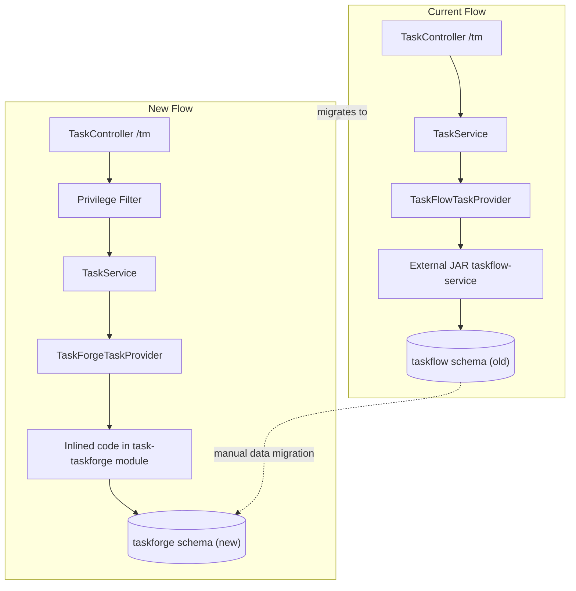
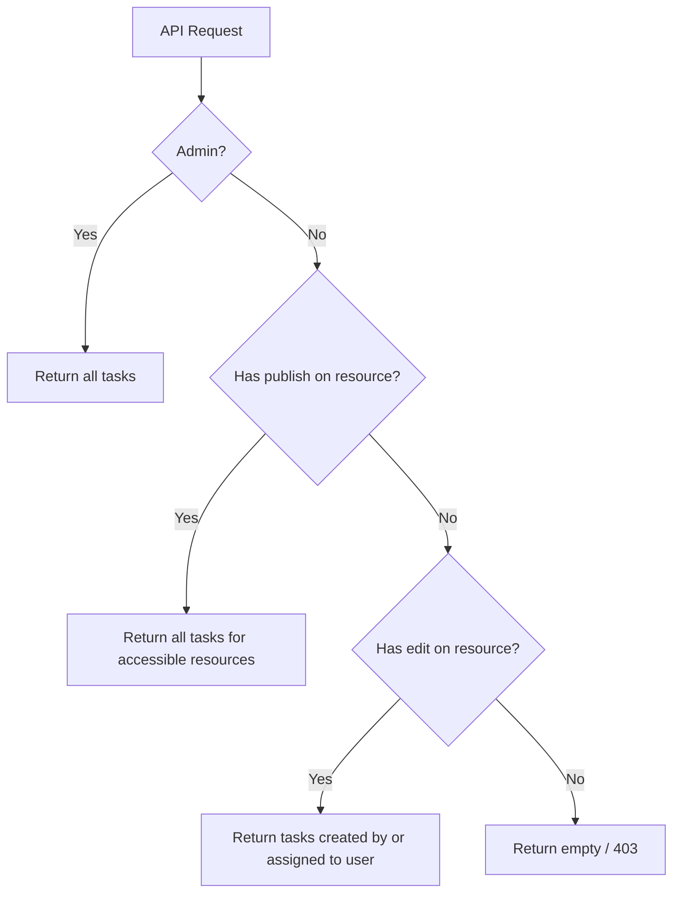

# Task Access Control Migration Plan

## Context

Currently, TermX task management has two privilege levels (`Task.view`, `Task.edit`) with no resource-level filtering. All users with `Task.view` see all tasks. The CCM project implements role-based task visibility (ICT/AUDITOR see all, PRACTITIONER sees only own tasks) via a security rules engine.

The goal: implement privilege-based task visibility in TermX where:

- **Viewer** (only `*.ResourceType.view`): cannot see tasks
- **Editor** (`*.ResourceType.edit`): sees only tasks they created or are assigned to, for resources they have edit access to
- **Publisher** (`*.ResourceType.publish`): sees all tasks for resources they have access to
- **Admin**: sees all tasks

### Naming: taskflow -> taskforge

All references to "taskflow" are renamed to **"taskforge"** throughout the codebase and database. A brand-new DB schema `taskforge` is created with fresh tables. The old `taskflow` schema remains untouched; data migration from `taskflow` to `taskforge` is done manually outside of this plan.

## Phase 1: Inline taskflow-service and SequenceService into termx-server

Two external libraries are inlined: `com.kodality.taskflow:taskflow-service:1.1-SNAPSHOT` and `com.kodality.commons:commons-sequence`. All new code uses `org.termx.`* packages (no "kodality" in new package names). All "taskflow" naming becomes "taskforge".

### 1.1 Inline SequenceService into termx-core

The `com.kodality.commons:commons-sequence` JAR contains only 2 classes (`SequenceService`, `SequenceRepository`) that wrap PostgreSQL functions `core.sequence_id()` and `core.sequence_nextval()`. The DB schema/functions are already loaded by TermX via the JAR's Liquibase changelog.

**Step 1:** Create two new files in `termx-core` under `org.termx.core.sequence`:

- `termx-core/src/main/java/org/termx/core/sequence/SequenceService.java` - thin wrapper calling `SequenceRepository`
- `termx-core/src/main/java/org/termx/core/sequence/SequenceRepository.java` - calls `core.sequence_id(?, ?, ?)` and `core.sequence_nextval(?, ?)`

Source (from helex-commons, which is identical in logic to kodality-commons but cleaner to copy):

```java
// SequenceService.java
package org.termx.core.sequence;

@Singleton
@RequiredArgsConstructor
public class SequenceService {
  private final SequenceRepository sequenceRepository;

  public String getNextValue(String sequence, String scope, LocalDate date, String tenant) {
    return sequenceRepository.getNextValue(sequence, scope, date, tenant);
  }
}
```

```java
// SequenceRepository.java
package org.termx.core.sequence;

@Singleton
public class SequenceRepository extends BaseRepository {
  public String getNextValue(String code, String scope, LocalDate date, String tenant) {
    Long sequenceId = jdbcTemplate.queryForObject("select core.sequence_id(?, ?, ?)", Long.class, code, scope, tenant);
    return jdbcTemplate.queryForObject("select core.sequence_nextval(?, ?)", String.class, sequenceId, date);
  }
}
```

**Step 2:** Copy the Liquibase SQL migrations from the JAR into `termx-core/src/main/resources/sys_sequence/changelog/`:

- `01-sys_sequence.sql`, `sequence_id.sql`, `sequence_nextval.sql`, `sequence_nextvala.sql`, `changelog.xml`

These files are already included by `termx-app/changelog.xml` via `<include file="sys_sequence/changelog/changelog.xml" relativeToChangelogFile="false"/>`, so they will be picked up from the classpath.

**Step 3:** Update `[termx-core/src/main/java/com/kodality/termx/core/sequence/SysSequenceService.java](termx-core/src/main/java/com/kodality/termx/core/sequence/SysSequenceService.java)`:

- Change import from `com.kodality.commons.sequence.SequenceService` to `org.termx.core.sequence.SequenceService`

**Step 4:** Remove from `[termx-core/build.gradle](termx-core/build.gradle)`:

- `implementation("com.kodality.commons:commons-sequence:${rootProject.commonsMicronautVersion}")`

### 1.2 Rename module: task-taskflow -> task-taskforge

Rename the Gradle module directory and update references:

- Rename directory `task-taskflow/` to `task-taskforge/`
- In `[settings.gradle](settings.gradle)`: change `include 'task-taskflow'` to `include 'task-taskforge'`
- In `[termx-app/build.gradle](termx-app/build.gradle)` (or wherever task-taskflow is referenced): update project references

### 1.3 Copy taskflow-service source files

Source: `/tmp/taskflow-service/src/main/java/com/kodality/taskflow/` (33 Java files)
Destination: `task-taskforge/src/main/java/org/termx/taskforge/`

Sub-packages and class renames (`Taskflow` -> `Taskforge` in class names):

- `api/` — `TaskforgeUserProvider`, `TaskInterceptor`, `TaskStatusChangeInterceptor`, `TaskforgeAttachmentStorageHandler`
- `auth/` — `TaskforgeSessionProvider`, `TaskforgeSessionInfo`
- `user/` — `TaskforgeUser`, `TaskforgeUserController`
- `project/` — `Project`, `ProjectService`, `ProjectRepository`, `ProjectController`
- `workflow/` — `Workflow`, `WorkflowService`, `WorkflowRepository`, `WorkflowController`, `WorkflowSearchParams`
- `task/` — `Task`, `TaskService`, `TaskRepository`, `TaskSearchParams`, `TaskController`
- `task/activity/` — `TaskActivity`, `TaskActivityService`, `TaskActivityRepository`, `TaskActivityController`, `TaskActivitySearchParams`
- `task/attachment/` — `TaskAttachmentService`, `TaskAttachmentRepository`
- `task/execution/` — `TaskExecution`, `TaskExecutionService`, `TaskExecutionRepository`, `TaskExecutionController`
- Root: `ApiError`

### 1.4 Copy and adapt Liquibase resources

Copy from `/tmp/taskflow-service/src/main/resources/taskflow/` into `task-taskforge/src/main/resources/taskforge/` and perform the following renames:

**Directory structure:**

```
task-taskforge/src/main/resources/taskforge/
  changelog/
    changelog.xml
    01-init-user.sql
    10-sequences.sql
    taskforge/
      taskforge-schema.xml          (was taskflow-schema.xml)
      changelog.xml
      10-project.sql
      20-workflow.sql
      30-task.sql
      31-task_activity.sql
      31-task_attachment.sql
      31-task_execution.sql
      33-task_read_log.sql          (new, from Phase 4)
      functions/
        task_action_trigger.sql
```

**SQL content changes** in all `.sql` and `.xml` files:

- Schema name: `taskflow` -> `taskforge` (e.g., `create table taskforge.task`, `taskforge.project`, etc.)
- Constraint names: `taskflow` prefix in names -> `taskforge` where applicable
- Schema creation: `CREATE SCHEMA IF NOT EXISTS taskforge`
- The `taskforge-schema.xml` file should create the `taskforge` schema instead of `taskflow`

**Changeset IDs:** should use unique IDs (e.g., prefix `taskforge:` instead of `taskflow:`) to avoid Liquibase conflicts with the already-executed `taskflow` changesets in the `databasechangelog` table.

### 1.5 Refactor all Java code

In all 33 inlined files plus the 6 existing TermX files:

- Package: `com.kodality.taskflow` -> `org.termx.taskforge`
- Class names: `Taskflow`* -> `Taskforge*` (e.g., `TaskflowUser` -> `TaskforgeUser`, `TaskflowSessionProvider` -> `TaskforgeSessionProvider`, etc.)
- All internal references, field names, variable names containing "taskflow" -> "taskforge"
- Import: `com.kodality.commons.sequence.SequenceService` -> `org.termx.core.sequence.SequenceService`
- SQL string literals: `taskflow.task` -> `taskforge.task`, etc.

### 1.6 Update build.gradle

In `[task-taskforge/build.gradle](task-taskforge/build.gradle)` (renamed from task-taskflow):

- **Remove** the external dependency: `api("com.kodality.taskflow:taskflow-service:${taskflowVersion}")`
- No new dependencies needed: all deps are available transitively through `termx-core`.

Remove `taskflowVersion` from `[gradle.properties](gradle.properties)`.

### 1.7 Refactor existing TermX taskforge code

Move and rename existing files:

- `TaskFlowTaskProvider.java` -> `org.termx.taskforge.task.TaskForgeTaskProvider`
- `TaskMapper.java` -> `org.termx.taskforge.task.TaskMapper`
- `TaskChangeInterceptor.java` -> `org.termx.taskforge.task.TaskChangeInterceptor`
- `TermxTaskflowSessionProvider.java` -> `org.termx.taskforge.TermxTaskforgeSessionProvider`
- `TermxTaskflowUserProvider.java` -> `org.termx.taskforge.TermxTaskforgeUserProvider`
- `ApiModuleInfo.java` -> `org.termx.taskforge.ApiModuleInfo`

Note: The inlined `TaskController` (from taskflow-service, originally at path `/taskflow/tasks`) and the TermX `TaskController` (at path `/tm/tasks`) may conflict. The inlined taskforge controllers should either be disabled (remove `@Controller`) or their paths should be prefixed to avoid collision. The TermX-level controllers at `/tm` are the ones that should remain as the public API.

### 1.8 Update taskforge data migration

In `[task-taskforge/src/main/resources/taskforge/changelog/data/00-taskforge-data.sql](task-taskforge/src/main/resources/task-taskflow/changelog/data/00-taskflow-data.sql)` (renamed from `00-taskflow-data.sql`):

- Change all `taskflow.project` -> `taskforge.project`
- Change all `taskflow.workflow` -> `taskforge.workflow`
- Update changeset IDs to `taskforge:` prefix
- The project code remains `termx`

### 1.9 Update other modules referencing taskflow imports

Search all other modules for imports from `com.kodality.taskflow.`* or `com.kodality.termx.taskflow.*` and update to `org.termx.taskforge.*`:

- `[terminology/.../CodeSystemTaskStatusChangeInterceptor.java](terminology/src/main/java/com/kodality/termx/terminology/task/CodeSystemTaskStatusChangeInterceptor.java)`
- `[terminology/.../ValueSetTaskStatusChangeInterceptor.java](terminology/src/main/java/com/kodality/termx/terminology/task/ValueSetTaskStatusChangeInterceptor.java)`
- `[terminology/.../MapSetTaskStatusChangeInterceptor.java](terminology/src/main/java/com/kodality/termx/terminology/task/MapSetTaskStatusChangeInterceptor.java)`
- `[wiki/.../WikiPageCommentTaskFlowInterceptor.java](wiki/src/main/java/com/kodality/termx/wiki/task/WikiPageCommentTaskFlowInterceptor.java)` (also rename class to `WikiPageCommentTaskForgeInterceptor`)
- `[wiki/.../WikiPageCommentTaskFlowStatusChangeInterceptor.java](wiki/src/main/java/com/kodality/termx/wiki/task/WikiPageCommentTaskFlowStatusChangeInterceptor.java)` (also rename)
- `[snomed/.../TaskFlowSnomedInterceptor.java](snomed/src/main/java/com/kodality/termx/snomed/task/TaskFlowSnomedInterceptor.java)` (also rename to `TaskForgeSnomedInterceptor`)

## Phase 2: Add Task.publish privilege and update defaults

### 2.1 Add Task.publish to Privilege interface

In `[task/src/main/java/com/kodality/termx/task/Privilege.java](task/src/main/java/com/kodality/termx/task/Privilege.java)`:

```java
public interface Privilege {
  String T_VIEW = "Task.view";
  String T_EDIT = "Task.edit";
  String T_PUBLISH = "Task.publish";
}
```

### 2.2 Update default privilege data migration

In `[termx-app/src/main/resources/db/changelog/uam/01-privilege-defaults.sql](termx-app/src/main/resources/db/changelog/uam/01-privilege-defaults.sql)`, add a new changeset that grants `Task.publish` to the `publisher` and `admin` roles. The existing `editor` role should have `Task.edit` (it already has `edit` on `Any` resource type, so this may already be covered). Verify the mapping:

- `viewer` role: `Task.view` only (via `Any.view`)
- `editor` role: `Task.view` + `Task.edit` (via `Any.view` + `Any.edit`)
- `publisher` role: `Task.view` + `Task.edit` + `Task.publish` (via `Any.view` + `Any.edit` + `Any.publish`)
- `admin`: all (via `Admin` + wildcard)

Currently `Task` is not registered as a resource type in the `Any` wildcard system. Check if the `Any` resource type with `view`/`edit`/`publish` actions covers `Task` or if `Task` needs its own `privilege_resource` entries.

## Phase 3: Implement privilege-based task filtering

### 3.1 Add `createdByOrAssignee` to TaskSearchParams

In the inlined `TaskSearchParams` (`org.termx.taskforge.task.TaskSearchParams`), add:

```java
private String createdByOrAssignee; // user sub - filters: created_by = ? OR assignee = ?
```

### 3.2 Update TaskRepository filter

In the inlined `TaskRepository` (`org.termx.taskforge.task.TaskRepository`), add to the `filter()` method:

```java
sb.appendIfNotNull(params.getCreatedByOrAssignee(), (s, p) -> 
    s.append("and (t.created_by = ? or t.assignee = ?)", p, p));
```

### 3.3 Add `createdByOrAssignee` to TermX TaskQueryParams

In `[task/src/main/java/com/kodality/termx/task/TaskQueryParams.java](task/src/main/java/com/kodality/termx/task/TaskQueryParams.java)`:

```java
private String createdByOrAssignee;
```

### 3.4 Update TaskMapper to pass new filter

In `TaskMapper.java` (now at `org.termx.taskforge.task.TaskMapper`), add to the `map(TaskQueryParams)` method:

```java
searchParams.setCreatedByOrAssignee(params.getCreatedByOrAssignee());
```

### 3.5 Implement filtering logic in TaskController

In `[task/src/main/java/com/kodality/termx/task/TaskController.java](task/src/main/java/com/kodality/termx/task/TaskController.java)`, modify `queryTasks()`:

```java
@Authorized(privilege = Privilege.T_VIEW)
@Get(uri = "/tasks{?params*}")
public QueryResult<Task> queryTasks(TaskQueryParams params) {
    SessionInfo session = SessionStore.require();
    
    // Admin sees everything
    if (session.hasPrivilege("*.*.publish") || session.hasPrivilege("*.*.*")) {
        return taskService.queryTasks(params);
    }
    
    // Editor: see only own tasks (created by me or assigned to me)
    if (session.hasAnyPrivilege(List.of("*.Task.edit", "*.*.edit"))) {
        params.setCreatedByOrAssignee(session.getUsername());
        return taskService.queryTasks(params);
    }
    
    // Viewer only: return empty
    return QueryResult.empty();
}
```

Additionally, the same logic should apply in `loadTask()` - an editor should only be able to load a task they created or are assigned to. A viewer should get 403.

### 3.6 Resource-level privilege check

When a task has `context` items (e.g., `code-system|icd-10`), the system should verify the user has at least `edit` privilege on the referenced resource. This means:

- Extract context items from task (or from query params)
- Use `session.getPermittedResourceIds("CodeSystem.edit")` to get the list of resources the user can edit
- Filter tasks whose context references resources the user has access to

This is more complex and could be implemented as a post-filter or by passing permitted resource IDs into the query. The approach:

1. In `queryTasks()`, compute the set of resources the user can edit/publish
2. Pass this as an additional filter or post-filter the results
3. For tasks without context: apply the createdByOrAssignee filter only

## Phase 4: DB Migration - task_read_log and full parity

### 4.1 Add task_read_log table

Create new Liquibase changeset in `task-taskforge/src/main/resources/taskforge/changelog/taskforge/33-task_read_log.sql`:

```sql
--liquibase formatted sql

--changeset taskforge:task_read_log-1
create table taskforge.task_read_log (
  id                    bigint not null generated by default as identity primary key,
  task_id               bigint not null,
  user_id               text not null,
  last_opened_time      timestamptz not null,
  sys_status            char(1) default 'A' not null,
  sys_version           integer not null,
  sys_created_at        timestamptz not null,
  sys_created_by        text not null,
  sys_modified_at       timestamptz not null,
  sys_modified_by       text not null,
  constraint task_read_log_task_fkey foreign key (task_id) references taskforge.task (id),
  constraint task_read_log_ukey unique (task_id, user_id)
);
select core.create_table_metadata('taskforge.task_read_log');
--
```

Include this new file in `task-taskforge/src/main/resources/taskforge/changelog/taskforge/changelog.xml`.

### 4.2 Add TaskReadLog service and repository

Create new classes in `task-taskforge` module under `org.termx.taskforge.task.readlog`:

- `TaskReadLogRepository` - upsert method (same as CCM pattern)
- `TaskReadLogService` - `logTaskRead(Long taskId)` method

### 4.3 Add "opened" endpoint

In `TaskController`, add:

```java
@Authorized(privilege = Privilege.T_VIEW)
@Post("/tasks/{number}/opened")
public void logTaskRead(@PathVariable String number) { ... }
```

### 4.4 Add unseen changes filter

Add `unseenChanges` (Boolean) to `TaskSearchParams` and wire it into the query:

```sql
AND (trl.last_opened_time IS NULL OR trl.last_opened_time < t.updated_at)
```

This requires a LEFT JOIN on `taskforge.task_read_log` in the task query.

### 4.5 Add lastOpenedTime to Task model

Add `lastOpenedTime` to the Task model and populate it from the LEFT JOIN.

## Phase 5: Web UI Changes (future - after backend testing)

### 5.1 Hide task list for view-only users

In `[app/src/app/root-routing.module.ts](../termx-web/app/src/app/root-routing.module.ts)` (line 41), change privilege from `*.Task.view` to `*.Task.edit`:

```typescript
{path: 'tasks', children: TASK_ROUTES, data: {privilege: ['*.Task.edit']}},
```

### 5.2 Update landing page task cards

In the landing page component, conditionally show task cards only if user has `*.Task.edit` privilege.

### 5.3 Update resource task widget

In `[resource-tasks-widget.component.ts](../termx-web/app/src/app/resources/resource/components/resource-tasks-widget.component.ts)`:

- Only render the widget if user has at least `edit` privilege on the resource
- The backend filtering handles the rest (editors see own tasks, publishers see all)

### 5.4 Add "unseen changes" indicator

- Add eye icon to task list rows for tasks with changes since last opened
- Call `POST /tm/tasks/{number}/opened` when a task is viewed
- Add `unseenChanges` filter option to task list

### 5.5 Update task search params model

In `[task-search-params.ts](../termx-web/app/src/app/task/_lib/model/task-search-params.ts)`, add `unseenChanges?: boolean`.

### 5.6 Update task model

In `[task.ts](../termx-web/app/src/app/task/_lib/model/task.ts)`, add `lastOpenedTime?: Date`.

## Architecture Summary







## Key Files to Modify


| Module              | File                                                               | Change                                                                           |
| ------------------- | ------------------------------------------------------------------ | -------------------------------------------------------------------------------- |
| `termx-core`        | New: `org/termx/core/sequence/SequenceService.java`                | Inlined from kodality-commons                                                    |
| `termx-core`        | New: `org/termx/core/sequence/SequenceRepository.java`             | Inlined from kodality-commons                                                    |
| `termx-core`        | `SysSequenceService.java`                                          | Update import to `org.termx.core.sequence`                                       |
| `termx-core`        | `build.gradle`                                                     | Remove `commons-sequence` dependency                                             |
| `task`              | `Privilege.java`                                                   | Add `T_PUBLISH`                                                                  |
| `task`              | `TaskController.java`                                              | Add privilege-based filtering logic                                              |
| `task`              | `TaskQueryParams.java`                                             | Add `createdByOrAssignee`                                                        |
| `settings.gradle`   | Rename module                                                      | `task-taskflow` -> `task-taskforge`                                              |
| `task-taskforge`    | `build.gradle`                                                     | Remove external JAR dependency                                                   |
| `task-taskforge`    | 33 inlined files under `org/termx/taskforge/`                      | Copied from taskflow-service, `taskflow`->`taskforge`, `org.termx` packages      |
| `task-taskforge`    | 6 existing files                                                   | Move from `com.kodality.termx.taskflow` to `org.termx.taskforge`, rename classes |
| `task-taskforge`    | All Liquibase `.sql`/`.xml` resources                              | Schema `taskflow`->`taskforge`, new changeset IDs                                |
| `task-taskforge`    | `TaskSearchParams.java` (inlined)                                  | Add `createdByOrAssignee`                                                        |
| `task-taskforge`    | `TaskRepository.java` (inlined)                                    | Add filter for `createdByOrAssignee`, LEFT JOIN read_log                         |
| `task-taskforge`    | `TaskMapper.java`                                                  | Map new params                                                                   |
| `task-taskforge`    | New: `org/termx/taskforge/task/readlog/TaskReadLogRepository.java` | Read log support                                                                 |
| `task-taskforge`    | New: `org/termx/taskforge/task/readlog/TaskReadLogService.java`    | Read log support                                                                 |
| `task-taskforge`    | New: `33-task_read_log.sql`                                        | DB migration in `taskforge` schema                                               |
| `terminology`       | 3 interceptor files                                                | Update imports                                                                   |
| `wiki`              | 2 interceptor files                                                | Update imports, rename classes `TaskFlow`->`TaskForge`                           |
| `snomed`            | 1 interceptor file                                                 | Update imports, rename class `TaskFlow`->`TaskForge`                             |
| `termx-app`         | New changeset in UAM                                               | Task.publish privilege data                                                      |
| `gradle.properties` | Remove `taskflowVersion`                                           |                                                                                  |


## Naming Convention Summary


| Old                                                    | New                                                     |
| ------------------------------------------------------ | ------------------------------------------------------- |
| DB schema `taskflow`                                   | DB schema `taskforge`                                   |
| Package `com.kodality.taskflow.*`                      | Package `org.termx.taskforge.*`                         |
| Package `com.kodality.termx.taskflow.*`                | Package `org.termx.taskforge.*`                         |
| Class `TaskflowUser`                                   | Class `TaskforgeUser`                                   |
| Class `TaskflowUserProvider`                           | Class `TaskforgeUserProvider`                           |
| Class `TaskflowSessionProvider`                        | Class `TaskforgeSessionProvider`                        |
| Class `TaskflowSessionInfo`                            | Class `TaskforgeSessionInfo`                            |
| Class `TaskflowAttachmentStorageHandler`               | Class `TaskforgeAttachmentStorageHandler`               |
| Class `TaskFlowTaskProvider`                           | Class `TaskForgeTaskProvider`                           |
| Class `TermxTaskflowSessionProvider`                   | Class `TermxTaskforgeSessionProvider`                   |
| Class `TermxTaskflowUserProvider`                      | Class `TermxTaskforgeUserProvider`                      |
| Class `TaskflowUserController`                         | Class `TaskforgeUserController`                         |
| Class `WikiPageCommentTaskFlowInterceptor`             | Class `WikiPageCommentTaskForgeInterceptor`             |
| Class `WikiPageCommentTaskFlowStatusChangeInterceptor` | Class `WikiPageCommentTaskForgeStatusChangeInterceptor` |
| Class `TaskFlowSnomedInterceptor`                      | Class `TaskForgeSnomedInterceptor`                      |
| Module `task-taskflow`                                 | Module `task-taskforge`                                 |
| Resources `taskflow/changelog/`                        | Resources `taskforge/changelog/`                        |
| SQL `taskflow.task`                                    | SQL `taskforge.task`                                    |
| SQL `taskflow.project`                                 | SQL `taskforge.project`                                 |
| SQL `taskflow.workflow`                                | SQL `taskforge.workflow`                                |
| SQL `taskflow.task_activity`                           | SQL `taskforge.task_activity`                           |
| SQL `taskflow.task_attachment`                         | SQL `taskforge.task_attachment`                         |
| SQL `taskflow.task_execution`                          | SQL `taskforge.task_execution`                          |
| SQL `taskflow.task_read_log`                           | SQL `taskforge.task_read_log`                           |


