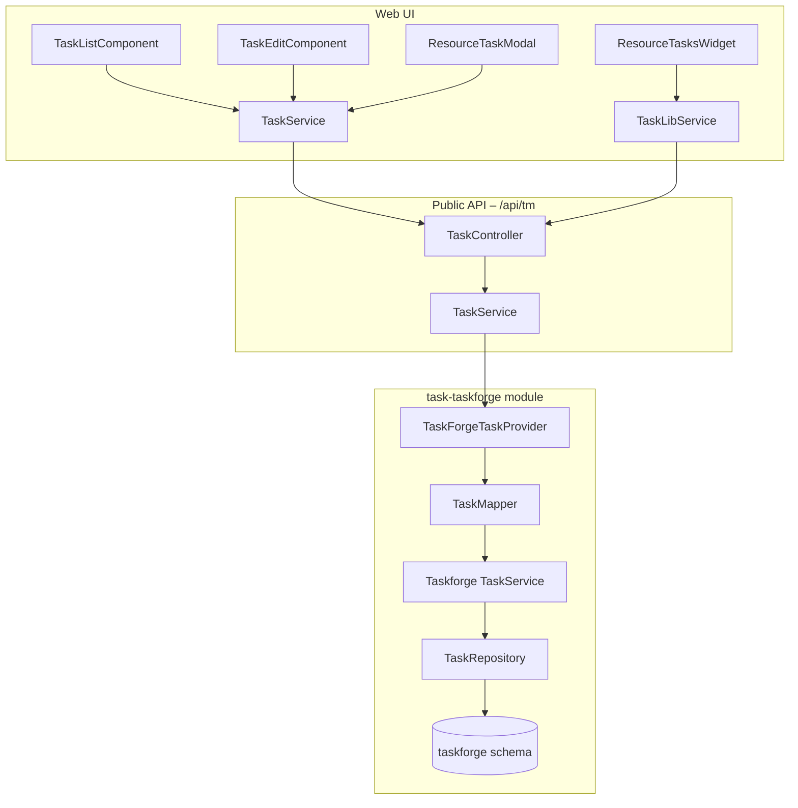

# Task Management (TaskForge)

## Overview

TermX task management provides a workflow-driven system for creating, assigning, and tracking tasks
linked to terminology resources. Tasks are created either manually (from the task list page) or
automatically from resource-specific workflows (version review/approval, concept review).

The backend is implemented as the **TaskForge** module (`task-taskforge`), an inlined fork of the
former external `taskflow-service` library. The public REST API is exposed at `/api/tm/tasks` with
privilege-based filtering. The frontend is an Angular module with a task list, task editor, resource
task widget, and resource task modal.

## Configuration

TaskForge is automatically enabled when the `task-taskforge` module is included in the application. No feature flags are required.

### Database Configuration

TaskForge uses the `taskforge` database schema which is created automatically via Liquibase migrations on application startup.

**Required database functions:**

- `core.sequence_id()` and `core.sequence_nextval()` for task number generation
- These are provided by the `termx-core` module

### Project and Workflow Configuration

Projects and workflows are configured via database records (see migration `90-migrate-from-taskflow.sql`).

**Default configuration:**

- Project: `termx` (created automatically)
- Default workflows: `task`, `version-review`, `version-approval`, `concept-review`, `concept-approval`, `wiki-page-comment`

**Custom projects and workflows:**

Projects and workflows can be added via the API or directly in the database. Each project can define custom workflow types with specific status transitions.

### Environment Variables

No environment variables are required. TaskForge uses the main application database connection.

## Use-Cases

### Scenario 1: Manual Task Creation for CodeSystem Review

**Context:** Terminology editor needs to create a review task for a CodeSystem version before publication.

**Steps:**
1. Navigate to task list page (`/tasks`)
2. Click "Create Task" button
3. Select task type: "concept-review"
4. Select workflow: "version-review"
5. Select resource type: "CodeSystem" and specific resource: "icd-10"
6. Assign to reviewer and add description
7. Save task

**Outcome:** Task appears in assignee's task list, linked to ICD-10 CodeSystem. Assignee receives notification and can track review progress.

### Scenario 2: Automatic Version Approval Task

**Context:** Publisher wants to request approval before publishing a ValueSet version.

**Steps:**
1. Navigate to ValueSet version page
2. Click "Create Approval Task" button
3. Modal opens with pre-filled context (ValueSet + version)
4. Select approver from list (restricted to users with publish privilege)
5. Add optional comment
6. Submit

**Outcome:** Approval task created automatically with correct workflow and context. Approver sees task in their list and can approve/reject.

### Scenario 3: Concept Review Workflow

**Context:** Senior editor needs to review new concepts added by junior editor before they are published.

**Steps:**
1. Junior editor adds new concepts to CodeSystem
2. Junior editor creates "Concept Review" task from concept page
3. Task is assigned to senior editor with context linking to specific concepts
4. Senior editor opens task, clicks context link to view concepts
5. Senior editor adds comments via task activities
6. Senior editor changes task status to "approved" or "rejected"

**Outcome:** Structured review process with full audit trail. Task activity log shows all comments and status transitions.

### Scenario 4: Tracking Unseen Task Changes

**Context:** Publisher wants to quickly find tasks that have been updated since they last viewed them.

**Steps:**
1. Open task list page
2. Enable "Show only tasks with unseen changes" filter
3. See tasks with eye icon indicator
4. Open a task (automatically marked as "seen")
5. Refresh list - task no longer shows eye icon

**Outcome:** Efficient way to stay updated on task changes without manually checking every task.

### Scenario 5: Privilege-Based Task Visibility

**Context:** Organization has editors who should only see their own tasks, not all tasks in the system.

**Steps:**
1. Configure user with `*.CodeSystem.edit` privilege (not publish)
2. User logs in - system automatically derives `*.Task.view` and `*.Task.edit` privileges
3. User navigates to task list (now accessible with Task.view)
4. System automatically filters to show only tasks:
   - Created by the user OR assigned to the user
5. User with `icd-10.CodeSystem.publish` sees:
   - Tasks created by OR assigned to them (any resource)
   - PLUS all ICD-10 tasks (publisher oversight)

**Outcome:** Users see only relevant tasks via automatic privilege derivation and OR-based filtering, reducing clutter and protecting sensitive information.

## API

All endpoints are under `/api/tm`.

### Tasks

| Method | Path | Privilege | Description |
|--------|------|-----------|-------------|
| GET | `/tasks{?params*}` | Task.view | Query tasks (privilege-filtered) |
| GET | `/tasks/{number}` | Task.view | Load single task by number |
| POST | `/tasks` | Task.edit | Create task |
| PUT | `/tasks/{number}` | Task.edit | Update task |
| PATCH | `/tasks/{number}` | Task.edit | Patch individual fields |
| POST | `/tasks/{number}/opened` | Task.view | Log task opened (read log) |
| POST | `/tasks/{number}/activities` | Task.edit | Create activity (comment) |
| PUT | `/tasks/{number}/activities/{id}` | Task.edit | Update activity |
| DELETE | `/tasks/{number}/activities/{id}` | Task.edit | Cancel activity |

### Projects & Workflows

| Method | Path | Privilege | Description |
|--------|------|-----------|-------------|
| GET | `/projects` | Task.view | List all projects |
| GET | `/projects/{code}/workflows` | Task.view | List workflows for a project |

### Query Parameters

Common query parameters for `/tasks{?params*}`:

- `text` - Full-text search across title and content
- `project` - Filter by project code
- `status` - Filter by status (open/closed/specific status codes)
- `assignee` - Filter by assigned user
- `priority` - Filter by priority level
- `type` - Filter by task type
- `createdBy` - Filter by author
- `createdAfter`, `createdBefore` - Date range filters
- `unseenChanges` - Show only tasks with updates since last view
- `context` - Filter by resource context (`type|id` format)

### Privilege-Based Filtering

**Virtual privilege derivation at login:**
- Any resource edit privilege (e.g., `*.CodeSystem.edit`) → derives `*.Task.view` and `*.Task.edit`
- Any resource publish privilege (e.g., `*.ValueSet.publish`) → derives `*.Task.view`, `*.Task.edit`, and `*.Task.publish`
- View-only privileges → no Task privileges (task list hidden)

**Task visibility rules (OR logic):**

| User Privilege | Task List Accessible? | Tasks Visible |
|----------------|----------------------|---------------|
| `*.CodeSystem.view` only | ❌ No | None (no Task privileges) |
| `icd-10.CodeSystem.edit` | ✅ Yes | Tasks created by OR assigned to user |
| `icd-10.CodeSystem.publish` | ✅ Yes | (Created by OR assigned to user) OR (context = code-system\|icd-10) |
| `*.*.publish` | ✅ Yes | (Created by OR assigned to user) OR (all contexts) |
| `*.*.*` (admin) | ✅ Yes | All tasks (no filter) |

## Testing

### Quick start

```bash
# Start application with mock auth enabled
MICRONAUT_ENVIRONMENTS=local ./gradlew :termx-app:run

# Query tasks as admin (sees all tasks)
curl http://localhost:8200/api/tm/tasks

# Query tasks as editor (sees only own/assigned tasks)
curl -H "Authorization: Bearer editor" http://localhost:8200/api/tm/tasks

# Query tasks as publisher (sees all tasks for accessible resources)
curl -H "Authorization: Bearer publisher" http://localhost:8200/api/tm/tasks

# Query tasks as viewer (empty result)
curl -H "Authorization: Bearer viewer" http://localhost:8200/api/tm/tasks
```

### Test scenario: Task creation and access control

```bash
# 1. Create a task as editor
curl -X POST -H "Authorization: Bearer editor" \
     -H "Content-Type: application/json" \
     -d '{
       "title": "Review ICD-10 Mapping",
       "type": "concept-review",
       "workflow": "concept-review",
       "project": "termx",
       "priority": "routine",
       "context": [{"type": "code-system", "id": "icd-10"}]
     }' \
     http://localhost:8200/api/tm/tasks

# 2. Query as the same editor (should see the task)
curl -H "Authorization: Bearer editor" http://localhost:8200/api/tm/tasks

# 3. Query as different editor (should NOT see the task)
curl -H "Authorization: Bearer editor" http://localhost:8200/api/tm/tasks

# 4. Query as publisher with icd-10 publish access (should see the task)
curl -H "Authorization: Bearer publisher" http://localhost:8200/api/tm/tasks

# 5. Query as viewer (should see empty result)
curl -H "Authorization: Bearer viewer" http://localhost:8200/api/tm/tasks
```

### Test scenario: Unseen changes tracking

```bash
# 1. Get task list and note a task number
curl -H "Authorization: Bearer admin" http://localhost:8200/api/tm/tasks

# 2. Mark task as opened
curl -X POST -H "Authorization: Bearer admin" \
     http://localhost:8200/api/tm/tasks/TASK-123/opened

# 3. Update the task (as different user)
curl -X PATCH -H "Authorization: Bearer editor" \
     -H "Content-Type: application/json" \
     -d '{"title": "Updated Title"}' \
     http://localhost:8200/api/tm/tasks/TASK-123

# 4. Query with unseenChanges filter (should include the task)
curl -H "Authorization: Bearer admin" \
     "http://localhost:8200/api/tm/tasks?unseenChanges=true"
```

## Data Model

### Task

| Field | Type | Description |
|-------|------|-------------|
| number | String | Auto-generated task number (via sequence) |
| title | String | Task title |
| content | String | Markdown content |
| type | String | `task`, `phase`, `epic`, `feature`, `milestone`, `bug`, `user-story` |
| status | String | Governed by workflow transitions |
| priority | String | From `request-priority` value set (`routine`, `urgent`, `asap`, `stat`) |
| workflow | String | Workflow code (e.g. `task`, `version-review`, `concept-approval`) |
| project | CodeName | Project code and names |
| assignee | String | Assigned user |
| createdBy | String | Author |
| createdAt | OffsetDateTime | Creation timestamp |
| updatedBy | String | Last modifier |
| updatedAt | OffsetDateTime | Last modification timestamp |
| lastOpenedTime | Date | When the current user last opened the task (from `task_read_log`) |
| context | TaskContextItem[] | Linked resources (`type` + `id` pairs) |
| activities | TaskActivity[] | Activity/comment history |

### TaskContextItem

| Field | Type | Description |
|-------|------|-------------|
| type | String | Resource type key (see Context Types below) |
| id | String/Number | Resource identifier |

**Context types:**

| Context type | Resource | Frontend selector |
|-------------|----------|-------------------|
| `code-system` | CodeSystem | `tw-code-system-search` |
| `code-system-version` | CodeSystem version | (set by resource modal) |
| `concept-version` | Concept version | (set by concept review) |
| `value-set` | ValueSet | `tw-value-set-search` |
| `value-set-version` | ValueSet version | (set by resource modal) |
| `map-set` | MapSet | `tw-map-set-search` |
| `map-set-version` | MapSet version | (set by resource modal) |
| `wiki` | Wiki space | `tw-space-select` |
| `snomed-concept` | SNOMED CT concept | (set by SNOMED integration) |
| `snomed-translation` | SNOMED translation | (set by SNOMED integration) |
| `page-comment` | Wiki page comment | (set by wiki comment flow) |

Context is mandatory when creating a task manually. It links the task to specific terminology resources and is used for privilege-based filtering.

### TaskActivity

| Field | Type | Description |
|-------|------|-------------|
| id | Long | Activity ID |
| taskId | Long | Parent task ID |
| note | String | Markdown comment |
| transition | Map | Field changes (`field` -> `{from, to}`) |
| updatedBy | String | Author of the activity |
| updatedAt | OffsetDateTime | Timestamp |

Activities are created in two ways:
- **Automatically** by a database trigger (`task_action_trigger`) when task fields change
- **Manually** via the API when a user adds a comment

### Project

| Field | Type | Description |
|-------|------|-------------|
| id | Long | Internal ID |
| institution | String | Institution code |
| code | String | Project code (e.g. `termx`) |
| names | LocalizedName | Localized display names |

### Workflow

| Field | Type | Description |
|-------|------|-------------|
| code | String | Workflow type code |
| transitions | Transition[] | Allowed status transitions (`{from, to}`) |

Default workflow types: `task`, `version-review`, `version-approval`, `concept-review`,
`concept-approval`, `wiki-page-comment`.

## Architecture



### Module dependencies

- **task** -- defines the public API (`TaskController`, `TaskService`, `TaskProvider`, `Privilege`,
  models). Has no implementation of its own.
- **task-taskforge** -- implements `TaskProvider` via `TaskForgeTaskProvider`. Contains all domain
  logic, repositories, Liquibase migrations, and the `taskforge` database schema.
- **termx-app** -- wires both modules together.

### Privilege-Based Access Control Flow

```mermaid
flowchart TD
    Login[User Login] --> DerivePrivs[Derive Task Privileges]
    DerivePrivs -->|*.*.edit or *.*.publish| TaskPrivs[*.Task.view/edit/publish]
    
    Request[API Request] --> Auth[@Authorized Task.view]
    Auth -->|No Task.view| Forbidden[403 Forbidden]
    Auth -->|Has Task.view| Controller[TaskController]
    
    Controller --> CheckAdmin{Is Admin?}
    CheckAdmin -->|Yes| AllTasks[No Filter]
    CheckAdmin -->|No| BuildFilter[Build Visibility Filter]
    
    BuildFilter --> SetUsername[username = session.username]
    BuildFilter --> GetPublisher[publisherContexts = publish resources]
    
    AllTasks --> Repository[TaskRepository]
    SetUsername --> Repository
    GetPublisher --> Repository
    
    Repository --> SQL[WHERE own tasks OR publisher context]
    SQL --> Database[(taskforge.task)]
    Database --> Results[Filtered Results]
```

Task privileges are automatically derived from resource privileges at login:

| Resource Privilege | Derived Task Privileges | Tasks Visible |
|--------------------|------------------------|---------------|
| `*.*.*` | `*.*.*` | All tasks |
| `*.*.publish` (any publish) | `*.Task.view/edit/publish` | Own tasks + all publisher context tasks |
| `*.CodeSystem.publish` | `*.Task.view/edit/publish` | Own tasks + CodeSystem tasks |
| `*.*.edit` (any edit) | `*.Task.view/edit` | Own tasks only |
| `*.*.view` only | None | No task access (403) |

**How filtering works:**

1. **Login** -- `SessionFilter.deriveTaskPrivileges()` adds Task privileges based on resource privileges
2. **Gate check** -- `@Authorized(privilege = Privilege.T_VIEW)` verifies Task.view exists
3. **Visibility filter** -- Controller builds `TaskVisibilityFilter` with:
   - `username` for creator/assignee matching
   - `publisherContexts` for publisher resource matching
4. **SQL filtering** -- Repository applies OR logic: `(own tasks) OR (publisher context match)`

Single task load applies the same logic: admins see all, others see tasks matching own OR publisher criteria.

## Technical Implementation

### Database Schema

**Tables:**

```
taskforge.project          -- Projects (multi-tenant, ACL-protected)
taskforge.workflow         -- Workflow definitions per project
taskforge.task             -- Tasks with JSONB context
taskforge.task_activity    -- Activity log (comments + field-change transitions)
taskforge.task_execution   -- Time tracking (period, duration, performer)
taskforge.task_attachment   -- File attachments
taskforge.task_read_log    -- Per-user last-opened timestamp
```

**Migration from taskflow:**

A smart migration script (`90-migrate-from-taskflow.sql`) handles two scenarios:
- **taskflow schema exists**: migrates `project` and `workflow` records preserving IDs
- **taskflow schema does not exist**: creates a default `termx` project with ACL and default
  workflow definitions

In both cases, `core.seq_id` is advanced past the highest migrated ID to prevent conflicts.

### Unseen Changes Implementation

The system tracks when each user last viewed a task via the `taskforge.task_read_log` table.

**Backend:**

- `POST /tm/tasks/{number}/opened` upserts a record in `task_read_log` with the current timestamp.
- The `unseenChanges` search parameter adds a filter:
  `task_read_log.last_opened_time IS NULL OR task_read_log.last_opened_time < task.updated_at`
- The `lastOpenedTime` field is populated via a LEFT JOIN on `task_read_log` and returned with the
  task model.

**Frontend:**

- **Eye icon** in the task list's first column for tasks where
  `!lastOpenedTime || lastOpenedTime < updatedAt`.
- **Filter checkbox** "Show only tasks with unseen changes" sends `unseenChanges=true` to the API.
- **Auto-mark as seen** when opening a task (`TaskEditComponent` calls `logTaskOpened` on load).

### Frontend Components

**TaskListComponent:**

Paginated, filterable task list. Filters:
- Text search, project, status (open/closed/specific), assignee, priority, type, author
- Date ranges (created, finished)
- Unseen changes toggle
- Presets: "Assigned to me", "Authored by me"

State is persisted in `ComponentStateStore` across navigation.

**TaskEditComponent:**

Dual-mode form for creating and editing tasks.

**Create mode** (`/tasks/add`):
- Task type, title, project (required), workflow (required), priority (required)
- Context selection: resource type dropdown (CodeSystem, ValueSet, MapSet, Wiki) and resource
  instance selector -- both mandatory
- Content (markdown editor)
- Save button creates the task and redirects to edit mode

**Edit mode** (`/tasks/:number/edit`):
- Inline editing with patch-on-blur for most fields
- Status transitions based on workflow definition
- Activity list with comments and field-change transitions
- Context displayed read-only with clickable links to resources
- Marks task as "seen" on load

**ResourceTasksWidgetComponent** (`tw-resource-tasks-widget`):

Displays tasks related to a specific resource. Used in resource summary pages.
- Inputs: `resourceId`, `resourceType`, `taskFilters`
- Searches tasks by `context: type|id`
- Supports aggregated views for releases (across linked resources) and SNOMED concepts

**ResourceTaskModalComponent** (`tw-resource-task-modal`):

Modal for creating review/approval tasks from resource pages.
- Inputs: `resourceType` (CodeSystem, ValueSet, MapSet)
- Auto-fills context with resource ID and version
- Assignee restricted by resource-level edit/publish privileges
- Composes title and markdown content with resource links
- Used by version summary pages and resource action buttons

**TaskContextLinkService:**

Injectable service that opens context items in the appropriate route. Handles navigation to
code systems, value sets, map sets, SNOMED concepts, wiki page comments, and their versions.

### Task Creation Flows

**1. Manual creation (task list page):**

User navigates to `/tasks/add`, fills in the form including mandatory context (resource type +
resource), and saves. The `TaskEditComponent` builds a `Task` object with `context` from the
selected type and resource ID.

**2. Version review/approval (resource pages):**

From a CodeSystem, ValueSet, or MapSet summary/version page, the user clicks "Create review"
or "Create approval". The `ResourceTaskModalComponent` opens with pre-filled context (resource ID
+ version ID), assignee selection, and an optional comment. Workflow is set to `version-review`
or `version-approval`.

**3. Concept review (code system concept pages):**

From the concept list or concept edit page, the user creates a concept review task. Context is
set to `[code-system, concept-version, code-system-version]`. Workflow is `concept-review` or
`concept-approval`.

**4. SNOMED concept review:**

From the SNOMED dashboard, a review task is created with context
`[{type: 'code-system', id: 'snomed-ct'}, {type: 'snomed-concept', id: conceptId}]`.

**5. Wiki page comments:**

Wiki page comments can create tasks with `page-comment` context type. Status changes on these
tasks are handled by `WikiPageCommentTaskForgeStatusChangeInterceptor`.

### Status Change Interceptors

When a task's status changes, interceptor beans are notified. These handle side effects in other
modules:

| Module | Interceptor | Trigger |
|--------|-------------|---------|
| terminology | `CodeSystemTaskStatusChangeInterceptor` | Concept version status sync |
| terminology | `ValueSetTaskStatusChangeInterceptor` | Value set version status sync |
| terminology | `MapSetTaskStatusChangeInterceptor` | Map set version status sync |
| wiki | `WikiPageCommentTaskForgeStatusChangeInterceptor` | Page comment resolution |
| snomed | `TaskForgeSnomedInterceptor` | SNOMED translation status sync |

### Source Files

**Backend:**

| Module | Path | Description |
|--------|------|-------------|
| task | `task/src/main/java/com/kodality/termx/task/` | Public API: controller, service, models, privileges |
| task-taskforge | `task-taskforge/src/main/java/org/termx/taskforge/` | Implementation: services, repositories, mapper |
| task-taskforge | `task-taskforge/src/main/resources/taskforge/changelog/` | Liquibase migrations |

**Frontend:**

| Path | Description |
|------|-------------|
| `app/src/app/task/_lib/` | Models, lib service, shared components (type, status) |
| `app/src/app/task/containers/` | TaskListComponent, TaskEditComponent |
| `app/src/app/task/services/` | TaskService (extends TaskLibService) |
| `app/src/app/task/task.module.ts` | Module definition and routes |
| `app/src/app/resources/resource/components/resource-tasks-widget*` | Resource task widget |
| `app/src/app/resources/resource/components/resource-task-modal*` | Resource task modal |

### Related Documentation

- [Task Access Control](task-access-control.md) - Detailed guide on privilege-based filtering
- [Mock Authentication](mock-auth.md) - Mock user profiles for testing task access control
