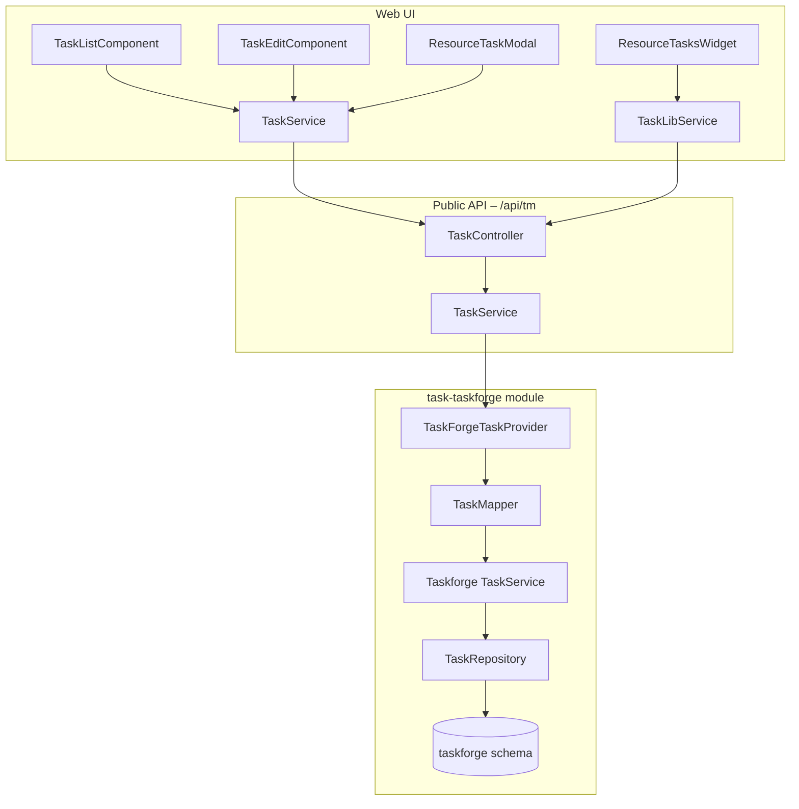

# Task Management (TaskForge)

## Overview

TermX task management provides a workflow-driven system for creating, assigning, and tracking tasks
linked to terminology resources. Tasks are created either manually (from the task list page) or
automatically from resource-specific workflows (version review/approval, concept review).

The backend is implemented as the **TaskForge** module (`task-taskforge`), an inlined fork of the
former external `taskflow-service` library. The public REST API is exposed at `/api/tm/tasks` with
privilege-based filtering. The frontend is an Angular module with a task list, task editor, resource
task widget, and resource task modal.

## Architecture



### Module dependencies

- **task** -- defines the public API (`TaskController`, `TaskService`, `TaskProvider`, `Privilege`,
  models). Has no implementation of its own.
- **task-taskforge** -- implements `TaskProvider` via `TaskForgeTaskProvider`. Contains all domain
  logic, repositories, Liquibase migrations, and the `taskforge` database schema.
- **termx-app** -- wires both modules together.

## API Endpoints

All endpoints are under `/api/tm`.

### Tasks

| Method | Path | Privilege | Description |
|--------|------|-----------|-------------|
| GET | `/tasks` | Task.view | Query tasks (privilege-filtered) |
| GET | `/tasks/{number}` | Task.view | Load single task by number |
| POST | `/tasks` | Task.edit | Create task |
| PUT | `/tasks/{number}` | Task.edit | Update task |
| PATCH | `/tasks/{number}` | Task.edit | Patch individual fields |
| POST | `/tasks/{number}/opened` | Task.view | Log task opened (read log) |
| POST | `/tasks/{number}/activities` | Task.edit | Create activity (comment) |
| PUT | `/tasks/{number}/activities/{id}` | Task.edit | Update activity |
| DELETE | `/tasks/{number}/activities/{id}` | Task.edit | Cancel activity |

### Projects & Workflows

| Method | Path | Privilege | Description |
|--------|------|-----------|-------------|
| GET | `/projects` | Task.view | List all projects |
| GET | `/projects/{code}/workflows` | Task.view | List workflows for a project |

## Data Model

### Task

| Field | Type | Description |
|-------|------|-------------|
| number | String | Auto-generated task number (via sequence) |
| title | String | Task title |
| content | String | Markdown content |
| type | String | `task`, `phase`, `epic`, `feature`, `milestone`, `bug`, `user-story` |
| status | String | Governed by workflow transitions |
| priority | String | From `request-priority` value set (`routine`, `urgent`, `asap`, `stat`) |
| workflow | String | Workflow code (e.g. `task`, `version-review`, `concept-approval`) |
| project | CodeName | Project code and names |
| assignee | String | Assigned user |
| createdBy | String | Author |
| createdAt | OffsetDateTime | Creation timestamp |
| updatedBy | String | Last modifier |
| updatedAt | OffsetDateTime | Last modification timestamp |
| lastOpenedTime | Date | When the current user last opened the task (from `task_read_log`) |
| context | TaskContextItem[] | Linked resources (`type` + `id` pairs) |
| activities | TaskActivity[] | Activity/comment history |

### TaskContextItem

| Field | Type | Description |
|-------|------|-------------|
| type | String | Resource type key (see Context Types below) |
| id | String/Number | Resource identifier |

### TaskActivity

| Field | Type | Description |
|-------|------|-------------|
| id | Long | Activity ID |
| taskId | Long | Parent task ID |
| note | String | Markdown comment |
| transition | Map | Field changes (`field` -> `{from, to}`) |
| updatedBy | String | Author of the activity |
| updatedAt | OffsetDateTime | Timestamp |

Activities are created in two ways:
- **Automatically** by a database trigger (`task_action_trigger`) when task fields change
- **Manually** via the API when a user adds a comment

### Project

| Field | Type | Description |
|-------|------|-------------|
| id | Long | Internal ID |
| institution | String | Institution code |
| code | String | Project code (e.g. `termx`) |
| names | LocalizedName | Localized display names |

### Workflow

| Field | Type | Description |
|-------|------|-------------|
| code | String | Workflow type code |
| transitions | Transition[] | Allowed status transitions (`{from, to}`) |

Default workflow types: `task`, `version-review`, `version-approval`, `concept-review`,
`concept-approval`, `wiki-page-comment`.

## Context Types

Tasks are linked to resources via context items. The `type` field maps to a resource category:

| Context type | Resource | Frontend selector |
|-------------|----------|-------------------|
| `code-system` | CodeSystem | `tw-code-system-search` |
| `code-system-version` | CodeSystem version | (set by resource modal) |
| `concept-version` | Concept version | (set by concept review) |
| `value-set` | ValueSet | `tw-value-set-search` |
| `value-set-version` | ValueSet version | (set by resource modal) |
| `map-set` | MapSet | `tw-map-set-search` |
| `map-set-version` | MapSet version | (set by resource modal) |
| `wiki` | Wiki space | `tw-space-select` |
| `snomed-concept` | SNOMED CT concept | (set by SNOMED integration) |
| `snomed-translation` | SNOMED translation | (set by SNOMED integration) |
| `page-comment` | Wiki page comment | (set by wiki comment flow) |

When creating a task manually (from `/tasks/add`), the user must select a resource type and
a specific resource instance. Context is mandatory and cannot be changed after creation.

## Privilege-Based Access Control

Three privilege levels control task visibility:

| Privilege | Role | Tasks visible |
|-----------|------|---------------|
| `*.*.*` | Admin | All tasks |
| `*.Task.publish` or `*.*.publish` | Publisher | All tasks for resources the user has publish access to |
| `*.Task.edit` or `*.*.edit` | Editor | Only tasks they created or are assigned to, for resources they have edit access to |
| `*.Task.view` only | Viewer | Empty result |

### How filtering works

1. **Admin** -- no filters applied, returns all tasks.
2. **Publisher** -- `permittedContexts` computed from `session.getPermittedResourceIds("*.publish")`;
   SQL filters tasks to those whose context references permitted resources.
3. **Editor** -- `createdByOrAssignee` set to the current username, plus `permittedContexts` from
   `session.getPermittedResourceIds("*.edit")`.
4. **Viewer** -- returns empty result set.

Single task load applies the same logic: admins can load any task, publishers can load tasks for
their permitted resources, editors can only load their own tasks for permitted resources.

## Unseen Changes

The system tracks when each user last viewed a task via the `taskforge.task_read_log` table.

### Backend

- `POST /tm/tasks/{number}/opened` upserts a record in `task_read_log` with the current timestamp.
- The `unseenChanges` search parameter adds a filter:
  `task_read_log.last_opened_time IS NULL OR task_read_log.last_opened_time < task.updated_at`
- The `lastOpenedTime` field is populated via a LEFT JOIN on `task_read_log` and returned with the
  task model.

### Frontend

- **Eye icon** in the task list's first column for tasks where
  `!lastOpenedTime || lastOpenedTime < updatedAt`.
- **Filter checkbox** "Show only tasks with unseen changes" sends `unseenChanges=true` to the API.
- **Auto-mark as seen** when opening a task (`TaskEditComponent` calls `logTaskOpened` on load).

## Frontend Components

### TaskListComponent

Paginated, filterable task list. Filters:
- Text search, project, status (open/closed/specific), assignee, priority, type, author
- Date ranges (created, finished)
- Unseen changes toggle
- Presets: "Assigned to me", "Authored by me"

State is persisted in `ComponentStateStore` across navigation.

### TaskEditComponent

Dual-mode form for creating and editing tasks.

**Create mode** (`/tasks/add`):
- Task type, title, project (required), workflow (required), priority (required)
- Context selection: resource type dropdown (CodeSystem, ValueSet, MapSet, Wiki) and resource
  instance selector -- both mandatory
- Content (markdown editor)
- Save button creates the task and redirects to edit mode

**Edit mode** (`/tasks/:number/edit`):
- Inline editing with patch-on-blur for most fields
- Status transitions based on workflow definition
- Activity list with comments and field-change transitions
- Context displayed read-only with clickable links to resources
- Marks task as "seen" on load

### ResourceTasksWidgetComponent (`tw-resource-tasks-widget`)

Displays tasks related to a specific resource. Used in resource summary pages.
- Inputs: `resourceId`, `resourceType`, `taskFilters`
- Searches tasks by `context: type|id`
- Supports aggregated views for releases (across linked resources) and SNOMED concepts

### ResourceTaskModalComponent (`tw-resource-task-modal`)

Modal for creating review/approval tasks from resource pages.
- Inputs: `resourceType` (CodeSystem, ValueSet, MapSet)
- Auto-fills context with resource ID and version
- Assignee restricted by resource-level edit/publish privileges
- Composes title and markdown content with resource links
- Used by version summary pages and resource action buttons

### TaskContextLinkService

Injectable service that opens context items in the appropriate route. Handles navigation to
code systems, value sets, map sets, SNOMED concepts, wiki page comments, and their versions.

## Task Creation Flows

### 1. Manual creation (task list page)

User navigates to `/tasks/add`, fills in the form including mandatory context (resource type +
resource), and saves. The `TaskEditComponent` builds a `Task` object with `context` from the
selected type and resource ID.

### 2. Version review/approval (resource pages)

From a CodeSystem, ValueSet, or MapSet summary/version page, the user clicks "Create review"
or "Create approval". The `ResourceTaskModalComponent` opens with pre-filled context (resource ID
+ version ID), assignee selection, and an optional comment. Workflow is set to `version-review`
or `version-approval`.

### 3. Concept review (code system concept pages)

From the concept list or concept edit page, the user creates a concept review task. Context is
set to `[code-system, concept-version, code-system-version]`. Workflow is `concept-review` or
`concept-approval`.

### 4. SNOMED concept review

From the SNOMED dashboard, a review task is created with context
`[{type: 'code-system', id: 'snomed-ct'}, {type: 'snomed-concept', id: conceptId}]`.

### 5. Wiki page comments

Wiki page comments can create tasks with `page-comment` context type. Status changes on these
tasks are handled by `WikiPageCommentTaskForgeStatusChangeInterceptor`.

## Database Schema

### Tables

```
taskforge.project          -- Projects (multi-tenant, ACL-protected)
taskforge.workflow         -- Workflow definitions per project
taskforge.task             -- Tasks with JSONB context
taskforge.task_activity    -- Activity log (comments + field-change transitions)
taskforge.task_execution   -- Time tracking (period, duration, performer)
taskforge.task_attachment   -- File attachments
taskforge.task_read_log    -- Per-user last-opened timestamp
```

### Migration from taskflow

A smart migration script (`90-migrate-from-taskflow.sql`) handles two scenarios:
- **taskflow schema exists**: migrates `project` and `workflow` records preserving IDs
- **taskflow schema does not exist**: creates a default `termx` project with ACL and default
  workflow definitions

In both cases, `core.seq_id` is advanced past the highest migrated ID to prevent conflicts.

## Status Change Interceptors

When a task's status changes, interceptor beans are notified. These handle side effects in other
modules:

| Module | Interceptor | Trigger |
|--------|-------------|---------|
| terminology | `CodeSystemTaskStatusChangeInterceptor` | Concept version status sync |
| terminology | `ValueSetTaskStatusChangeInterceptor` | Value set version status sync |
| terminology | `MapSetTaskStatusChangeInterceptor` | Map set version status sync |
| wiki | `WikiPageCommentTaskForgeStatusChangeInterceptor` | Page comment resolution |
| snomed | `TaskForgeSnomedInterceptor` | SNOMED translation status sync |

## Files

### Backend

| Module | Path | Description |
|--------|------|-------------|
| task | `task/src/main/java/com/kodality/termx/task/` | Public API: controller, service, models, privileges |
| task-taskforge | `task-taskforge/src/main/java/org/termx/taskforge/` | Implementation: services, repositories, mapper |
| task-taskforge | `task-taskforge/src/main/resources/taskforge/changelog/` | Liquibase migrations |

### Frontend

| Path | Description |
|------|-------------|
| `app/src/app/task/_lib/` | Models, lib service, shared components (type, status) |
| `app/src/app/task/containers/` | TaskListComponent, TaskEditComponent |
| `app/src/app/task/services/` | TaskService (extends TaskLibService) |
| `app/src/app/task/task.module.ts` | Module definition and routes |
| `app/src/app/resources/resource/components/resource-tasks-widget*` | Resource task widget |
| `app/src/app/resources/resource/components/resource-task-modal*` | Resource task modal |

### Related documents

- [Task Access Control](task-access-control.md) -- detailed migration plan for taskflow -> taskforge and privilege-based filtering
- [Mock Authentication](mock-auth.md) -- mock user profiles for testing task access control
